[Table of Contents](README.md)

[BACK](first-exploration.md)

# Create your First Project (Mac OS)

## Start Visual Studio
When you run Visual Studio 2019 (VS2019) for Mac , you should see the following:

## Choose a Blank Xamarin.Forms App
First choose a blank forms app. Note also there are options for Native iOS and Android apps. For this course, you should ignore these.

## Project a Project Name
On the next page, give your app a name. Also, provide an "Organisational ID". This can be anything for now, but is typically the reverse DNS name of a company website. When you come to submit on the App Stores, this will be important.

## Configure the App
For now, leave this page as it is. You might want to change the location of where your apps are stored. As a tip, if you are using OneDrive or iCloud Drive, you might not want to use a folder in their heirarchy. Solution files tend to have a lot of small files (often with long paths) which change rapidly as you build your application. This may have an impact on network traffic and battery life if using a portable computer. My preference is to have a folder in my home directory called `git`
I also keep all subfolders in git synchronised with GitHub.

In my own case:
I work on a policy that if my Mac was driven over by a truck, I would loose not data. Everything is securely held in the cloud.

- I use GitHub and GitHub Desktop for code 
- I use OneDrive (Business) for everything else.

## Xamarin Forms Solution
One you click create, give VS time to setup. You should now see something similar to the image below:

We will now run this app on the simulators for iOS and Android.

## Test on the iOS Simulator
If you are using a Mac, then running on the iOS simulator is a straightforward process. 

- A pre-requisite for this step is that you have installed and run Xcode at least once.
- Set your start up project to the iOS native App
- (Optional) Build the project (CMD-B) and check for errors
- Run

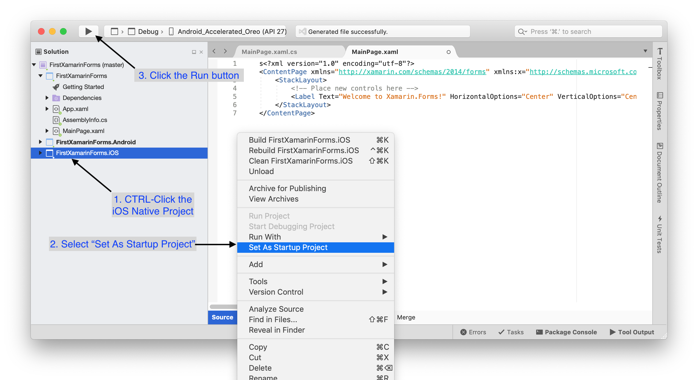

- Once the simulator appears, you should see an image similar to that below

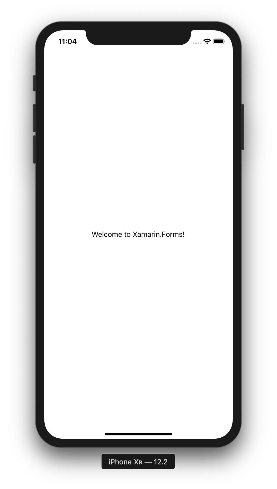

- Try rotating the simulator (CMD-left cursor)

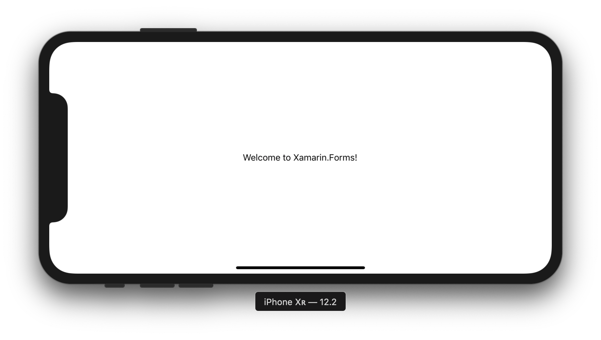

You might want to explore the Simulator menu. There are more things you can do of course.

- Press the stop button to end the simulation.

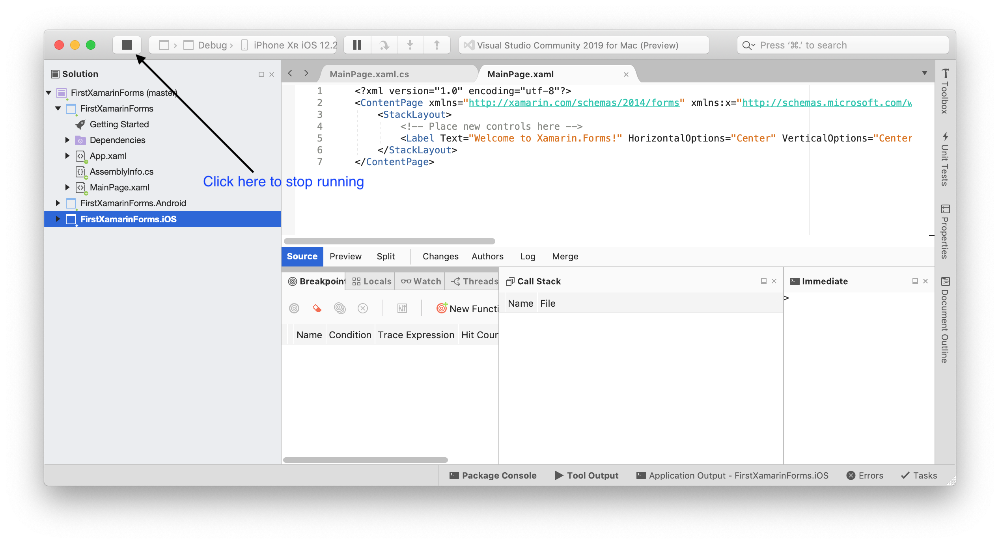

## Resetting the iOS Simulator
If you experience any problems with the iOS simulator, or if you simply want to clean out any old applications, you can reset it. With the simulator as the active application:

- Click the menu item Hardware->Erase All Content and Settings.
- The simulator will be reset and will reboot

## Testing on Android
Running on the Android Simulator is slightly more involved the first time you do it.

- Make the Android project the Start-Up Project
- On the VS menu, choose Tools->Device Manager
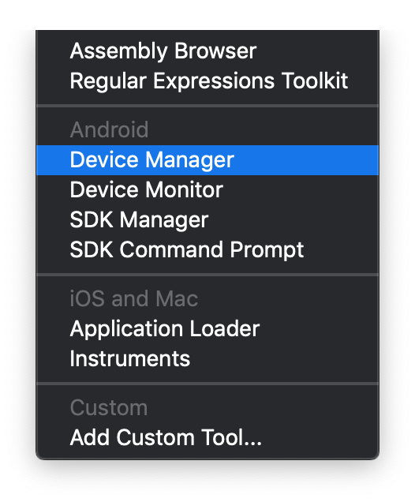
- In the window that appears, add a new device
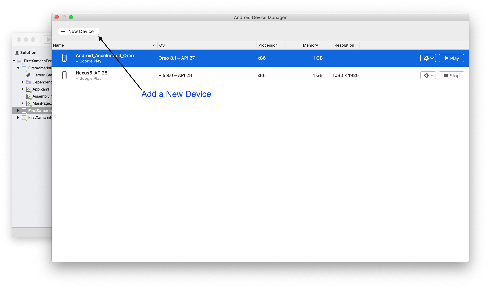
- Configure the device to use the latest operating system and Create
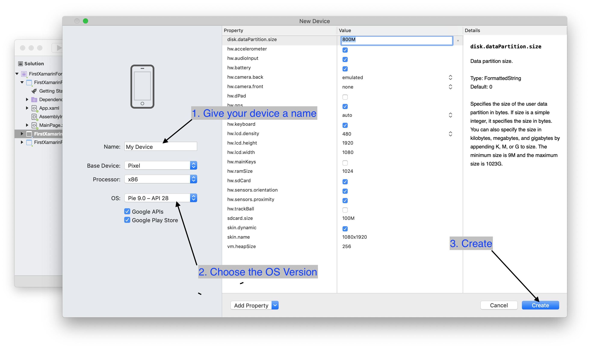

Visual Studio will now download and create the Android Emulator as specified. This can take a while as the images can be quite large.

Once the device has been created, you can choose an emulator.

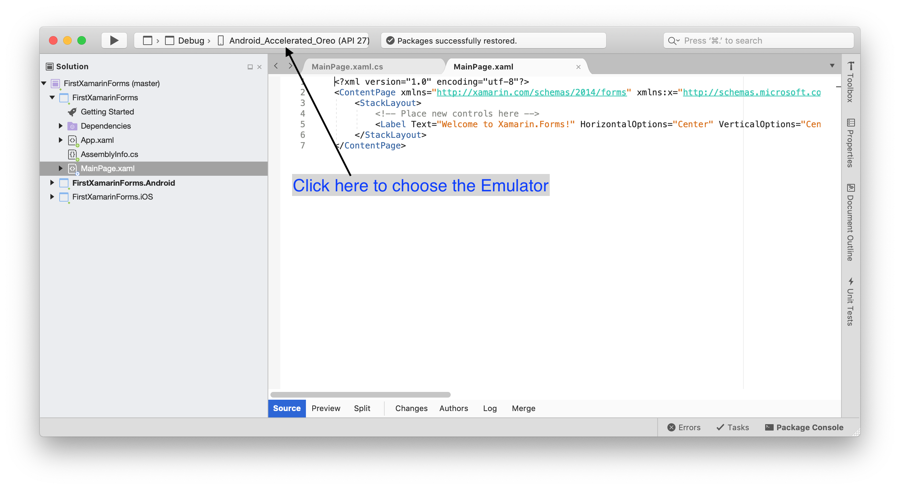

Now click the Play button to test. Again, this can take a while especially the first time you do it.

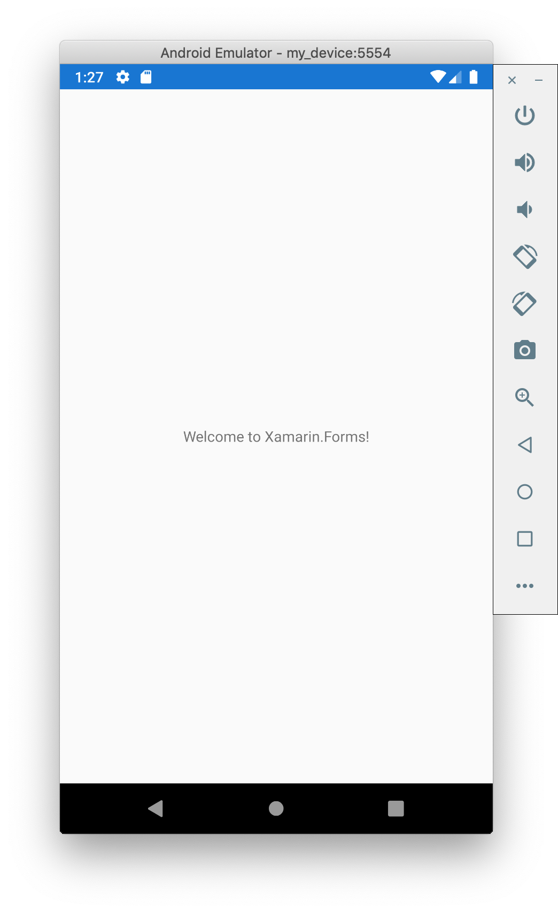

## Resetting the Android Emulator
If you have problems with the Emulator, maybe after an upgrade, try resetting it back to factory settings.

- First close all emulators down
- Back in Visual Studio, choose Tools->Device Manager
- For the emulator you wish to reset, click the Settings Cog and choose 'Factory Reset'

# Keeping it all up to date
As a general rule, for this course you can mostly leave things as they are. However, as a working developer you sometimes need to update various components in a Xamarin.Forms solution. These are discussed in turn.

## Updates for Xamarin Forms or other libraries
Updates to Xamarin Forms can occur fairly frequently. These can be feature additions and/or bug fixes. For any given project, 

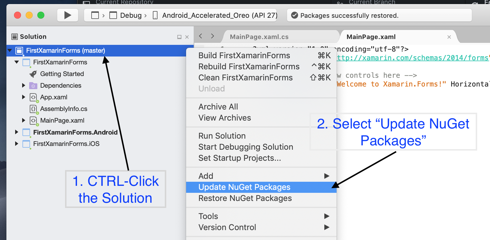

[NuGet](https://www.nuget.org/) is the .NET package manager. At some point you will probably want to explore this more, but that is left for later.

A number of packages might be updated. Commonly 'Xamarin Forms' is updated for the shared and the native projects. It is important all three have the same version of NugGet packages.

## A new version of Android or iOS being released
For Android, this typically means a newer simulator can be added. Sometimes, you will see warnings that your version of Android is too old for the PlayStore. This becomes relevent when you want to publish an app on the Google Play store. 

A simple update is to create an Android Emulator using the latest version of Android. Note that as we are using the Microsoft Emulator, this might not be available on day 1. 

### Updates to Visual Studio
One of the simplest things to check is for updates to Visual Studio. Under the first menu item of Visual Studio, click "Check for Updates". I suggest you use the Stable Channel (although I break my own guideline often as I can't resist peeking at new stuff coming along).

### Updates to the Android SDK
Sometimes the Software Development Kit (SDK) for Android has updates. This might be bug fixes to the compiler or a new SDK version for example.

- In Visual Studio, click Tools->SDK Manager

- Click through Platforms, Tools and Locations. Check for an UPDATE button appearing.

For more details, [see the Microsoft documentation](https://docs.microsoft.com/en-us/xamarin/android/get-started/installation/android-sdk?tabs=windows)

### Update the Android Settings
The version of Android you are using is specified in the native Android project.

- CTRL-Click the Android Project and Click "Options"
- Under the Build section, choose 'Android Application'

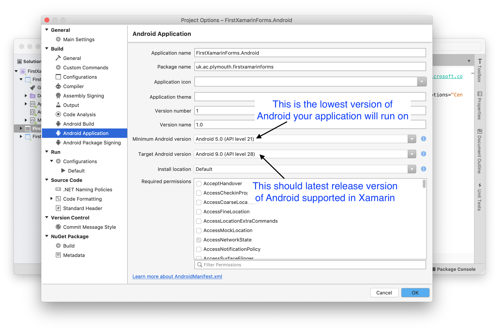

There are two main settings to consider updating.

- *Minimum Android Version* A quick look at the [Google Distribution Dashboard](https://developer.android.com/about/dashboards) and you will see an estimate of the versions on Android being used in any given month. What is sometimes striking is how few devices are running the latest operating system. It is therefore common to write an app that supports older operating system versions. In this example, we are supporting Android API 21 (Android 5)

- *Target Android Version* In general, _this should be set to the latest stable version of Android_ so that all the new APIs are available and known bugs have been squashed. Updating this might also be a requirement of the PlayStore as policy changes.

### Updates to Xcode
This is realtively simple to manage. 

- Run the Apple Mac App Store application
- Click "Updates". If there is an update to Xcode, click the button to download and install it. 
- You should then run Xcode once before using the simulator in Visual Studio.

----

[BACK](first-exploration.md)
