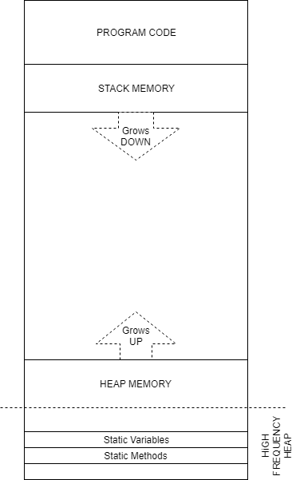
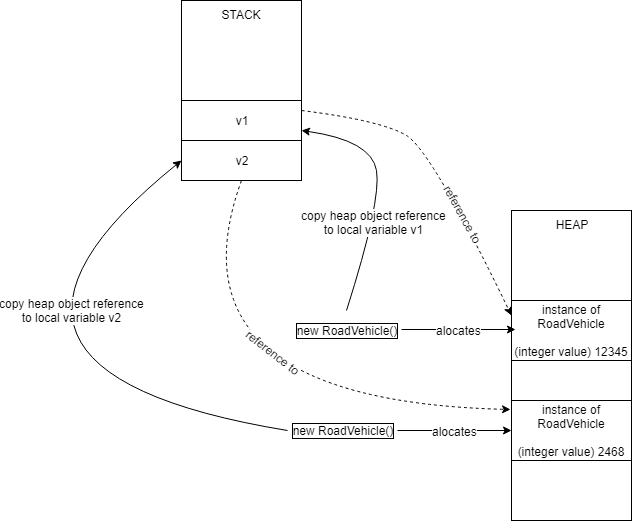

# Essential C# Part 1
This section is intended to be a quick refresher of some of the C# we will encounter in subsequent sections. 
It is not a comprehensive treatment of C#.

In this section, all the code will be targeting a console application.
You can use either Visual Studio 2019 or [Visual Studio Code](https://code.visualstudio.com/download).

- Visual Studio 2019. Create a new project, and search on "Console". From the results pick Console App (.NET Core)
- Visual Studio Code. [See these instructions](https://docs.microsoft.com/en-us/dotnet/core/tutorials/with-visual-studio-code) to create and debug an console application.

I will use Visual Studio Code as I like the built in terminal.

## Hello World Revisited
When you create a new Console app, name the project `HelloWorld` and check the source file `Program.cs` is generated as follows:

```C#
using System;

namespace HelloWorld
{
    class Program
    {
        static void Main(string[] args)
        {
            Console.WriteLine("Hello World!");
        }
    }
}
```

One of the disadvantages to this approach is that you can't get Hello World on the screen without creating a class and a static method. There is another way however. Microsoft recently released access to [Try.net](https://dotnet.microsoft.com/platform/try-dotnet) where you can create a console in the browser.

Let's examine this code more closely however and pick out some key discussion points (maybe to finish later).

- The entry point for a C# application is `Main`. However, it has the word `static` on the front. Static classess will be covered below, but it's important to note.
- `Console.WriteLine` invokes a method, but what is Console? There is no instance variable called Console created, so how come it exists? Again, the clue is in the word `static`. To understand this, we need to know what me mean by a _class_ and an _instance of a class_.
- `namespace HelloWorld` appears around the code. Why is this here?
- `using System` again, it's there, so good to question what it means

## Create and Instantiating a class
Let's wind back and go over a topic you are likely to have covered already - writing a class and instantiating one (with `new`).

**Task:** Create a new class `RoadVehicle`

- Right click the HelloWorld project (as opposed to the Solution), and choose Add->New Item
- Ensure Class is selected
- Set the Name to `RoadVehicle.cs`

The code should look something like this:

```C#
using System;
using System.Collections.Generic;
using System.Text;

namespace HelloWorld
{
    class RoadVehicle
    {
    }
}
```

Let's add a *constructor* method to the `RoadVehicle` class. This is the method that runs when we create an *instance* of this class.

```C#
    class RoadVehicle
    {
        public RoadVehicle()
        {
            Console.WriteLine("RoadVehicle Constructor");
        }
    }
```

Back in `Program.cs`, we now create an instance of this class in the `Main`method

```C#
        static void Main(string[] args)
        {
            Console.WriteLine("Hello World!");

            RoadVehicle v1 = new RoadVehicle();
        }
```

Now run the code. The string "RoadVehicle Constructor" should have been written to the console window.

You have probably used the `new` keyword before, but do you know _why_ you use it? It's all about how the computer manages memory.
We have actually added two objects to memory:

- The `RoadVehicle` class itself (yes, the class can be thought of as an object in its own right). There is only ever **one copy** of the class object in memory, and it is created on first reference.
- An _instance_ of the class. You can have multiple instances of the class, but they are not the same as the class itself. We will see the distinction as we progress.

### Member Variables vs Static Members
There are two types of data storage associated with a class

- **instance member** variable, where each instance has it's own copy
- **static member** variable, where the class object has a single unique copy

Update RoadVehicle.cs to read as follows:

```C#
    class RoadVehicle
    {
        public static string ProjectVersion = "1.0"; // static member variable
        public int EngineSerialNumber;               // instance member variable

        public RoadVehicle()
        {
            Console.WriteLine("RoadVehicle Constructor");
        }
    }
```

Note the `static` keyword. Let's now create multiple instances of `RoadVehicle` back in `Main`

```C#
        static void Main(string[] args)
        {
            Console.WriteLine("Hello World!");
            Console.WriteLine("Code running: Project version " + RoadVehicle.ProjectVersion);

            RoadVehicle v1 = new RoadVehicle();
            v1.EngineSerialNumber = 12345;

            RoadVehicle v2 = new RoadVehicle();
            v2.EngineSerialNumber = 2468;

            //Just to be sure
            if ((v1 == null) || (v2 == null))
            {
                System.Console.WriteLine("That all went badly!");
                return;
            }

            Console.WriteLine("Vehicle 1 serial: " + v1.EngineSerialNumber.ToString());
            Console.WriteLine("Vehicle 2 serial: " + v2.EngineSerialNumber.ToString());
        }
    }
```        

We can identify five additional objects now existing in memory: the two instances of `RoadVehicle`, two local variables `v1` and `v2`, and the class object for `RoadVehicle`. These all reside in different areas of memory within the application.

A simplified representation of an application memory is shown below.



- **Program Code** is where executable instructions for each method are stored. These are held in a distinctly different area to data (variables). It is typically _read-only_ and executable.
- **Stack Memory** holds data such as function parameters and local variables. This region grows downwards (in terms of memory address) as you enter a method and contracts back upwards when you leave.
- **Heap Memory** is allocated on request at run-time, typically using the _new_ keyword. When you use _new_, the heap manager attempts to locate a space on the heap that is large enough for the type of object being alocated and stored. In the (hopefully unlikely) event that it cannot find such a block of memory, a _null_ is returned. Heap memory can be enourmous as it can often utilise page files (also known as swap files) on disks if there is in sufficient RAM. The top of the heap typically grows upwards (in terms of memory address) as more objects are allocated and down as objects are deallocated. 
- There are different regions of the heap. One is the _high frequency heap_, within which static variables are stored and persist.

Back to the code, we note the following:

- Each instance of `RoadVehicle` has it's own _independent_ copy of `EngineSerialNumber`. The keyword `new` requests that a portion of the _heap memory_ is allocted and reserved to hold all the member variables for each _instance_ of the class `Roadvehicle`. _new_ returns either a reference to the allocated memory (on sucess) or null (if it fails).
- We did not use `new` to access the static member `ProjectVersion`. As soon as there is a reference to the `RoadVehicle` class (via accessing a static or new), a single class object is created in memory. We can view this as a _singleton_ object where only one copy can ever be created. Therefore there is only ever one copy of the `ProjectVersion` string in memory. As it is public, it is global to the whole application.

Note also that we have two local variables, `v1` and `v2`. These are declared locally within the `Main` function, and are assigned to the reference value return by `new`. Under the hood, `new` returns a reference to some allocated block of memory on the heap (or null if it fails). We therefore say these are _reference types_ (under the hood, reference types related to an actual address in memory). This is in contrast to _value types_ (such as `int` or `bool`). 

Both `v1` and `v2` _only exist within the Main function_. The variables themselves are stored in another area of memory known as the *function stack*. This transient region of memory holds data such as function parameters and local variables. 

> `v1` and `v2` are local variables, so only exist within the context of the `Main` function

So for the following code:
```C#
            RoadVehicle v1 = new RoadVehicle();
            v1.EngineSerialNumber = 12345;

            RoadVehicle v2 = new RoadVehicle();
            v2.EngineSerialNumber = 2468;
```

We can visualise this as follows:



Once execution leaves `Main`, all stack-based objects are automatically deleted,  including `v1` and `v2`. So what happens to the two instances of `RoadVehicle` stored in the heap memory?

> Any object dynamically allocated on the heap with `new` will _persist as long as there is at least one reference to it_. If that reference is removed, the heap object will be automatically deallocated, thus freeing up the memory for other purposes. This process is automated by the .NET [_garbage collector_](https://docs.microsoft.com/en-us/dotnet/standard/garbage-collection/fundamentals)

The great news is we rarely have to worry about deallocating memory as it's done for us.

### When names collide - namespace to the rescue!
A class name needs to be unique. However, as projects become large and complex, probably involving code written by others (in libraries or additional source), there chance of a name collision is very real. Therefore, we enclose our class declatations within a namespace. In this case, we use the namespace HelloWorld.

To illustrate this, do the following:

- In RoadVehicle.cs, change the namespace to DepartmentOfTransport

```C#
namespace DepartmentOfTransport
```

Back in `Program.cs`, you should be able to see there are errors indicating the type `RoadVehicle` cannot be found. This is because no such type (a class is a custom type) exists.

One option is to give it it's fully qualified name:

```C#
            DepartmentOfTransport.RoadVehicle v1 = new DepartmentOfTransport.RoadVehicle();
            DepartmentOfTransport.RoadVehicle v2 = new DepartmentOfTransport.RoadVehicle();
```            

This is very verbose and not so readable, but as you can see, `DepartmentOfTransport.RoadVehicle` is also unlikely to cause a name collision (if it does, choose another namespace).

Subject to there being no other class called RoadVehicle in the project, we can skip the namespace prefix by writing the following line at the top of our source code:

```C#
using DepartmentOfTransport;
```

The compiler now knows to search all the namespaces being used for type names. This is equally true for the `Console` class object.

You can try this if you like. 
- Comment out the line `using System`
- Note the error - to fix, replace `Console` with 'System.Console' 

## Properties

## Partial Classes

## Inheritance and constructors

## Polymorphism and the big-bad-mouse

## Static Classes
