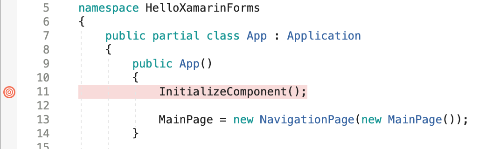

[Table of Contents](README.md)

# First Exploration in Xamarin Forms
This section is intended to familiarise you with the tools and to demonstrate some of the key concepts.
The first task is to create a blank forms app.

- For the Mac, [follow this link](create-project-mac.md)
- For Windows, [follow this link](create-project-pc.md)

For more detailed information on setting up the Android Emulator, [see the  Microsoft page](https://docs.microsoft.com/en-us/xamarin/android/get-started/installation/android-emulator/)

To setup a real device for development, [see the guide from Microsoft](https://docs.microsoft.com/en-us/xamarin/android/get-started/installation/set-up-device-for-development)

Before you try and run anything, take some time to explore these projects. There are some important points to note:

- A Solution is a collection of projects that may have dependencies between each other.
- A Forms Solution is actually two apps (one for iOS and the other for Android) and one shared library (the Forms project)
- The entry point of each is a Native _Platform Specific_ App - each instantiates Forms code to create the UI etc.
- Each constituent project within the solution has it's own settings, so the Android project has distinct settings to iOS.


Let's now take an initial look at a single page Xamarin.Forms application.

##  (i) Hello World
It is customary to start every course with a Hello World. So much can be captured with such a simple example that is is worth doing. Sometimes it is easier to show rather than explain, so we begin with a short video walkthrough.

### Mac OS
<p align="center">
<a href="http://www.youtube.com/watch?feature=player_embedded&v=zwc2u7w6d3Y" target="_blank"></a>
</p>

### Microsoft Windows
*TBD*

*TASK*
Recreate what you saw in the video. This is an exercise in familiarisation more than anything, so don't worry if it all seems a bit strange.
   
## (ii) Unpicking what just happened
Ok, let's step back and look at what is happening here. It is suggested that having a high-level view helps to visualise the relationships between all the components, without which, it can all feel strange and out of control. We can then dive into each aspect and try to demystefy what is going on.


The `MainPage` class is what we are most interested in here. This is related to a single page of content within which is placed a label and button. It also contains all the code to manage the UI and react to user events. It is what is referred to as a _ContentPage_. As you build up your application, and add in nagivation, you will probably have multiple Content Pages (typically one per screen of infomration).

Before the first content page, we see classes that are responsible for managing the application life cycle. Let's take a quick look at each in turn. Our focus will be on the cross platform code, which is where the developer is expecting to spend most of the time.

### The App Class
This is the first (cross-platform) Xamarin.Forms class that is instantiated. Before that are classes that are platform specific. We wish to focus on cross-platform for now and do our best to avoid touching any platform-specific code.

A single instance of the `App` class is instantiated by the platform-specific code. This App class is built from two documents:

- App.xaml.cs
- App.xaml

If you've come from other platforms, you might find this surprising. It certainly was to me! Let's take a brief look at each in turn.

#### App.xaml.cs
````C#
using System;
using Xamarin.Forms;
using Xamarin.Forms.Xaml;

namespace HelloXamarinForms
{
    public partial class App : Application
    {
        public App()
        {
            InitializeComponent();

            MainPage = new MainPage();
        }

        protected override void OnStart()
        {
            // Handle when your app starts
        }

        protected override void OnSleep()
        {
            // Handle when your app sleeps
        }

        protected override void OnResume()
        {
            // Handle when your app resumes
        }
    }
}
````
First, consider the class declaration

```C#
public partial class App : Application
```

The parent class is `Application`, a Xamarin.Forms class that provides important hooks into the application lifecycle. 

> If you are interested, details can be found in the [Microsoft Documentation](https://docs.microsoft.com/en-us/dotnet/api/xamarin.forms.application?view=xamarin-forms)

iOS and Android have their own equivalent of course (e.g. the AppDelegate on iOS), but you can avoid writing platform specific code by subclassing the `Application` class and overriding methods such as `OnStart()`, as is shown above.

- This is a `partial` class declatation. This must mean that _somewhere_, there is at least one other [C# partial class](https://docs.microsoft.com/en-us/dotnet/csharp/programming-guide/classes-and-structs/partial-classes-and-methods)  declaration. More on that in the next section.

This class is also declared within a _namespace_
```C#
namespace HelloXamarinForms
```
[Namespaces](https://docs.microsoft.com/en-us/dotnet/csharp/programming-guide/namespaces/) are a way to avoid name collisions. You can think of them as _prefixes_ on Class, Structure and Interface names - so really we are declaring `HelloXamarinForms.App`. 

> Namespaces are helpful as there may be other classes called `App` maybe in your own code or a third-party library. Whenever we wish to refer to this particular class, we _could_ type `HelloXamarinForms.App`. This can produce verbose code, so often you see the `using` keyword at the top of a source file. This allows for implicit namespace qualifiers which helps keep code concise and readable. Of course, if there are names which conflict within the set of namespaces you use, then you would still need to give the explicit name. Again, more on this later.

- Note also that the constructor calls `InitializeComponent()` - again, we will look at this more closely in the next section, but as we will see, it is related to this being a partial class.

- Finally, the `MainPage` property of `Application` is set to an insance of our `MainPage` class. This is something we may change once we start adding navigation features. This very line is often the lowest entry point for an application.

So quite a bit to think about here. Why is this a partial class? Where is the rest of the class? How come we have a XAML file alongside? If you are confused, don't be put off (yet!), all should become clear.

#### App.xaml
Alongside the C# file is a XAML file. In fact, the the solution explorer, these two files seem to be implicitly linked in some way.

```XAML
<?xml version="1.0" encoding="utf-8"?>
<Application xmlns="http://xamarin.com/schemas/2014/forms" 
             xmlns:x="http://schemas.microsoft.com/winfx/2009/xaml" 
             xmlns:d="http://xamarin.com/schemas/2014/forms/design" 
             xmlns:mc="http://schemas.openxmlformats.org/markup-compatibility/2006" 
             mc:Ignorable="d" 
             x:Class="HelloXamarinForms.App">
    <Application.Resources>
    </Application.Resources>
</Application>
```
There are some clues in here:

```XAML
<Application ...
```
Ok, so this is something to do with the `Application` parent class we met in the C# file above. There are also quite a few [XML namespaces](https://www.w3schools.com/xml/xml_namespaces.asp) being defined. We will talk more about these later. They look scarier than they really are.

```XAML
x:Class="HelloXamarinForms.App"
```
This suggests this is something to do with the `App` class. 

### The MainPage Class
Let's recap on where we are in the greater scheme of things:


The constructor for the `App` class obtains an instance of `MainPage` and sets it to a property that happens to have the same name. This way, the instance of `MainPage` becomes the root screen of information that the user sees. 

Let's now look at `MainPage` a little more closely. 

Once again, the `MainScreen` class is constructed using two files, `MainScreen.xaml.cs` and `MainScreen.xaml`.
Let's start with the XAML file

#### MainScreen.xaml
The user interface for `MainScreen` is declared in an XML based language known as [XAML](https://docs.microsoft.com/en-us/xamarin/xamarin-forms/xaml/).

_If_ you've come from another mobile platform, you might be surprised to find yourself declaring your user inteterface in XML. You might be even more surprised to discover there is no [WYSIWYG](https://en.wikipedia.org/wiki/WYSIWYG) tool to write the XML for you. If you are from the iOS world, there is not graphical StoryBoard - although when we meet Shell, there is something equivalent.

> Before you run away in fear and loathing, I suggest you allow this idea to sink in and try to avoid pre-judging it. It is also worth noting that both Google and Apple have both introduced declarative UI in [Flutter](https://flutter.dev/docs/get-started/flutter-for/declarative) and [SwiftUI](https://developer.apple.com/xcode/swiftui/) respectively. _Declarative UI seems to be the way the wind is blowing_.

Note the following:

- You are not forced to use XAML, you can still declare all your UI in C#
- You are encouraged to use XAML as it's a language _designed_ to declare UI in a way that is more concise and readable than C#

Ok, let's take an initial look at the UI for `MainPage`.

```XAML
<?xml version="1.0" encoding="utf-8"?>
<ContentPage xmlns="http://xamarin.com/schemas/2014/forms" 
             xmlns:x="http://schemas.microsoft.com/winfx/2009/xaml" 
             xmlns:d="http://xamarin.com/schemas/2014/forms/design" 
             xmlns:mc="http://schemas.openxmlformats.org/markup-compatibility/2006"
             mc:Ignorable="d" 
             x:Class="HelloXamarinForms.MainPage">
    <StackLayout>       
        <!-- Place new controls here -->
        <Label Text="Welcome to Xamarin.Forms!"
               FontSize="Large"
               HorizontalOptions="Center" 
               x:Name="MessageLabel"
               VerticalOptions="CenterAndExpand"/>
        <Button Text="Click Me" VerticalOptions="CenterAndExpand" Clicked="Handle_Clicked"/>
    </StackLayout>
</ContentPage>
```

##### ContentPage

Firstly, there is the opening element `<ContentPage ...` along with another list of [XML namespaces](https://www.w3schools.com/xml/xml_namespaces.asp), [ContentPage](https://docs.microsoft.com/en-us/dotnet/api/xamarin.forms.contentpage?view=xamarin-forms) is a Xamarin.Forms class for managing (no surprise) a page of content.

> `MainPage` is a subclass of `ContentPage`.

This XML element + associated attributes will be _parsed_ by some code hidden from view (as we will see more clearly later). When MainPage is `instantiated` in code, one of the first things it will do is the eqivalent at run-time:

```C#
   Content = new StackLayout();
```

Note the `Content` property of `ContentPage` is explicity set in code, yet it does not explicity appear in the XAML. This is because `Content` is marked as the default (in the absence of any other property name), and this is known as the *ContentProperty*. 

The following XAML would be equally valid:

```XAML
...
<ContentPage.Content>
    <StackLayout>       
        <!-- Place new controls here -->
        <Label Text="Welcome to Xamarin.Forms!"
               FontSize="Large"
               HorizontalOptions="Center" 
               x:Name="MessageLabel"
               VerticalOptions="CenterAndExpand"/>
        <Button Text="Click Me" VerticalOptions="CenterAndExpand" Clicked="Handle_Clicked"/>
    </StackLayout>
</ContentPage.Content>
```

> Note that as far as XML is concerned, a dot within an element name is perfectly valid and has no special meaning. In XAML however, it does have a meaning. This notation is used as an alternative to using an XML attribute as we will see later.

At risk of getting too detailed, in the class declaration of `ContentPage`, we see a class attribute being set as follows:

```C#
...
[ContentProperty ("Content")]
public class ContentPage : TemplatedPage
...
```

The part in square parenthesis is known as a [Class Attribute](https://docs.microsoft.com/en-us/dotnet/csharp/programming-guide/concepts/attributes/). This is setting an attribute `ContentProperty` to the string "Content". At _run time_, when the XAML is parsed, the code can look up the `ContentProperty` attribute of the `ContentPage` class (a string), and treat tihs it as the default property (where none is given otherwise).


##### StackLayout

Next we see the XML element `<StackLayout>`. 

As explained above, this will instantiate an instance of the class `StackLayout` and set it to the `Content` property of `ContentPage`.

Why `StackLayout`? Well, all content pages need two things:

- Objects to Display (Buttons, Labels etc.)
- Rules on how to lay out the objects on the screen

This object fulfills the second of these requirements. In fact, for content to display properly, the root view object (`Content` property) in any content page should be a layout of some sort.

[StackLayout](https://docs.microsoft.com/en-gb/dotnet/api/xamarin.forms.stacklayout?view=xamarin-forms), a subclass of the `Layout` class, is one of the commonly used and simpler layout objects in Xamarin.Forms. [More layout choices are available](https://docs.microsoft.com/en-us/xamarin/xamarin-forms/user-interface/layouts/stack-layout) and will be discussed later.

`StackLayout` can be used to layout components in both vertical and horizontal orientations, and they can be nested. The default orientation is vertical.

The `StackLayout` class has a property called `Children`. This is a collection (List) of `View` objects. 
If we were to write the equivalent in code, it might look something like this:

```C#
...
    public partial class MainPage : ContentPage
    {
        Label MyLabel;

        public MainPage()
        {
            InitializeComponent();

            MyLabel = new Label
            {
                Text = "Welcome to Xamarin.Forms!",
                VerticalOptions = LayoutOptions.CenterAndExpand,
                HorizontalOptions = LayoutOptions.Center
            };

            Button btn = new Button
            {
                Text = "Cick Me",
                VerticalOptions = LayoutOptions.CenterAndExpand,
                
            };
            btn.Clicked += Btn_Clicked; ;

            StackLayout lyt = new StackLayout();
            lyt.Children.Add(MyLabel);
            lyt.Children.Add(btn);

            Content = lyt;
        }

        private void Btn_Clicked(object sender, EventArgs e)
        {
            MyLabel.Text = "Hello World";
        }
        ...
```
Note the explicit reference to the `Children` property (list of views to be arranged on screen). No such property is made in the XAML because again, it is declared as the `ContentProperty`.


`StackLayout` is a subclass of the generic class `Layout`. Again, here is a sneak peak of the generic Layout class declaration in Xamarin.Forms
```C#
[ContentProperty ("Children")]
public abstract class Layout<T> : Layout, IViewContainer<T> where T : View
```

So from this, we can probably expect other layout classes to have a `Children` property.

##### The Label and Button
Finally we see the declaration (and implicit instantiation) of `Label` and `Button` objects. These become added to the `Children` collection of the `StackLayout`.

```XAML
<Label Text="Welcome to Xamarin.Forms!"
      FontSize="Large"
      HorizontalOptions="Center" 
      x:Name="MessageLabel"
      VerticalOptions="CenterAndExpand"/>
<Button Text="Click Me" VerticalOptions="CenterAndExpand" Clicked="Handle_Clicked"/>
```
Note how the following is used:

- XML elements declare instances of classes
- XML attributes (of elements) are used to set properties on these objects. 

For the Label, the equivalent code might be:

```C#
   Label MessageLabel = new Label
   {
       Text = "Welcome to Xamarin.Forms!",
       FontSize = 18.0,
       HorizontalOptions = LayoutOptions.Center,
       VerticalOptions = LayoutOptions.CenterAndExpand
   };
```

Another way to write the XAML would be as follows:

```XAML
      <Label x:Name="MessageLabel"> 
             <Label.Text>"Welcome to Xamarin.Forms!"</Label.Text>
             <Label.FontSize>18.0</Label.FontSize>
             <Label.HorizontalOptions>LayoutOptions.Center</Label.HorizontalOptions>
             <Label.VerticalOptions>LayoutOptions.CenterAndExpand</Label.VerticalOptions>
      </Label>
```

The attribute `x:Name` was left as an attribute. 
> `x:Name` is not a property of the class `Label`. 
It turns out that "MessageLabel" becomes the name of a property in `MainPage` that references the instance of Label being created here. Keep a mental note of this for now as all will be revealed below.

> Note also that I am guessing that Font Size 18.0 is something equivalent to "Large". In reality, the "Large" string is converted to a number using a converter class, again something we will meet later.

That was a lot of stuff! Don't expect to take all the above in immediately. It is likely that you will need to encounter all of this multiple times for it to begin to sink in.

#### MainScreen.xaml.cs
Examine the source code

```C#
using System;
using System.Collections.Generic;
using System.ComponentModel;
using System.Linq;
using System.Text;
using System.Threading.Tasks;
using Xamarin.Forms;

namespace HelloXamarinForms
{
    // Learn more about making custom code visible in the Xamarin.Forms previewer
    // by visiting https://aka.ms/xamarinforms-previewer
    [DesignTimeVisible(false)]
    public partial class MainPage : ContentPage
    {
        public MainPage()
        {
            InitializeComponent();
        }

        void Handle_Clicked(object sender, System.EventArgs e)
        {
            MessageLabel.Text = "Hello World";
        }
    }
}
```

Firstly there is the namespace, `namespace HelloXamarinForms`. This effectively makes `HelloXamarinForms` a prefix on anything declared within it.

Once again, we see a partial class declaration

```C#
public partial class MainPage : ContentPage
```

Again, we are expecting there to be at least one other C# file with a partial declaration of `MainPage`, _somewhere_.

We see it subclasses [`ContentPage`](https://docs.microsoft.com/en-us/dotnet/api/xamarin.forms.contentpage?view=xamarin-forms).

Once again, the constructor of the C# class calls the initialisation method `InitializeComponent()`. This is realted to the companion XAML file (as we will see).

```C#
   public MainPage()
   {
      InitializeComponent();
   }
```

Next, we see the event handler for the button

```C#
   void Handle_Clicked(object sender, System.EventArgs e)
   {
      MessageLabel.Text = "Hello World";
   }
```

This is where things might seem surprising. There is nothing in this part of the class declaration that says anything about `MessageLabel`. You may recall that it _is_ referenced in the XAML.

```XAML
  <Label Text="Welcome to Xamarin.Forms!"
         FontSize="Large"
         HorizontalOptions="Center" 
         x:Name="MessageLabel"
         VerticalOptions="CenterAndExpand"/>
```

Yep, it's one of those XML attributes again! Then there is that `x:` prefix. In the same XAML file we see the following:

```XAML
...
<ContentPage xmlns="http://xamarin.com/schemas/2014/forms" 
             xmlns:x="http://schemas.microsoft.com/winfx/2009/xaml" 
             ...
```
Again, some quite scary looking [XML namespaces](https://www.w3schools.com/xml/xml_namespaces.asp) are used as a prefix to avoid name collisions. The default for most tags is `http://xamarin.com/schemas/2014/forms`. So, when we say <Button/> we mean <http://xamarin.com/schemas/2014/forms:Button/>. No chance of a name collision there!

That's ok for the Xamarin classes. When the parser works through the tree, it knows about such things, but not all attributes are from Xamarin.Forms

As you might imagine, the attribute `Name` is an excellent candidate for a collision, so probably wise to choose something else that (i) is meaningful but also (ii) unlikely to collide with others. Here the namespace for XAML is used `http://schemas.microsoft.com/winfx/2009/xaml:Name` which is again very safe, but very verbose. x:Name is the same thing, but concise and still clear. `http://schemas.microsoft.com/winfx/2009/xaml:Name` has a meaning for XAML ans is also used in other XAML based frameworks. 

Remember that XAML (XML) is going to be parsed _somewhere_, and that it will result in objects being instantiated in memory so they can be displayed etc. But how do you obtain a reference to these objects so you can change or interrogate them? That's what the next section tries to reveal.

### Diving Down Deeper and the Mystery of the Label!

We've had a look at the two classes, `App` and `MainPage`. Both are constructed from a C# and a XAML file. Rather than try and explain, a short video is provided to reveal how the `MainPage` is completed.

<p align="center">
<a href="http://www.youtube.com/watch?feature=player_embedded&v=jlwr3PLytAw" target="_blank"></a>
</p>

So under the hood, as soon as the XAML file is saved, the file `MainPage.xaml.g.cs` is generated in the background (almost immediately).

Here is a sample:

```C#
//------------------------------------------------------------------------------
// <auto-generated>
//     This code was generated by a tool.
//     Runtime Version:4.0.30319.42000
//
//     Changes to this file may cause incorrect behavior and will be lost if
//     the code is regenerated.
// </auto-generated>
//------------------------------------------------------------------------------

[assembly: global::Xamarin.Forms.Xaml.XamlResourceIdAttribute("HelloXamarinForms.MainPage.xaml", "MainPage.xaml", typeof(global::HelloXamarinForms.MainPage))]

namespace HelloXamarinForms {
    
    [global::Xamarin.Forms.Xaml.XamlFilePathAttribute("MainPage.xaml")]
    public partial class MainPage : global::Xamarin.Forms.ContentPage {
        
        [global::System.CodeDom.Compiler.GeneratedCodeAttribute("Xamarin.Forms.Build.Tasks.XamlG", "2.0.0.0")]
        private global::Xamarin.Forms.Label MessageLabel;
        
        [global::System.CodeDom.Compiler.GeneratedCodeAttribute("Xamarin.Forms.Build.Tasks.XamlG", "2.0.0.0")]
        private void InitializeComponent() {
            global::Xamarin.Forms.Xaml.Extensions.LoadFromXaml(this, typeof(MainPage));
            MessageLabel = global::Xamarin.Forms.NameScopeExtensions.FindByName<global::Xamarin.Forms.Label>(this, "MessageLabel");
        }
    }
}
```

#### So that's where it went!
Note the line 
```C#
public partial class MainPage : global::Xamarin.Forms.ContentPage
```
So we have found the other fragment of the `MainPage` class! 

Look inside and we see the following property:
```C#
private global::Xamarin.Forms.Label MessageLabel;
```
So now we know that the property `MessageLabel` is nothing particularly special afterall. How does it get hooked up to the actual `Label` instance? Remember calling `InitializeComponent()` in both the `App` and `MainPage` constructors? For `MainPage`, we have this code generated:

```C#
  private void InitializeComponent() {
      global::Xamarin.Forms.Xaml.Extensions.LoadFromXaml(this, typeof(MainPage));
      MessageLabel = global::Xamarin.Forms.NameScopeExtensions.FindByName<global::Xamarin.Forms.Label>(this, "MessageLabel");
  }
```
The following parses the XML:
```C#
global::Xamarin.Forms.Xaml.Extensions.LoadFromXaml(this, typeof(MainPage));
```
The following hooks up the `MessageLabel` to the correct object in memory:
```C#
MessageLabel = global::Xamarin.Forms.NameScopeExtensions.FindByName<global::Xamarin.Forms.Label>(this, "MessageLabel");
```

Complicated? Yes.
Magic? No.

#### Task
Try the following:

- Put a breakpoint in the App class as shown below:

- Run the code and when it breaks, step in to the function.
- Look at the name of the source file you enter
- What is the classname?

# Summary
There is quite a lot of 'detail stuff' in a simple hello world application. We already met the following:

- partial classes
- XML elements and attributes
- XAML UI declatation, objects and properties
- Application, ContentPage, Label, Button and StackLayout classes
- namespaces in C# and XAML
- event handlers
- references to UI elements

If you're head is spinning a little, that's only human. Remember that if you don't yet understand this fully, that makes you human. With useage, time and many nights of good sleep, things will begin to clarify. 

Also, learning is rarely a linear process. I reccomend you return to this section in a few weeks time. 

