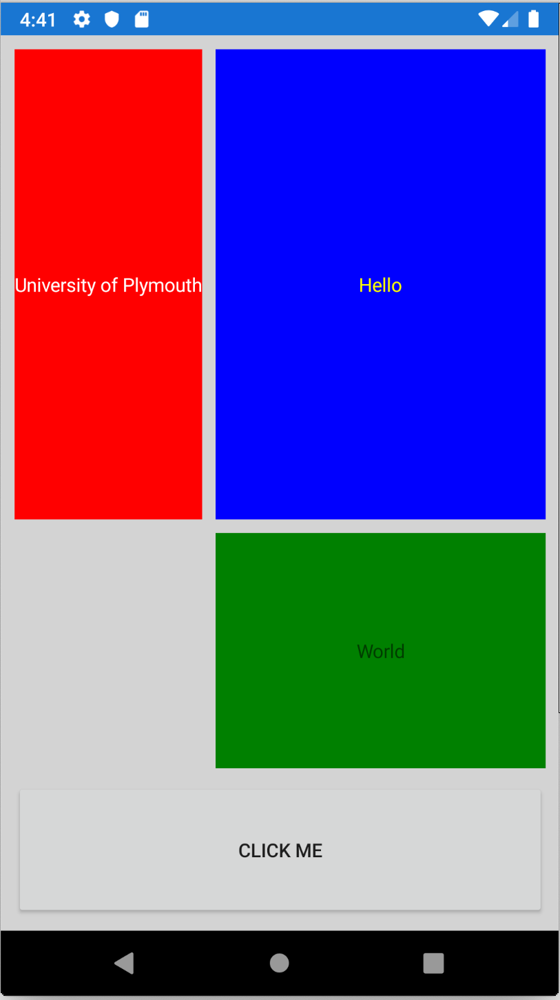

[Table of Contents](README.md)

# Grid Layout
In the previous example, we used `StackLayout` to layout our UI using XAML. `StackLayout` is quite simple, and with nesting, it's possible to create quite complex UI designs. This makes it tempting to use, but if what you want are objects arranged in a linear grid, the [GridLayout]((https://docs.microsoft.com/xamarin/xamarin-forms/user-interface/layouts/grid)) might actually be more appropriate and simple.

> It is suggest you read the [Microsoft Documentation on Grid Layout](https://docs.microsoft.com/xamarin/xamarin-forms/user-interface/layouts/grid) once you've worked through this section.

> The example projects for this section are in the [GridDemo folder](/code/Chapter1/GridDemo)
>
> Open the solution GridLayoutDemo. Build and run and you should see a screen that matches the figure below:



The three coloured labels and single gray button are arranged in a 3x2 grid.

- Column 0 (left hand side) is sized to fit the width of the content
- Column 1 (right hand side) is sized to fit the remaining space
- Row 0 (top) is twice the height of row 1
- Row 2 is fixed at 100 points high. Rows 0 and 1 fill the remaining space
- All labels are set to fill and expand their available space
- There is a 10 point margin around the whole table
- There are 10 point spacings between columns and rows

The XAML for this is shown below:

```XML
<?xml version="1.0" encoding="utf-8"?>
<ContentPage xmlns="http://xamarin.com/schemas/2014/forms"
             xmlns:x="http://schemas.microsoft.com/winfx/2009/xaml"
             xmlns:d="http://xamarin.com/schemas/2014/forms/design"
             xmlns:mc="http://schemas.openxmlformats.org/markup-compatibility/2006"
             mc:Ignorable="d"
             x:Class="GridLayoutDemo.MainPage">

    <!-- Top level layout is a Grid -->
    <Grid Padding="10,10,10,10" BackgroundColor="LightGray"
          RowSpacing="10" ColumnSpacing="10" >

        <!-- The Grid can have its own resource dictionary-->
        <Grid.Resources>
            <ResourceDictionary>
                <!-- Implicit style : applies to all Labels in the grid -->
                <Style TargetType="Label">
                    <Setter Property="HorizontalOptions" Value="FillAndExpand" />
                    <Setter Property="VerticalOptions" Value="FillAndExpand" />
                    <Setter Property="HorizontalTextAlignment" Value="Center"/>
                    <Setter Property="VerticalTextAlignment" Value="Center"/>
                </Style>
            </ResourceDictionary>            
        </Grid.Resources>

        <!-- Define Rows -->
        <Grid.RowDefinitions>
            <RowDefinition Height="2*"/>
            <RowDefinition Height="*"/>
            <RowDefinition Height="100"/>
        </Grid.RowDefinitions>

        <!-- Define Columns -->
        <Grid.ColumnDefinitions>
            <ColumnDefinition Width="Auto"/>
            <ColumnDefinition Width="*"/>
        </Grid.ColumnDefinitions>

        <!-- Place Content -->
        <Label Text="University of Plymouth" Grid.Row="0" Grid.Column="0"
               TextColor="White" BackgroundColor="Red"/>
        <Label Text="Hello" Grid.Row="0" Grid.Column="1"
               TextColor="Yellow" BackgroundColor="Blue"/>
        <Label Text="World" Grid.Row="1" Grid.Column="1" 
               BackgroundColor="Green"/>
        <Button Text="CLICK ME" Grid.Row="2" Grid.Column="0" Grid.ColumnSpan="2"/>

    </Grid>
</ContentPage>
```

First there is the `Grid` element which has replaced `StackLayout` as the top level layout. The `Padding` property places space between the edge of the screen and the grid child elements. Note the grid itself extends to the edges of the available screen space. To avoid clutter, a 10 point space is also added between the rows and columns.

```XML
    <Grid Padding="10,10,10,10" BackgroundColor="LightGray"
          RowSpacing="10" ColumnSpacing="10" >
```          

Next, a `Style` is defined inside a resource dictionary. We've not covered styles yet, but the example given here is a simple example. This _implicit_ style sets the default properties of all `Label` objects in the grid. This saves a lot of repetition later and is not the focus of this section. For an introduction to styles, [see the Microsoft documentation](https://docs.microsoft.com/xamarin/xamarin-forms/user-interface/styles/xaml/introduction) 

```XML
<Grid.Resources>
    <ResourceDictionary>
        <!-- Implicit style : applies to all Labels in the grid -->
        <Style TargetType="Label">
            <Setter Property="HorizontalOptions" Value="FillAndExpand" />
            <Setter Property="VerticalOptions" Value="FillAndExpand" />
            <Setter Property="HorizontalTextAlignment" Value="Center"/>
            <Setter Property="VerticalTextAlignment" Value="Center"/>
        </Style>
    </ResourceDictionary>            
</Grid.Resources>
```

Next we define the dimensions and relative sizes of the columns and rows. 

- The * means proportional width or height
- 2* means twice the size of *
- 100 is an absolute height
- Auto means fit to content

```XML
<Grid.RowDefinitions>
    <RowDefinition Height="2*"/>
    <RowDefinition Height="*"/>
    <RowDefinition Height="100"/>
</Grid.RowDefinitions>

<Grid.ColumnDefinitions>
    <ColumnDefinition Width="Auto"/>
    <ColumnDefinition Width="*"/>
</Grid.ColumnDefinitions>
```

Finally, we add the content. Note following:

- Each element (`Label` or `Button`) specifies the row and column position using `Grid.Row` and `Grid.Column`
   - `Grid.Row` and `Grid.Column` are not properties of `Label` or `Button`. These are known as [attached properties](https://docs.microsoft.com/dotnet/framework/wpf/advanced/attached-properties-overview) and help to make the XAML easy to read 
- For each label, the default properties for `HorizontalOptions`, `VerticalOptions`, `HorizontalTextAlignment` and `VerticalTextAlignment` are set in the style above.
- The `Button` is set to span 2 columns using the attached property `Grid.Columnspan`.

```XML
<!-- Place Content -->
<Label Text="University of Plymouth" Grid.Row="0" Grid.Column="0"
        TextColor="White" BackgroundColor="Red"/>
<Label Text="Hello" Grid.Row="0" Grid.Column="1"
        TextColor="Yellow" BackgroundColor="Blue"/>
<Label Text="World" Grid.Row="1" Grid.Column="1" 
        BackgroundColor="Green"/>
<Button Text="CLICK ME" Grid.Row="2" Grid.Column="0" Grid.ColumnSpan="2"/>
```


## Embedded Layouts

The image below shows an example of a `StackLayout` and a `GridLayout`. The portion of the screen with the light gray background uses `GridLayout`


This section only discussed the `XAML`.

## Top Level StackLayout

```XML
    <StackLayout>
        <!-- Place new controls here -->
        <Label Text="Welcome to Xamarin.Forms" 
           HorizontalOptions="Center"
           VerticalOptions="CenterAndExpand" />

        <Grid Padding="10,10,10,10" VerticalOptions="CenterAndExpand" BackgroundColor="LightGray" >
           <Grid.RowDefinitions>
               <RowDefinition Height="2*"/>
               <RowDefinition Height="*"/>
               <RowDefinition Height="100"/>
           </Grid.RowDefinitions>
           <Grid.ColumnDefinitions>
               <ColumnDefinition Width="Auto"/>
               <ColumnDefinition Width="*"/>
           </Grid.ColumnDefinitions>
        </Grid>
        
    </StackLayout>
```

# Challenge
- Add two sliders as alternatives for entering the weight and height

# Self-Study Task
Redesign the BMI example to use a grid layout.

# References

1. [Microsoft Documentation on Grid Layout](https://docs.microsoft.com/xamarin/xamarin-forms/user-interface/layouts/grid)

----

[Back to Table of Contents](./README.md)