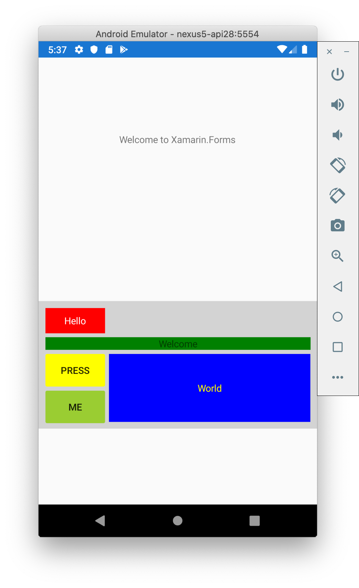

[Table of Contents](README.md)

# Grid Layout
In the previous example, we used `StackLayout` to layout our UI using XAML. `StackLayout` is quite simple, and with nesting, it's possible to create quite complex UI designs. This makes it tempting to use, but if what you want are objects arranged in a linear grid, the [GridLayout]((https://docs.microsoft.com/xamarin/xamarin-forms/user-interface/layouts/grid)) might actually be more appropriate and simple.

> It is suggest you read the [Microsoft Documentation on Grid Layout](https://docs.microsoft.com/xamarin/xamarin-forms/user-interface/layouts/grid) once you've worked through this section.

> The example code for this section is in the [GridDemo folder](/code/Chapter1/GridDemo)

The image below shows an example of a `StackLayout` and a `GridLayout`. The portion of the screen with the light gray background uses `GridLayout`



This section only discussed the `XAML`.

## Top Level StackLayout

```XML
    <StackLayout>
        <!-- Place new controls here -->
        <Label Text="Welcome to Xamarin.Forms" 
           HorizontalOptions="Center"
           VerticalOptions="CenterAndExpand" />

        <Grid Padding="10,10,10,10" VerticalOptions="CenterAndExpand" BackgroundColor="LightGray" >
           <Grid.RowDefinitions>
               <RowDefinition Height="2*"/>
               <RowDefinition Height="*"/>
               <RowDefinition Height="100"/>
           </Grid.RowDefinitions>
           <Grid.ColumnDefinitions>
               <ColumnDefinition Width="Auto"/>
               <ColumnDefinition Width="*"/>
           </Grid.ColumnDefinitions>
        </Grid>
        
    </StackLayout>
```

# Challenge
- Add two sliders as alternatives for entering the weight and height

# Self-Study Task
Redesign the BMI example to use a grid layout.

# References

1. [Microsoft Documentation on Grid Layout](https://docs.microsoft.com/xamarin/xamarin-forms/user-interface/layouts/grid)

----

[Back to Table of Contents](./README.md)