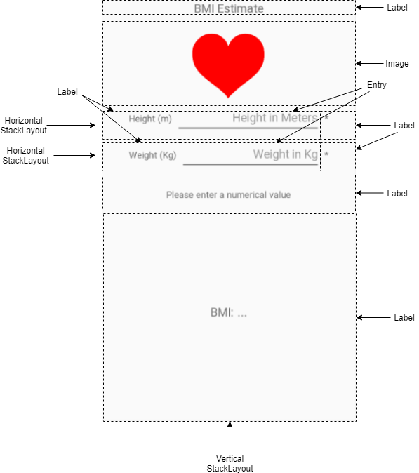
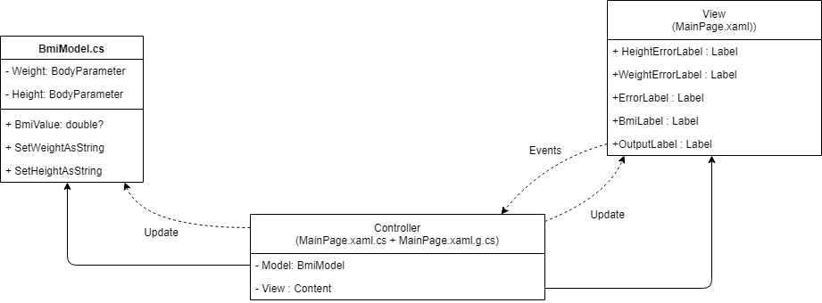
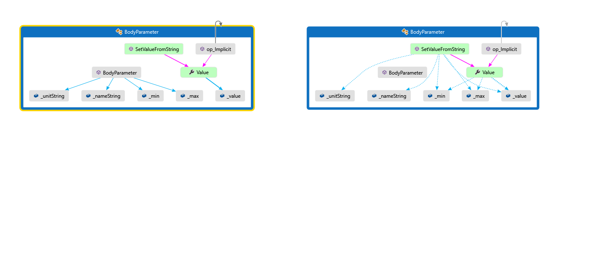
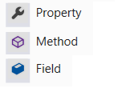
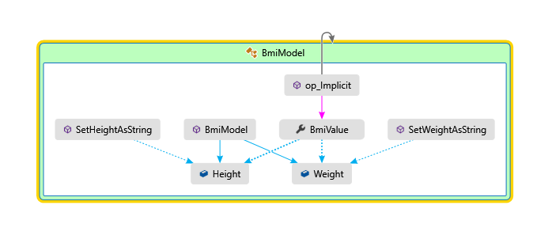

[Table of Contents](README.md)

---

# A second exploration into Xamarin.Forms
In this section, we build another single paged application, only this time we will add a little more complexity. For this, there are some suggested prerequisites including:

- **Static methods** There is one instance of a static method in this example. Worth revising if you're unsure.
- **await and async** If you've not met these two before, you will now! They deserve a much more thorough treatment than is given here. If you want the long treatment, [try this article](https://docs.microsoft.com/dotnet/csharp/programming-guide/concepts/async/). Alternatively, maybe give it a try here first.
- **`out` parameters** Useful for in-place modification, but bordering on obscure. If unsure, [this is a good time to revise this](https://docs.microsoft.com/dotnet/csharp/language-reference/keywords/out-parameter-modifier).

For this section, we will specifically look at the following:

- **StackLayout** - especially the start, centre, end, fill and expand combinations
- **Nested StackLayouts** - including horizontal layout
- **Text `Entry` boxes** - including associated events 

For the sef-study task, you will redesign the layout using a [Grid layout](https://docs.microsoft.com/xamarin/xamarin-forms/user-interface/layouts/grid).

**Task**
It is suggested that you follow along with this project. You won't have to type everything in as the final sources are available.

**A word about MVVM**
It should be stressed this point that a conscious effort is being made to 'keep it simple'. For sure there are benefits from employing patterns, such as Model-View-ViewModel (MVVM) which incorporates 'binding' between components. However, there is already much to take in, so this will be deferred to a later discussion. After all, how is anyone supposed to appreciate the solution to a problem before they've encountered the problem? The intent here is to first become familiar and even comfortable with Xamarin Forms, maybe encounter some spaghetti code mess on route, before recognizing the need and desire to employ patterns to bring things back under greater control. Motivation is key in education, maybe it is _the_ key. Without first establishing a need, clever and elegant solutions risk being passed by as just more 'stuff' to know. 

**A word about unit testing**
In the next section we will encounter Unit Testing. This is something that is easily grasped and can be liberating (I know this sounds a little hippy with bear with me). It is also a great vehicle to practice our C# and to help us reflect on the code being written. Most of all, it allows us to slow down, test what we have crafted, and _build confidence_ so we can progress with greater confidence. It is sometimes said that to go faster, you must first slow down. I recognize that in myself whether writing software, HDL or designing some electronics. Unit testing can help here and can still be quite satisfying.

Although considered good practice, I do not consider unit testing an advanced concept. I remember the first time I encountered unit testing. 30 minutes in and I was wondering, _why had I not known about this before?_ If you've not done unit testing before, maybe you will experience something similar. Visual studio also makes it very easy to implement.

Such testing regimes has become a necessity in part due to the complexity of modern software. In the early 1980's, life was simpler - you wrote BASIC (Beginners All-purpose Symbolic Instruction Code) into an interpreter, and saw instant results. You would often write short little programs to try ideas, and back then, a small red cube moving across the screen scored 'cool points' with your friends. It did not matter so much that your code structure got a little out of control and turned to digital spaghetti.

Now the bar is higher, and we are (even mentally) trapped inside large IDEs and complex frameworks, not always feeling in total control. Even the humble "hello world" application gets entangled with user interface components, classes, Frameworks etc. Yes, you can write console applications and that is fine, but unit testing let's you write just functions to test your own project code all in the same solution. No mess, no UI, just code all kept tidily together. Best of all, as you update your project code, you can keep applying those tests. If you find a bug, you return to the tests. It's similar to testing an electronic circuit where you pull out a component (from a bigger system) and test it in isolation. Trying to do this while still connected to everything else adds further orders of magnitude levels of complexity. Longer term, we aim to write our code more like an electronic circuit - component based and inherently testable.

Unit Testing is also brought in early as it underpins some of the benefits (that MVVM thing again) that will become apparent later in the course. As a heads-up, with certain architectural decisions, it becomes possible to test the code that manages your UI state. If you've ever written an activity (Android) or view controller (iOS) you may recognize this problem. If not, don't worry, you're going to meet it in Xamarin Forms as well. _Testing UI logic_ is a pretty big thing - you've met those bugs, the button that was not re-enabled, the visual element that was not updated, the switch that was ignored etc. 

As a closing point, some perspective. The problem of testing will not go away. Any statefull system that depends on a sequence of events is always going to be trouble. Testing needs to be performed at all levels - user, UI, unit, and manual code walk-through. For sequential logic, full coverage soon becomes impossible to achieve. It's why safety critical systems often use older established technology that has undergone thousands / millions of hours. Anyway, we want to write code and not waffle on about testing, so with that in mind, let's build another app.

# StackLayout
Let's start with a simple example of using stack layout, and explore some of the layout options.
Watch the following video / tutorial.

<p align="center">
<a href="http://www.youtube.com/watch?feature=player_embedded&v=nLUlfb7Ia0g" target="_blank"></a>
</p>

Let's recap.

- `StackLayout` is itself a view, that manages child views. It is given space by its parent. It distributes and allocates the available space between the children.
- A StackLayout can be vertical or horizontal
   - For a vertical StackLayout, it will default to only allocating the _required_ vertical space for each component. It will allocate all the horizontal space it has.
   - For a horizontal StackLayout, it will default to only allocating the _required_ horizontal space for each component. It will allocate all the vertical space it has.
- Where child view requests to expand along an axis, the stack view will try to allocate the maximum space available. Where more than one component asks to expand along the same axis, so the space will be distributed evenly
- Where a child requests to fill along a given axis, it will attempt to resize the control to fill the available space.

## The BMI Estimator
The application is called the 'Body Mass Index' (BMI) Estimator. The task is fairly easy to describe:

> A user enters two numeric values into two text boxes respectively. The first is the person's weight (in Kilograms) and the second is the person's height (in meters). The application validates the input values and if valid, calculates and displays the so-called body mass index (weight / height<sup>2</sup>)

Sounds simple? Well, in relative terms it is (which is why it's used at this point), but when learning a new framework it still provides plenty to think about.

First, let's see what it does:

<p align="center">
<a href="http://www.youtube.com/watch?feature=player_embedded&v=LzxN8CvPero" target="_blank"></a>
</p>

### Setting up the project
This is a similar process to the previous exercise, but as this is (presumably) all new to you, it does not hurt to repeat. 

<p align="center">
<a href="http://www.youtube.com/watch?feature=player_embedded&v=boWrMFmcwcQ" target="_blank"></a>
</p>

Furthermore, there are some addition steps needed to add some images to the project (any maybe some IDE bugs to traverse). Watch the following video to learn how to add image assets to your project.

<p align="center">
<a href="http://www.youtube.com/watch?feature=player_embedded&v=BJ3V_U9dqGY" target="_blank"></a>
</p>

To know more about image resolution for different Android screen densities, [take a read of the section 'Provide alternative bitmaps'](https://developer.android.com/training/multiscreen/screendensities#TaskProvideAltBmp). 

### Building the User Interface (UI)
The user interface is built using one top-level vertical `StackLayout` and three horizontal child `StackLayout` elements.

<p align="center">
<a href="http://www.youtube.com/watch?feature=player_embedded&v=BJ3V_U9dqGY" target="_blank"></a>
</p>

A summary of the UI is shown below:



For those in the know, yes, a grid layout might have been a better choice. However, we are learning about `StackLayout` so let's go with it. 

Rather than watch me write the XAML, [the XAML for this view is shown here](/code/Chapter1/bmi_estimate/final/bmi_estimate/MainPage.xaml)

First add this XAML to your own project then read it through carefully. Maybe try experimenting with Expand and Fill?

- Which elements have a named reference?
- What events are being used? Try typing them in yourself and getting Visual Studio to generate the code behind for you.

#### Some points of interest. 
Note the properties of the `Entry` types:

```XAML
      <Entry 
          Placeholder="Height in Meters" 
          HorizontalOptions="FillAndExpand"
          HorizontalTextAlignment="End"
          VerticalOptions="Center"
          Keyboard="Numeric" 
          TextChanged="Handle_HeightChanged"
          />
```

The keyboard type is set to "Numeric". 

- **Experiment** Try different keyboard types. If you can contrast Android and iOS. Note the software keyboard is native to each platform.

The property `TextChanged` is an event handler. Look in the [code-behind](/code/Chapter1/bmi_estimate/final/bmi_estimate/MainPage.xaml.cs) and locate the event handlers. 

Before writing any further code behind this XAML, let's take a step back and consider the software architecture. 

### The Architecture
The Model-View-Controller (MVC) 'pattern' is commonly used in native Android and iOS projects, so I've chosen to stick to something that resembles this simple paradigm. The Xamarin community do tend to prefer another known as MVVM, and for good reasons, but let's hold back on that for now.

Consider the figure below:



Let's look at each aspect of MVC in turn.

- **Model** The Model is pure C#.NET code. It encapsulates the data and all the operations performed on it, including any data-type conversion. It also exposes an API to update and read back the values. Because it is pure C# code, this lends it to being more easily tested.
- **View** The View is written in XAML, and only contains View objects, including objects of type `Label`, `Image` and `Entry`. The view tends to be computer generated (to some extent). There are UI Test Frameworks, but these are harder to use than code testing tools.
- **Controller** In the variant of MVC, the Controller coordinates information flow between the Model and View (so they never have to meet!). It handles events generated by the view objects and updates the model. It also contains UI logic, which updates view objects with newly calculated values and UI state changes (such as hiding/showing different UI elements). In general, if the Model class made a spontaneous change (e.g. via an incoming network packet), then these changes would be observed by the controller and updates to the view would be made, although the example here does not do this.

> A key with this version of MVC is that the Model and View are not directly connected. The controller is said to have _strong references_ to both the model object(s) and the view objects. We say they are _tightly coupled_. In fact, it's often the case that the controller instantiates both model and view objects (whereby it may be said to _own_ the model and view objects). A look under the hood and this will be apparent. 

A downside with the MVC architecture is that the controller can quickly bloat and become overly complex. If the UI changes, this can results in complex changes to the controller. Furthermore, _they (and the UI logic they contain) are also harder to test_ especially as they are so tightly coupled to the UI (it's harder to simulate UI based events). 

### Building the Model Code
We will write the UI logic last. Having designed a UI, we not turn our attention to the Model. There are only two central data parameters, _weight_ and _height_. However, both of these each have their own minimum and maximum values. They also have individual units and names which may be needed for display purposes. 

- An early decision was made to encapsulate all this relevant information into the `BodyParameter` class and test.

Looking at the UI, it is observed that the numerical values entered are not numbers, but strings. Somewhere these strings are going to need to be _parsed_ to double values. These values need to be validated in code, and furthermore, this needs to be tested. 

- Values may be out of range - this needs to be checked and handled in code
- String parsing is an operation that may potentially fail - such a failure needs to be handled gracefully

- It was also decided (rightly or wrongly) to include the parsing and validation in the model objects. This was (in part) to make it easier to test the validation algorithms.

Finally, both parameters are encapsulated inside a `BmiModel` class. This will be responsible for calculating the Body Mass Index ( weight / height<sup>2</sup>

One criteria for all the above is that there shall be no reference / dependency on the UI code in the model classes. It should be possible to use them in a stand-alone command line application for example. More relevant to this case, they should be useable inside a _Unit Test_ project.

> If we can get the model right, in principle, the rest of the application will fall into place more easily.

**Note** I don't want to create the illusion that the app was written in such a linear and logical order as is presented here. My brain at least does not work quite like that! The truth is there were a few iterations until a model design was settled upon. Yes there are more formal ways to model data and OO applications - for that, there are no doubt many excellent courses and books (none of which I've taken or read ;). Moving on...

#### `BodyParameter` class
The weight and height are encapsulated in the `BodyParameter` class. This class is responsible for converting, storing, describing and validating each parameter.

Creation of the `BodyParameter` class is shown in the next video:

<p align="center">
<a href="http://www.youtube.com/watch?feature=player_embedded&v=IEMC40W75dA" target="_blank"></a>
</p>

Visual Studio (Enterprise) has a useful feature that allows you to visualize your objects as a "Code Map". The Code Map for the `BodyParameter` class is shown below:

<table>
   <tr>
      <td>
         
      </td>   
      <td>
         
      </td>
   </tr>
   <tr>
      <td colspan = "2">
         _Code Map for the `BodyParameter` class_ Left: Write operations; Right: Read operations. Calls are shown with purple arrows. Field write operations are shown as solid blue arrow. The field read operations are shown as dashed blue arrows.*
      </td>
   </tr>
</Table>

[The `BodyParameter` class code is shown here](/code/Chapter1/bmi_estimate/final/bmi_estimate/BodyParameter.cs). Before running ahead to write the UI Logic, we first pause to create a **Unit Test** project, and to test our new data model class.

#### Unit testing
Setting up a unit test project in Visual Studio is mostly straightforward. Watch the following video to see the steps:

<p align="center">
<a href="http://www.youtube.com/watch?feature=player_embedded&v=NC4DJVDy7j8" target="_blank"></a>
</p>

Some check points to consider:

- Add a new MSTest (C#) unit test project to your solution
- Make sure your class being tested is public
- In the Unit Testing project, add a reference to the project containing the model code (Right click Dependencies->Add Reference)
- Note the namespace of the unit testing project is probably different to the code under test. Add `using <namespace>` where possible.

Building the unit tests builds confidence in the code. All tests passing does not guarantee everything is perfect of course, and it's a fairly common experience that more tests may be added later as more obscure bugs are found, but every effort should be made to cover all eventualities. Don't be surprised if you write more test code than there is code being tested!

> For hardware chip designers, it would be normal to spend more than 2/3 project development writing `testbenches` (the hardware equivalent to unit testing). Even then, hardware gets shipped with bugs.

[The unit tests used for demonstration are shown here](/code/Chapter1/bmi_estimate/final/ModelTest/UnitTest1.cs)

Now we add one more layer of abstraction to the Model.

### The `BmiModel` class

The final `BmiModel` class is created to encapsulate both the height and weight (both of type `BodyParameter`) and perform the calculation for the BMI value itself.

Watch the following video to see the `BmiModel` class being created

<p align="center">
<a href="http://www.youtube.com/watch?feature=player_embedded&v=eZar2Tr9N7A" target="_blank"></a>
</p>

To recap, the `BmiModel` class was created and unit tests were added before proceding with the rest of the project. 

[The source code is here](/code/Chapter1/bmi_estimate/final/bmi_estimate/BmiModel.cs)

[The beginnings of some unit tests are given here](/code/Chapter1/bmi_estimate/final/ModelTest/UnitTest1.cs)

The Code Map is shown below.

 
 
Note the properties `Weight` and `Height` are of type `BodyParameter`. If we've written all the tests to cover as many eventualities as possible, and all tests pass, then it's time to write UI logic to synchronies the UI elements to the model. This will be done in a way that tries to be more familiar to the learner (as opposed to being purist).

### UI Logic - hooking it all up
The controller in this case is the code behind the XAML, that is [MainPage.xaml.cs](/code/Chapter1/bmi_estimate/final/bmi_estimate/MainPage.xaml.cs)

Watch the following video to see the creation of the controller.

<p align="center">
<a href="http://www.youtube.com/watch?feature=player_embedded&v=U10QCMcdkA8" target="_blank"></a>
</p>

### Adding some Animation
As a final step, let's add a little UI eye-candy. Watch the following video to add an animated effect to the error label.

<p align="center">
<a href="http://www.youtube.com/watch?feature=player_embedded&v=o3oHiLsMsHA" target="_blank"></a>
</p>

> **Task** In the initialisation code, set the initial opacity of the error label to 0.0.

Take a look at this code and you will notice the keyword `async` and `await` in different places. The reason is the following code:

```C#
     private async Task GiveFeedback(string MessageString)
     {
         ErrorLabel.Text = MessageString;
         await ErrorLabel.FadeTo(1.0, 500);
         await Task.Delay(2000);
         await ErrorLabel.FadeTo(0.0, 500);
     }
```

This code sets the text of a `Label`(while it is usually invisible), fades it's colour to black, waits for 2s, then fades back to white again. The _asynchronous_ waits (`await`) essentially resume control back to the UI code until the following task (run in the background) has completed.

> any function that performs an `await` must itself be marked as asynchronous using `async`

Let's now follow the sequence of events from a character being entered into a text box (type `Entry`) through to model updates and consequential UI updates:

### Event Handler
The two event handlers are shown below. Note the addition of the `async` keyword.

```C#
  private async void Handle_HeightChanged(object sender, TextChangedEventArgs e)
  {
      await SyncViewAndModelAsync(EntrySource.Height, e.NewTextValue);
  }
  private async void Handle_WeightChanged(object sender, TextChangedEventArgs e)
  {
      await SyncViewAndModelAsync(EntrySource.Weight, e.NewTextValue);
  }
```

Whenever a character is added or removed, one of these is event handlers are called. What calls it and when? Hidden away there is an _event queue_. As events are generated (typically by user input, but could be a timer or a network response), so events are added to the queue. As as this queue is processed (each event in turn), so methods are called _in sequence_. All this is done on the _main thread_. The trick is to keep each task short to give the UI a smooth and responsive feel.

> If you don't know what threads are, for now consider them functions running in parallel to the code we have been writing so far. All UI code must/should be running on the _main thread_. If you run some code that takes a significant time to complete (such as a delay, animation or write to disk), it is not acceptable to block up the main thread while waiting for it to complete. Doing so would render the UI unresponsive and risk the app being kicked by the host operating system. You need to find another way - this is the beauty of `async`/`await`. It allows you to interrupt / resume a method to break it into short bursts and for other tasks to run while it's waiting. 

> Do not confuse `await` with running _code_ on another thread. `await` will simply yield execution from wherever it is called (mid-method) and allow the next task in the main thread queue to be performed (or sleep if there is nothing else to do). You typically `await` on some hardware device, such as a file write (disk controller), network transaction (network interface), delay (Hardware Timer) or animation (GPU possibly). Once the device has performs the operation, this will notify the operating system and in turn, this will generate a new event on the main thread queue. When this event is processed, the _awaiting_ method resumes where it left off (mid method, how clever!). Now, notice I mentioned device here. You wait on another (non CPU) device to complete a task. In effect, this is parallel processing through hardware (the only true type!) - what you cannot do is `await` on a CPU intensive calculation unless it spins out another thread. From the caller's perspective, it's all happening on the main thread.

Ok, let's trace what happens next. 

- The asynchronous method `SyncViewAndModelAsync` is called. Two parameters are passed:
   - The Entry Source (`EntrySource.Height` or `EntrySource.Weight`) to indicate which type of parameter is being updated
   - The text from the `Entry` box that has changed

Remember the MVC discussion above? Well, there is the controller part where we _synchronize the View and the Model_

```C#
private async Task SyncViewAndModelAsync(EntrySource src, string newValueAsString)
{
   bool success;
   string ErrorString;

   //Choose which parameter we are using
   if (src == EntrySource.Height)
   {
       success = Model.SetHeightAsString(newValueAsString, out ErrorString);
       HeightErrorLabel.IsVisible = !success;
   }
   else
   {
       success = Model.SetWeightAsString(newValueAsString, out ErrorString);
       WeightErrorLabel.IsVisible = !success;
   }

   if (Model.BmiValue != null)
   {
       BmiLabel.IsVisible = true;
       OutputLabel.IsVisible = true;
       OutputLabel.Text = string.Format("{0:f1}", Model.BmiValue);
   }
   else
   {
       BmiLabel.IsVisible = false;
       OutputLabel.IsVisible = false;
   }

   //Animate message to user
   if (!success)
   {
       await GiveFeedback(ErrorString);
   }

}
```

Now how the parsing errors or out of range values are handled. For example:

```C#
   if (src == EntrySource.Height)
   {
       success = Model.SetHeightAsString(newValueAsString, out ErrorString);
       HeightErrorLabel.IsVisible = !success;
   }
   else
   {
       success = Model.SetWeightAsString(newValueAsString, out ErrorString);
       WeightErrorLabel.IsVisible = !success;
   }
```

The little `*` symbols are displayed next to entry fields that don't validate. Remember that the model object contained the validation code (so we could test it).

Now we attempt to display a BMI value, or blank it if not valid

```C#
   if (Model.BmiValue != null)
   {
       BmiLabel.IsVisible = true;
       OutputLabel.IsVisible = true;
       OutputLabel.Text = string.Format("{0:f1}", Model.BmiValue);
   }
   else
   {
       BmiLabel.IsVisible = false;
       OutputLabel.IsVisible = false;
   }
```

Now for the flashy bit! This displays the error message (the reason why the model code validation fails) using a label that appears briefly before fading out. Again, note the `await` used here.

```C#
   //Animate message to user
   if (!success)
   {
       await GiveFeedback(ErrorString);
   }
```

Finally, the asynchronous `GiveFeedback` method used to perform the animated fades:
 
```C#
  private async Task GiveFeedback(string MessageString)
  {
      ErrorLabel.Text = MessageString;
      await ErrorLabel.FadeTo(1.0, 500);
      await Task.Delay(2000);
      await ErrorLabel.FadeTo(0.0, 500);
  }
```

This is the source of all that `async` / `await` trouble! Here is how it works in simple terms:

- The label text property is set (on the main thread)
- A background tasks is started to fade in the label. This will take 0.5 seconds (500ms), so execution is yielded to the UI event queue in case anything else is waiting. An animation is running in the background (we don't need to know the mechanism, it could be the GPU, or a parallel thread etc..). 
- After 0.5s, the animation will complete and will generate an event, which once processed, resumes the `GiveFeedback` method. Another asynchronous task is started, this time to simply wait for 2s (2000ms). Again, execution is yielded until this is complete. A timer is now running in the background (again, could be hardware based).
- After 2s, the timer generates an event and once processed,  execution once again resumes. This time it is to fade the label out. Once this is done, execution will resume, the function with exit. All the above is performed on the main thread. How the asynchronous tasks operate in parallel is hidden from us.

All the time this is going on, the UI remains responsive. Had these tasks not been asynchronous, the UI would have been locked up for at least 3 seconds, which is not a good user experience.

> Not having to write multi-threaded code is a good thing as it is infamously difficult to debug and test. One might even go as far as to say it is dangerous.

## Final Code
[All the code for this project is found in the final folder here](https://github.com/UniversityOfPlymouthComputing/MobileDev-XamarinForms/tree/master/code/Chapter1/bmi_estimate/final)

## Summary and Reflection
This section was based around a simple single page application, the BMI estimate. The architecture was based on a variant of "Model View Controller" (MVC).

- Model Code contained data, methods to perform calculations on the data and type conversions. It contained no UI code, and had to knowledge of either the controller or view
- View code was written in XAML. Nested StackView objects were used for layout. A particular emphasis was made on understand the meaning of the terms start, center, end, fill and expand and their combinations.
- Controller code was the code-behind the XAML. This has the task of synchronizing UI and Model objects. The Controller instantiated the model and held references to the view objects. It also has the task of managing the UI State, including the showing and hiding of different labels depending on what data was entered.

Unit tests were introduced early as a best-practice. The Model code proved to be highly testable. The Controller was not unit tested however. The reason is that it would be more challenging.

Central to the controller code was `SyncViewAndModelAsync`. [The source can be seen here](/code/Chapter1/bmi_estimate/final/bmi_estimate/MainPage.xaml.cs).

- Much of the logic in this method is concerned with managing UI State.
- If unit tests were written for this method, consider the following question: _How would the results would be checked?_

The problem with testing this method is that it depends on the view objects (UI) as well. A unit test application would have to somehow instantiate the view objects as well. Despite efforts to factor out code, it is still not obvious how this would be achieved seamlessly. This is where MVVM comes in and is a topic that will be introduced in subsequent chapters.

We tentatively met `async` and `await`. These C# language features were put to good effect to make sequencing of animations and delays super easy. Asynchronous programming was also contrasted with multi-threaded programming. Asynchronous code is not necessarily multi-threaded.

Next, we will discuss some more layout options.

----

[NEXT - Grid Layout](grid-layout.md)
