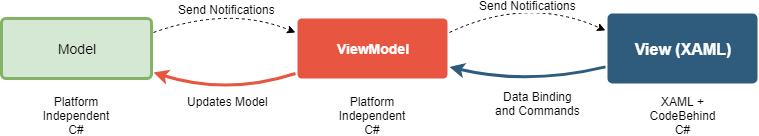

[Contents](/docs/README.md)

----

# Model-View-ViewModel (MVVM)
In the previous example, a Model-View-Controller architecture was used. For simple applications, this works well with the following caveats:

- It does not tends to scale well as controllers get complicated
- The controller is tightly coupled with the view, making it difficult to unit test

Despite this, many excellent applications have been written with MVC. 

> The Model-View-ViewModel (MVVM) architecture is similar to MVC, only it is not tightly coupled to the view making it easier to test.

[From the Microsoft Documentation](https://docs.microsoft.com/en-us/xamarin/xamarin-forms/xaml/xaml-basics/data-bindings-to-mvvm) (accessed 24/07/2019)

> The Model-View-ViewModel (MVVM) architectural pattern was invented with XAML in mind. The pattern enforces a separation between three software layers — the XAML user interface, called the View; the underlying data, called the Model; and an intermediary between the View and the Model, called the ViewModel. The View and the ViewModel are often connected through data bindings defined in the XAML file. The BindingContext for the View is usually an instance of the ViewModel.

_From: https://docs.microsoft.com/en-us/xamarin/xamarin-forms/xaml/xaml-basics/data-bindings-to-mvvm (accessed 24/07/2019)_

The key point here is the connection between the View Model (which probably sounds like a Controller at this point) and the View: _they are not as tightly coupled as MVC_.

- The View knows something of the ViewModel, but the ViewModel does not know any specifics about the View
- The View Model knows something of the Model, but the Model knows nothing about the ViewModel

This is summarised in the following figure.


The View Model and Model objects will contain no knowledge or reference to UI types. Only the view (XAML and code-behind) has knowledge of such types. The View Model and Model objects can therefore be compiled as part of a simple unit testing or even command line project.

This is achieved through the use of a _binding layer_ between the ViewModel and the View. Xamarin.Forms comes with a baked-in binding mechanism, but others are available. This is illustrated in the next figure:



Consider two possible scenarios:

1. The user makes a change to a UI element that has a property bound to a ViewModel property. This automatically causes an update to the ViewModel property without the need to write any code. The setter of that property may (or may not) then process the value and pass it to the Model via a public API. A common task for ViewModel is data conversion and updates to the Model.
2. A waiting network connection (invoked from within the Model) returns a new value and asynchronously updates a value in the model. This is advertised as an event. The ViewModel is listening for such events and so will observe the change. It then changes one of the bound properties which in-turn, provokes an automatic update in the UI

> The ViewModel is therefore the arbitrator between events in the View and events in the Model, marshalling data between them.

**Application State**
The Models define the _application state_ - Within the Model objects are the actual data, plus any methods that operate on the data. The ViewModel should not contan any domain specific data. A good Model should be self contained and highly testable.

**UI State**
The ViewModel also has state, but it is nothing to do with the domain Model data. These are typically properties relating to UI State, such as whether a Label is visible (`bool`), the selected row of a table (`int`) etc. A good view model will also be highly testable. In fact one of the objectives is to be able to simulate UI logic (clicks, text input etc.) through calling methods on the ViewModel, via a unit testing framework and without the need to link in UI libraries.

_You need to see it to fully appreciate this_

So how does this work? Starting with the interface between the ViewModel and View, some key conceptual points to note are as follows:

- Through "bindings", _properties_ of user interface objects will be bound to properties in the view model. This means when one is changed, the other may be automatically updated without having to write any code.
   - Often there is a one-to-one mapping, such as the `Text` propery of a `Label` (type `string`) to a `string` property in the view model.
   - Where there is no one-to-one type mapping, a _Value Converter_ can be inserted between them so that the ViewModel can avoid using UI types. 
- Bindings can be uni-directional or bi-directional. 
    - For uni-directional bindings, you also have control in which direction changes are propagated.
- Content pages and UI Components have a property called the `BindingContext` - this is typically the ViewModel
    - It is often the case that the View instantiates the ViewModel.
- It is also possible to bind UI elements to other UI elements (no view model involved)
- There can be multiple View Models and Models for any given View

For the interface between the ViewModel and Model, some key conceptual points to note are as follows:

- It is often the case that the ViewModel instantiates the Model
- The link between them may be limited to the ViewModel calling synchronous (public) APIs on the Model, and storing returned values.
    - If the returned values are saved in bounded properties in the ViewModel, then the UI may be automatically updated.
- The ViewModel can also invoke Asynchronous methods on the Model - the call-back is typically performed using .NET events

Ok, that's a lot of stuff and I suspect it does not yet hold much meaning until you see it in practise. For this, we need a simple example to illustrate all the key points.

## Part 1 - The Wise Sayings Application and Familiar Code

Like the examples before it, the example that is developed in this section is also trivially simple. This is on purpose. It starts with the familiar MVC architecture, and is evolved incrementally to a testable MVVM archirecture with Model data being pulled from the cloud (Azure Function). Although the resulting MVVM mode is longer and possibly overkill for such a simple application, it is hopefully illustrative. You can then apply it yourself to more real-world applications that scale beyond the trivial.

> Anticipate the difficult by managing the easy. Lao Tzu

All the code is available on the GitHub site. It is **strongly suggested** you open and examine each example as we progress.

[Part 1 is here](/code/Chapter2/Bindings/HelloBindings-01)

### The Button Event Handler
The view is defined in XAML along with some code-behind to manage the UI logic

Looking at the XAML and code-behind, there are some key points to note.


When the `Button` is clicked, it invokes the event handler `MessageButton_Clicked`
```C#
  private void MessageButton_Clicked(object sender, EventArgs e)
  {
      MessageLabel.Text = Sayings[next];
      next = (next + 1) % Sayings.Count;
  }
```  
The event handler is specified in XAML using the `Clicked` property as follows
```XAML
  <Button x:Name="MessageButton"
          Text="Click Me" 
          HorizontalOptions="Center" 
          VerticalOptions="CenterAndExpand"
          Clicked="MessageButton_Clicked"
          />
```

### The Toggle Switch Event Handler
The binary toggle switch is of type Switch, which is instantiated in XAML. 

```XAML
  <Switch x:Name="ToggleSwitch"  
          HorizontalOptions="Center"
          VerticalOptions="End"
          IsToggled="true"
          Toggled="ToggleSwitch_Toggled"
          />
```

Note the event handler `Toggled` is set to the `ToggleSwitch_Toggled` method in the code behind:

```C#
  private void ToggleSwitch_Toggled(object sender, ToggledEventArgs e)
  {
      MessageLabel.IsVisible = ToggleSwitch.IsToggled;
      MessageButton.IsEnabled = ToggleSwitch.IsToggled;
  }
```
Note the role is simply to enable / disable the Switch and the Message label. This is UI state. 

### The Model Data
The model data can be considered to be the instance variables `Sayings` and `next`. These are not yet properties, and yes, it would be better practise to make them properties..but all in good time.

## Part 2 - Binding Between UI Elements using Code
[Part 2 is here](/code/Chapter2/Bindings/HelloBindings-02). Build and run this to see what it does. Note the strange behaviour once you get back to the first saying. This was added to illustrate a point and will be removed later.

This step is simply to illustrate the mechanism of binding. Code is used to set up the bindings as it exposes the APIs that are leveraged by XAML in subsequent sections. This can be very helpful for demystifying what is going on.

To begin with, a three way binding will be set up between the `MessageLabel`, the `ToggleSwitch` and the `MessageButton`.           

We will bind `ToggleSwitch.IsToggled` to both the `MessageLabel.IsVisible` and `MessageButton.IsEnabled`. We will also set this up initially as a two-way binding. _A change in one will result in an automatical change in the other_. 

1. A change to `TooglSwitch.IsToggled` will _automatically_ change both `MesageLabel.IsVisible` and `MessageButton.IsEnabled`
1. A change to `MesageLabel.IsVisible` will _automatically_ change both `ToogleSwitch.IsToggled`. This in turn will activate (1)
1. A change to `MesageButton.IsEnabled` will _automatically_ change both `ToogleSwitch.IsToggled`. This in turn will activate (1)

### Binding Relationships
The figure below captures the necessary relationships to establish a binding between two properties


Becoming familiar with the notation is important here as it can otherwise get confusing. Some points to observe:

- The _Target_ is typically a UI object, and must interit from `BindableObject` (which provides the property `BindingContext`)
- The `BindingContext` is a reference to the source - the source can be any type of object (hence is more loosely coupled)
- A binding is setup between specified properties of the source and target objects
    - The target property is of type BindableProperty
    - The source property is loosely specified by name (as a string). 
    
As you can probably infer, the requiremens for the target are much more constrained than the source. The target does not know the concrete type of the source or it's bound property (just it's name). This means _the source can by almost any type object_.  It is commonly either a ViewModel or another UI component. Equally the source property is only known by name (string). Something known as [reflection](https://docs.microsoft.com/en-us/dotnet/csharp/programming-guide/concepts/reflection) will be used to find a property matching this name at run-time.

### Binding Properties of the Switch to the Label and Button
The first point to note is that the event handler for the Switch has been removed.

```XAML
     <Switch x:Name="ToggleSwitch"  
             HorizontalOptions="Center"
             VerticalOptions="End"
             IsToggled="true"
             />
```     

Next, look at the code-behind where the bindings are set up in code.

```C#
  public MainPage()
  {
      InitializeComponent();

      MessageLabel.BindingContext = ToggleSwitch; //Source
      MessageLabel.SetBinding(Label.IsVisibleProperty, "IsToggled", BindingMode.TwoWay);

      MessageButton.BindingContext = ToggleSwitch;
      MessageButton.SetBinding(Button.IsEnabledProperty, "IsToggled", BindingMode.TwoWay);
  }
```        

The `Switch` will be the source object. The `MessageLabel` and `MessageButton` will be targets. This creates a one-to-many realationship

First the `MessageLabel`. 

```C#
   MessageLabel.BindingContext = ToggleSwitch;
```

Here the _target_ is `MessageLabel` and the _source_ is `ToggleSwitch`.

Now the interesting bit:
```C#
MessageLabel.SetBinding(Label.IsVisibleProperty, "IsToggled", BindingMode.TwoWay);
```


With bindings there is first the `BindingContext` which acts as a reference to the **source** object. In uni-direction bindings, the default is always from source to target, where the source here is `ToggleSwitch` and the target is the `MessageLabel`. For two-way bindings, either could act as the source for the other.

Now the `SetBinding` method is called on the target (`MessageLabel`) - remember this is a specific instance on `Label` instantiated via XAML. 

- First we provide the **target property** as the first parameter. Note this is a static member (type `BindableProperty`) of the `Label` class. We wont worry about the specifics of this. What we need to remember is that it wll be nammed as the instance property (`IsVisible`) appended with the word `Property`  
- Next we give the name of the **source property**, but this time as a `string` (we will see why this is important later). This string is the name of the source property `IsToggled`.

----
[Contents](/docs/README.md)
