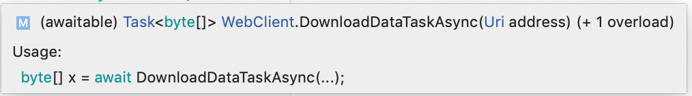

[Contents](README.md)

----

[Prev](anonymous-functions.md)

# Asynchronous Programming
I will try and keep this section shorter than the previous one. Again, this section discusses an important part of the C#.NET language, especially if you wish to work with the Xamarin.Forms APIs.

Let's begin with what this seciton is not about, and that is multithreaded programming, and for two reasons:

1. Multithreaded programming is a whole topic in it's own right and beyond the scope of this course (shame as it's a personal favourite ;)

1. For practical purposes, the approch we are about to meet is in many ways an alternative approach to multi-threaded programming.

For those with a background in multi-threaded programming, this might raise some eyebrows. What about blocking hardware? Well, my own reaction was the same, but C# (like some others) shows us that there is another way, and that way (when it can be applied) is much easier and safer to program.

> The underlying principle of asynchronous programming is that the slow devices (storage, network interfaces, timers) we often wait for are indepednent electronic devices, and so by their very nature, run in parallel to the CPU. The CPU does not need to stop and wait for such devices, it only needs to know when a device is ready.

The issue we are addressing is the asynchronous nature of the comuter systems and human interaction. 

Consider the user interface of a mobile device and it's touch screen. It responds to taps or other gestures _whenever the human operator feels inclined_. The comuter does not know when a user is going to tap the screen (human input is the epitomy of asynchronous input!). So modern devices are reactive, or _event driven_.

- When a user touches a screen, this is detected by the operating system (via hardware mechanisms we don't concern ourselves with), and this in turn it generates an _event_. 
    - An event is a record of something that happened together with some registered consequence (such as a method call, also known as an _event handler_)
- Upon receipt, the event is added to a queue (the event queue) by the operting system
- Events are pulled off the queue in turn and their respecitve methods (event handlers) are called.
- Events are perform sequentially and allowed to complete, _they should be short lived_ and usualy performed in the order they are recieved.
    - Event handlers that are not short lived need to be broken down in to additinal events 
    - As we shall see, this is super easy in C#
- When there are no events in the event queue, the operating system can put the application into a waiting state (saving CPU cycles and hence battery). 
    - Another touch event will "wake" the application again (again, handled by the operating system, so not your problem!)


Almost all of the above turns out to be automatic. Our task is to register and write event handlers and ensure they don't block the CPU for any significant amount of time (we are talking milliseconds here). _Anything that blocks for too will render the user interface unresponsive and could result in our application being kicked by the operating system._

 > Ah ha! (I hear some of you cry!). What if I'm uploading data to a server? That can take seconds! (Don't you just love catching out tutors?)

 Yes indeed, thre are many things that can take seconds, some more obvious than others, including:

 - network transactions (Wifi or Bluetooth)
 - Saving data to internal storage 
 - Animations
 - Waiting on a timer
 - ...More

So how do we perfom any of the above in an event handler? The answer lies in turning a single event handler into a multiple event handler, and for that, we use `await` and `async`

## `await` and `async` in action
I'm going to work through an example broken into 4 parts. 

Each example is contained within the folder [ImageFetch](https://github.com/UniversityOfPlymouthComputing/MobileDev-XamarinForms/tree/master/code/Chapter2/ImageFetch)

The following video shows the final product in v4. 

<p align="center">
<a href="http://www.youtube.com/watch?feature=player_embedded&v=6U7aAykQiac" target="_blank"></a>
</p>

Note the following:

- When the Fetch button is tapped, the image is downloaded from the Internet. I have throttled the download speed in the Android Emulator to emphasise this point.
- Throughout the operation of the application, the UI always remains responsive. Clicking the toggle button reveals and hides the label even during a download or while the image is animating.
- Nowhere in the code will we create any threads (for those with experience of multi-threaded programming)

There are three additional steps on the way to this:

- **v1** Downloads the image synchronously (demonstrating blocking)
- **v2** Downloads the image asynchronously. This allows the UI to remain response. It uses lambdas as a completion handler. This helps to explain how asynchronous APIs work.
- **v3** Also downloads the image asynchronously, only this time, the code is significantly simplified using `await`
- **v4** Reenforces the points in v3 by adding a sequence of animations, again using `await` to keep the code incredibly simple.

### User Interface
The user interface `MainPage.xaml` is common to each step.

Again, it's not going to win any design awards but I'm striving to keep the code as concise and simple as possible. In fact, you might be surprised how little code is needed.

The XAML is shown below:

```XML
<?xml version="1.0" encoding="utf-8"?>
<ContentPage xmlns="http://xamarin.com/schemas/2014/forms"
             xmlns:x="http://schemas.microsoft.com/winfx/2009/xaml"
             xmlns:d="http://xamarin.com/schemas/2014/forms/design"
             xmlns:mc="http://schemas.openxmlformats.org/markup-compatibility/2006"
             mc:Ignorable="d"
             x:Class="ImageFetch.MainPage">

    <StackLayout x:Name="MainStackLayout">
        
        <Label Text="Welcome to Xamarin.Forms!"
               HorizontalOptions="Center"
               VerticalOptions="CenterAndExpand" />

        <StackLayout Orientation="Vertical"
                     VerticalOptions="CenterAndExpand"
                     x:Name="InnerStack">

            <Label x:Name="HiddenMessage"
                   Text="Peek-a-boo"
                   VerticalOptions="CenterAndExpand"
                   BindingContext="{x:Reference ToggleSwitch}"
                   IsVisible="{Binding Path=IsToggled}"
                   HorizontalOptions="CenterAndExpand" />

            <StackLayout Orientation="Horizontal"
                         HorizontalOptions="CenterAndExpand">

                <Button x:Name="FetchButton"
                        Text="Fetch"
                        HorizontalOptions="CenterAndExpand"
                        VerticalOptions="Center"
                        Clicked="FetchButton_Clicked" />

                <Switch x:Name="ToggleSwitch"
                        VerticalOptions="Center"
                        HorizontalOptions="CenterAndExpand"/>

            </StackLayout>

            <ActivityIndicator x:Name="Spinner"
                                HorizontalOptions="Center"
                                VerticalOptions="Center"
                                IsEnabled="True"
                                IsVisible="True"
                                IsRunning="False" />
        </StackLayout>
    </StackLayout>
</ContentPage>
```

### Version 01 - Using a Synchronous API
The first version is intended to illustrate the problem we are solving. In this example, we download 
Open the task in the folder v1 and examing the code-behind `MainPage,xaml.cs`

```C#
public partial class MainPage : ContentPage
{
    public MainPage()
    {
        InitializeComponent();
    }

    private void FetchButton_Clicked(object sender, EventArgs e)
    {
        Spinner.IsRunning = true;
        FetchButton.IsEnabled = false;
        var img = DownloadImageSync("https://github.com/UniversityOfPlymouthComputing/MobileDev-XamarinForms/raw/master/code/Chapter2/ImageFetch/xam.png");
        img.VerticalOptions = LayoutOptions.CenterAndExpand;
        img.HorizontalOptions = LayoutOptions.CenterAndExpand;
        img.Aspect = Aspect.AspectFit;
        MainStackLayout.Children.Add(img);
        Spinner.IsRunning = false;
        FetchButton.IsEnabled = true;
    }

    Image DownloadImageSync(string fromUrl)
    {
        using (WebClient webClient = new WebClient())
        {
            var url = new Uri(fromUrl);
            //Download SYNCHRONOUSLY (NOT GOOD)
            var bytes = webClient.DownloadData(url);
            Image img = new Image();
            img.Source = ImageSource.FromStream(() => new MemoryStream(bytes));
            return img;
        }
    }
}
```

When the `Fetch` button is tapped, a single event handler `FetchButton_Clicked` is invoked. Within this code, the image is downloaded using the following line:

```C#
var img = DownloadImageSync("https://github.com/UniversityOfPlymouthComputing/MobileDev-XamarinForms/raw/master/code/Chapter2/ImageFetch/xam.png");
```

The method `DownloadImageSync` performs the download and once compelete, returns an `Image`. This image is then  added to the UI.

> We say this method is _synchronous_ because it does not return until all the tasks have been completed.

The code for `DownloadImageSync` is shown below:

```C#
Image DownloadImageSync(string fromUrl)
{
    using (WebClient webClient = new WebClient())
    {
        var url = new Uri(fromUrl);
        //Download SYNCHRONOUSLY (NOT GOOD)
        var bytes = webClient.DownloadData(url);
        Image img = new Image();
        img.Source = ImageSource.FromStream(() => new MemoryStream(bytes));
        return img;
    }
}
```

What is _good_ about this code is that everything is performed in sequence. It is easy to follow and debug. However, it is also fundamentally flawed due to the following line:

```C#
var bytes = webClient.DownloadData(url);
```

The `DownloadData` method of `WebClient` is _synchronous_. Execution will not progress past this method call until all the data has downloaded. We say such behaviour is **blocking**. A problem with blocking is that the UI event queue will not be processed, rendering the user interface as unresponsive.


**TASK**
- Run the code in **v1**. Click the `Fetch` button and then immediately after, try clicking the toggle switch.

- Try experimenting with the Android Emulator Network type settings


If you drop the network speed to very low rates, you might even get a warning about an _unresponsive application_.

> The traditional solution to managing blocking code is to put it in a separate _thread_ (code that runs in paralle). However, this adds significant complexity and real risk of introducing bugs that are notoriously difficult to find.

A safer and more elegant solution is to provide an _asynchronous_ alternative.

### Version 02 - Asynchronous Download with a Completion Handler
A word of caution with this section. _If at any point you get confused, do not blame yourself_. I will try my best to be clear, but I confess I struggle to do so, even for such a simple example. You might argue this is as much a reflection of the approach as it is my inability to explain clearly. However, when we come to contrast it with `v3`, you will hopefully see why I'm so keen on the modern approach in C# (`async` and `await`). Now you've been forewarned, read on in the comfort that it will get better...

Open the `v2` version of the project, build and test again. 

> Note how this time, the `Fetch` button remains responsive even during the download of the image.

This is a key point. The question is, how it this achieved?

Below is the updated code-behind, which has been reworked to make use of an asynchronous API method call `DownloadDataAsync`.

```C#
private void FetchButton_Clicked(object sender, EventArgs e)
{
    Spinner.IsRunning = true;
    FetchButton.IsEnabled = false;
    DownloadImageAsync("https://github.com/UniversityOfPlymouthComputing/MobileDev-XamarinForms/raw/master/code/Chapter2/ImageFetch/xam.png", (Image img)=>{
        img.VerticalOptions = LayoutOptions.CenterAndExpand;
        img.HorizontalOptions = LayoutOptions.CenterAndExpand;
        img.Aspect = Aspect.AspectFit;
        MainStackLayout.Children.Add(img);
        Spinner.IsRunning = false;
        FetchButton.IsEnabled = true;
    });
}

void DownloadImageAsync(string fromUrl, Action<Image> Completed)
{
    using (WebClient webClient = new WebClient())
    {
        webClient.DownloadDataCompleted += (object sender, DownloadDataCompletedEventArgs e)=>
        {
            Image Img = new Image();
            Img.Source = ImageSource.FromStream(() => new MemoryStream(e.Result));
            Completed(Img); //Call back
        };
        var url = new Uri(fromUrl);
        webClient.DownloadDataAsync(url);
    }
}
```

First take some time to study this code as best you can.

We will start at the lowest level and work back out, so 
let's begin with the actual method to download the image, which is found at the end of the `DownloadImageAsync` method:

```C#
webClient.DownloadDataAsync(url);
```

This method is `asynchronous` as it's name suggests. When you invoke it, **execution does not block**. Therefore, _it returns before the download has completed_. This is why this method cannot return a result (type `Image`) because it simply won't exist (yet). 

So how do we get the result? 

The `WebClient` class has an event handler for when data has been downloaded. This behaves much like the `Clicked` event handler of a button, and uses the same fundamental mechansim (the event queue).

```C#
        webClient.DownloadDataCompleted += (object sender, DownloadDataCompletedEventArgs e)=>
        {
            Image Img = new Image();
            Img.Source = ImageSource.FromStream(() => new MemoryStream(e.Result));
            Completed(Img); //Call back
        };
```

So once, the download has completed, the event handler is called. Within the event handler, the image is constructed from the received data and passed as a parameter as follows:

```C#
Completed(Img);
```

What is `Completed`? It's the second parameter in our (enclosing) method `DownloadImageAsync`. So working back out:

```C#
void DownloadImageAsync(string fromUrl, Action<Image> Completed)
```

If we step out again and now look at where this method is invoked (within the button event handler), we see the following:

```C#
    DownloadImageAsync("https://github.com/UniversityOfPlymouthComputing/MobileDev-XamarinForms/raw/master/code/Chapter2/ImageFetch/xam.png", (Image img)=>{
        img.VerticalOptions = LayoutOptions.CenterAndExpand;
        img.HorizontalOptions = LayoutOptions.CenterAndExpand;
        img.Aspect = Aspect.AspectFit;
        MainStackLayout.Children.Add(img);
        Spinner.IsRunning = false;
        FetchButton.IsEnabled = true;
    });
```

Note the second parameter, Yes, it's lambda code (yipee!). The `DownloadImageAsync` method is given the code (by parameter) to run once the download is complete and an image has been constructed.

 > The lambda itself has a single parameter of type `Image`.  The code within `DownloadImageAsync` calls this lambda, passing the downloaded image as a parameter.

 Intuitive huh?

> Don't be put off if this seems confusing, because it is. 

I really want you to see the contrast with the previous example. In some ways, it is actually important to note any confusion this alternative style introduces. Afterall, clarity of code is important too.

- `v1` was strightforward, and everything happened in sequence, which works well with human reasoning. However it was flawed because the UI was blocked during the download
- `v2` solves the blocking phenomena, but at the expense of code that is much harder to write or follow. Although not impossible to write or understand, it is less intuitive.

Before me move to `v3`, give the following some thought:

> `v2` is only having to manage one asynchronous call. What if we wanted to perform several potentially blocking tasks (using asynchronous APIs), but in a particular sequence? Think about all the callbacks and _nesting_ of code that might evolve. One might argue this approach does not scale well without additional work. Maybe you've heard the term _pyramid of hell_?

You might be thinking this is all sounding a bit negative, but it's not. We now meet `await` and `async`

### Version 03 - Asynchronous Download with `await`
In `v2` we were able to circumvent blocking by using an asynchronous API.

- The download was performed in the background (details were thankfully hidden from us)
- When the download was complete, an event was posted on the event queue
- We wrote an event handler to process the completion event
- Callbacks (completion handlers) were used to pass results back up the chain.

However, in contrast to `v1`, the flow of events was somewhat lost even in this simple example. Open `v3` and inspect the code-behind. You might be surprised to see a style which is more similar to `v1` than `v2`!

```C#
private async void FetchButton_Clicked(object sender, EventArgs e)
{
    Spinner.IsRunning = true;
    FetchButton.IsEnabled = false;
    var img =  await DownloadImageAsync("https://github.com/UniversityOfPlymouthComputing/MobileDev-XamarinForms/raw/master/code/Chapter2/ImageFetch/xam.png");
    img.VerticalOptions = LayoutOptions.CenterAndExpand;
    img.HorizontalOptions = LayoutOptions.CenterAndExpand;
    img.Aspect = Aspect.AspectFit;

    MainStackLayout.Children.Add(img);

    Spinner.IsRunning = false;
    FetchButton.IsEnabled = true;
}

async Task<Image> DownloadImageAsync(string fromUrl)
{
    using (WebClient webClient = new WebClient())
    {
        var url = new Uri(fromUrl);
        var bytes = await webClient.DownloadDataTaskAsync(url);
                
        Image img = new Image();
        img.Source = ImageSource.FromStream(() => new MemoryStream(bytes));
        return img;
    }
}
```

No event handlers and no lambda's were needed, yet the UI is not blocked, so how is done? Again, less work out from the actual download

```C#
var bytes = await webClient.DownloadDataTaskAsync(url);
```

This is subtly different to `v2`, with the addition of the word `Task` in the method name. 

> `DownloadDataTaskAsync` is invoked _as if it was a synchronous method_ (as in `v1`), only it is prefixed with the keyword `await`. Once complete, it returns an array of bytes which are then used to construct an image. This image is returned, again as we did in `v1`. However, **this code does not block the UI**.

Hover your mouse over the method `DownloadDataTaskAsync` in Visual Studio and you might see something like the following image:



Note it is marked as _awaitable_. 

The enclosing method is defined as follows:

```C#
async Task<Image> DownloadImageAsync(string fromUrl)
```

Note the following:

- It returns a type `Task<Image>`
- It is marked with the keyword `async`

Now look at where `DownloadImageAsync` is invoked:

```C#
var img =  await DownloadImageAsync("https://github.com/UniversityOfPlymouthComputing/MobileDev-XamarinForms/raw/master/code/Chapter2/ImageFetch/xam.png");
```

Again, the `await` keyword is used. We can do this because `DownloadImageAsync` is also awaitable.

So what does this mean and what is going on? From a working knowledge perspective, we can explain it as follows:

- An awaitable method is asynchronous and non-blocking. 
- When invoked, it will typically perform some background task (such as a download). The details of this are typically hidden from the developer.
   - At this point, let us say we have reached _POINT A_ in the code.
   - Execution does not move beyond _POINT A_, but instead of blocking, control will be yielded to the event queue so that other events (including the UI) can be processed responsively
- When the background task has completed, an event will be added to the event queue (details are again hidden from the developer)
   - When event is processed, __it will resume execution from POINT A_ 
   - The asynchronous method can even return a result as if it were synchronous code

In other words, we can write code in a simple and sequential style as `v1`, with all the benefits of `v2`. We let the C#.NET compiler and runtime handle all the call-backs and events for us. 

> What is so impressive (in my view) is how much effort has gone into this to make asynchronous programming more humanistic.

Under the hood, the workings of `await` and `async` are far beyond the scope of this course (or my understanding). I suggest you'll find _it just works_.

Here are a few guidelines for using `await` and `async`

- Any method that invokves an _awaitable_ method itself becomes _awaitable_. Such methods must be prefixed with `async`
- If an _awaitable_ method returns data of type `T`, it must instead return a value of type `Task<T>`. However, you treat the return type as type `T`
- Asynchronous event handlers can have a return type `void` (see below)

```C#
private async void FetchButton_Clicked(object sender, EventArgs e)
```

In the next example, we really see the benefit from `await` and `async` as we sequence up a number of asynchronsous operations, this time, animations.

### Version 04 - Adding Animation
Build and run the code in `v4`. 

When you click the Fetch button it first downloads an image from the Internet, inserts the downloaded image into the layout and finally performs a specific sequence of animations. 

> Downloading the image from the Internet can take several seconds. The animations follow, and also take several seconds to complete.

- In the first animation, the image fades from transparent to opaque.

- In the second animation, the image scales up and rotates.

- In the final animation, the image continues to rotate and return to it's original size.

**EXPERIMENT**

As soon as you click the `Fetch` button, confirm the UI is still responsive by toggling the switch several times

The only change from `v3` is the `Fetch` button event handler.

```C#
private async void FetchButton_Clicked(object sender, EventArgs e)
{
    Spinner.IsRunning = true;
    FetchButton.IsEnabled = false;
    var img =  await DownloadImageAsync("https://github.com/UniversityOfPlymouthComputing/MobileDev-XamarinForms/raw/master/code/Chapter2/ImageFetch/xam.png");
    img.VerticalOptions = LayoutOptions.CenterAndExpand;
    img.HorizontalOptions = LayoutOptions.CenterAndExpand;
    img.Aspect = Aspect.AspectFit;
    img.Opacity = 0.0;

    MainStackLayout.Children.Add(img);

    _ = await img.FadeTo(1.0, 2000);    //Allow to complete
    _ = img.RotateTo(360, 4000);        //Run concurrently with the next
    _ = await img.ScaleTo(2, 2000);     
    _ = await img.ScaleTo(1, 2000);

    Spinner.IsRunning = false;
    FetchButton.IsEnabled = true;
}
```
All that has changes is the addition of some additional lines of code:

First, the image is set to fully transparent
```C#
img.Opacity = 0.0;
```

The image is added to the layout, then it fades from transparent to visible

```C#
_ = await img.FadeTo(1.0, 2000);    //Allow to complete
```

This takes 2 seconds to complete, while still allowing the UI to be responsive. Once the animation is complete, the method is able to resume (assuming there are no other events ahead of it in the event queue)

```C#
_ = img.RotateTo(360, 4000);        //Run concurrently with the next
_ = await img.ScaleTo(2, 2000);     
```

Note the first line is not _awaited_. It is allowed to start and then execution moves to the next line which is _awaited_. This results in *both* animations occuring simultaneously (impressive huh!)

Once the image has reached double size, is is anaimated back to it's original size over 2 seconds

```C#
 _ = await img.ScaleTo(1, 2000);
 ```

 Once this is complete, the UI is updated and the method exits.

 ```C#
Spinner.IsRunning = false;
FetchButton.IsEnabled = true;
```

> Note how all this was written as if it was sequential code. Consider how a call-back approach would contrast in terms of complexity.

I propose `async` and `await` are one of the best features of C#.NET. I rest my case.

[Next - Loose Coupling with Interfaces](loose-coupling.md)

----

[Contents](/docs/README.md)
