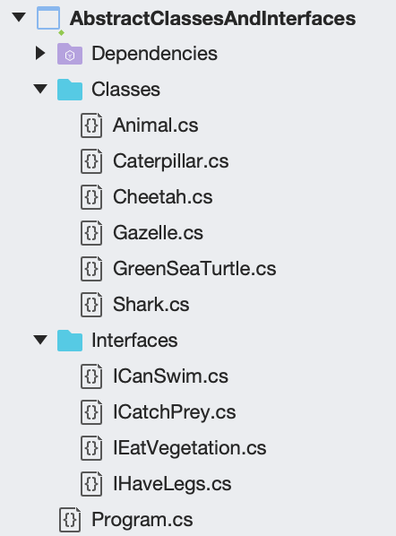
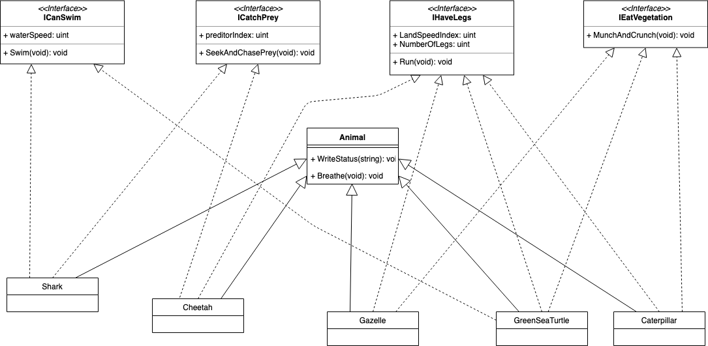

[Contents](README.md)

----

[Prev](async-programming.md)

# Loose Coupling with Interfaces
[Interfaces](https://docs.microsoft.com/en-us/dotnet/csharp/programming-guide/interfaces/) are one of those topics in Object Orientated Programming (OOP) that might have left you wondering "what's the point"?

You may have encountered the term 'design pattern', typically a collection of known solutions to problems in OOP, within which you will likely encounter interfaces. In fact, some people can have quite strong views about interfaces.

The focus of this course needs is not on design patterns, but on cross platform development using Xamarin.Forms. As an author, I am concerned not to overload the learner. However, we cannot completely ignore topics such as design patterns, although I will try to keep it to a minimum.

## Interfaces and Classes
You're probably familiar with a class. A class is a data type that encapsulates data and methods. Therefore, any given class offers certain guaranteed functionality (i.e. performs spefic tasks through methods). Because C# is a compiled and type-safe language, we know that when we instantiate a class type, we know the behaviour (methods) we are getting. 

> If we instantiate a class, and try and invoke a non-existing method in our code, the compiler will report this as an error and we won't even get to run the code. This avoids the embarrasment of run-time errors.

This is known as type-safety.

A class can also inherit diretly from one (and only one) parent class. In doing this, it also _inherits_ some (non private) of those behavious as well. _It is assumed you already know about class inheritance, although it wll be briefly covered below_.

You can make a class _abstract_. Such a class is incomplete, cannot be instantiated and can only be used as a parent class. Typically, some default behavior is included, and the child classes override the missing behaviour.

An interface contains no concrete code, athough new in C# v8 [default code can now be added](https://dle.plymouth.ac.uk/course/view.php?id=45357#section-3). 

## Why use interfaces
Sometimes interfaces are the only way to implement certain object orientated designs:
- C# only supports single inheritance. For multiple inheritance, you need to use interfaces
- A struct cannot inherit a parent, but can implement any number of interfaces

However, for the purposes of this course, there is one more key reason why they are used:

- As a means to create loose coupling between objects within and across assemblies. For the price of a small computational overhead, this can bring great flexibility into our software design.

If little of this is making any sense, then hopefully the following examples will clarify:

All the following examples are contained in a single solution [Loose Coupling](/code/Chapter2/LooseCoupling)

## Abstract Classes and Interfaces
The first project is "AbstractClassesAndInterfaces". Open this project and review the project structure:



There are 5 different animal classes (Caterpillar, Cheetah, Gazelle, GreenSeaTurtle and Shark) all of which inherit directly from the the `Animal.cs` base class.

```C#
public abstract class Animal
{
    protected void WriteStatus(String msg)
    {
        Console.WriteLine($"{this.GetType().Name}: {msg}");
    }

    public abstract void Breathe();

    public Animal()
    {
        WriteStatus("Constructor called");
    }
}
```

This base class is **abstract** because there is no concrete implementation of `Breath()`. The reason for this is as follows:

- All the subclasses (actual animals) do breath, so it makes sense to include this in a common parent class
- All the animals breath in a slightly different ways, so having a default behviour was deemed meaningless

If we look at an example, we can see the custom implementation of `Breathe()`

```C#
public class Caterpillar : Animal, IHaveLegs, IEatVegetation
{
    ...

    public override void Breathe()
    {
        WriteStatus("Breathing through spiracles and without lungs");
    }

    ...
}
```

> Failure you override `Breathe()` will result in a compiler error. All abstract methods must be overridden.

This is a useful feature in terms of safety. Making a base class method abstact enforces that all abstract methods are overridden (and you can trust the compiler to remind you!)

_I appreciate this example is somewhat contrived but the intention is explain the mechanism_

### Polynorphism
Given all the specific animal classes inherit `Animal`, we can use an abstraction known as polymorphism.

Consider the `Caterpillar` type. 

- In the physical world, we recognise it as an animal.
- It inherits the `Animal` base class, so has all the methods and properties of `Animal`
- It may well have additional sepcialist methods and properties as well, but we can still treat it as a generic animal.

So if we create a list of type `Animal`, we can add any subclass to the collection in the knowledge that it's still an `Animal` .

```C#
List<Animal> animals = new List<Animal>
{
    new Caterpillar(),
    new Cheetah(),
    new Gazelle(),
    new Shark(),
    new GreenSeaTurtle()
};
```

We could now iterate through this list, and invoke any of the parent class methods _because they are guaranteed to be implemented_.

```C#
foreach (var animal in animals)
{
    //All animals breath (via gills or lungs)
    animal.Breathe();
}
```

Here is the key point:

> A concrete instance of `Caterpillar` or `Shark` (or any of the subclasses) can **also** be considered to be of type `Animal` because `Animal` is a common baseclass.

The ability to have more than one type is **polymorphism**.

> Note that you could not add type `Animal` or `Shark` to a list of type `List<Caterpillar>` as there would be no guarantee that all the specialist methods and properties of `Caterpillar` would be implemented.

### Multiple Inheritance
So far, we've only considered a single parent class `Animal` and a set of subclasses (`Caterpillar`, `Cheetah`, `Gazelle`, `GreenSeaTurtle` and `Shark`). Within these species, there are some sub-groups. For example, the shark and the cheetah are both preditors, the tutle and shark both swim in water etc. Therefore these objects may share common behaviours which if defined in a type-safe way, could be relied upon if needed.

Like many languages, C# can only inherit one parent class. Although C# does not support the full-multiple inheritance found in C++ (and all the complexities that come with it), it does allow you to inherit any number of _interfaces_. 

> An interface contains only the signatures of methods, properties, events or indexers. A class or struct that implements the interface must implement the members of the interface that are specified in the interface definition. [Microsoft Documentation](https://docs.microsoft.com/en-us/dotnet/csharp/language-reference/keywords/interface), accessed Sept 2019

You can liken an interface to a pure abstract class. All members must be public. 

Extending the example, we can create a number of interfaces that define specific beviours




### Runtime Type-Testing
A powerful feature of C# is to be able to check the type of an object at runtime. Let's modify the code above and perform some runtime checks
```C#
foreach (var animal in animals)
{
    //All animals breath (via gills or lungs)
    animal.Breathe();

    //Populate the preditor list
    if (animal is ICatchPrey p)
    {
        preditors.Add(p);
        if (p.GetType() == typeof(Cheetah))
        {
            Console.WriteLine("  (Nice kitty)");
        }
    }
}
```

First the `is` operator, using in one of two ways:

- `E is T` will return `true` if `E` is not null and can be converted to type `T`.
- `E is T v` is similar, but also assigned `v` (of type `T`) to the converted value. This is a safe way to perform a type-conversion.

For the line `if (animal is ICatchPrey p)`, if the animal implements the interface `ICatchPrey`, then it is assigned to `p`. It can then be added to the list of preditors.


[Next - Handling Exceptions with Try-Catch](try-catch.md)

----

[Contents](/docs/README.md)