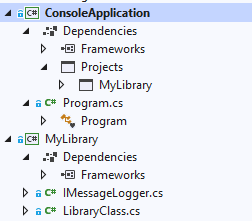

[Contents](README.md)

----

[Prev](async-programming.md)

# Loose Coupling with Interfaces
[Interfaces](https://docs.microsoft.com/en-us/dotnet/csharp/programming-guide/interfaces/) are one of those topics in Object Orientated Programming (OOP) that might have left you wondering "what's the point"?

You may have encountered the term 'design pattern', typically a collection of known solutions to problems in OOP, within which you will likely encounter interfaces. In fact, some people can have quite strong views about interfaces.

The focus of this course is not on design patterns, but on cross platform development using Xamarin.Forms. As an author, I am concerned to not overload the learner. However, we cannot completely ignore topics such as design patterns, although I will try to keep it to a minimum.

## Interfaces and Classes
You're probably familiar with a class. A class is a data type that encapsulates data and methods. Therefore, any given class offers certain guaranteed functionality (i.e. performs specific tasks through methods). Because C# is a compiled and type-safe language, we know that when we instantiate a class type, we know the behavior (methods) we are getting. 

> If we instantiate a class, and try and invoke a non-existing method in our code, the compiler will report this as an error and we won't even get to run the code. This avoids the embarrassment of run-time errors.

This is known as type-safety.

A class can also inherit directly from one (and only one) parent class. In doing this, it also _inherits_ some of those (non private) behaviors as well. _It is assumed you already know about class inheritance, although it wll be briefly covered below_.

Some classes are purely intended to be inherited and never directly instantiated. To achieve this, you can make a class _abstract_. Such a class is incomplete, cannot be instantiated and can only be used as a parent class. Typically, some default behavior is included, and the child classes implement the missing behavior and override any default behavior as appropriate.

Unlike an abstract class, an interface cannot contain any concrete code, although new in C# v8 [some default code can now be added](https://dle.plymouth.ac.uk/course/view.php?id=45357#section-3). 

## Why use interfaces
Sometimes interfaces are the only way to implement certain object orientated designs:
- C# only supports single inheritance. For multiple inheritance, you need to use interfaces
- A structure (struct) cannot inherit a parent, but can implement any number of interfaces

However, for the purposes of this course, there is one more key reason why they are used:

- As a means to create loose coupling between objects within and across assemblies. For the price of a small computational overhead, this can bring great flexibility into our software design.

If little of this is making any sense, then hopefully the following examples will clarify:

All the following examples are contained in a single solution [Loose Coupling](/code/Chapter2/LooseCoupling). This contains two working applications and one library. 

## Abstract Classes and Interfaces
The first project is "AbstractClassesAndInterfaces". Open this project and review the project structure:


There are 5 different animal classes (`Caterpillar`, `Cheetah`, `Gazelle`, `GreenSeaTurtle` and `Shark`) all of which inherit directly from the `Animal.cs` base class.

```C#
public abstract class Animal
{
    protected void WriteStatus(String msg)
    {
        Console.WriteLine($"{this.GetType().Name}: {msg}");
    }

    public abstract void Breathe();

    public Animal()
    {
        WriteStatus("Constructor called");
    }
}
```

This base class is **abstract** because there is no concrete implementation of `Breathe()`. The reason for this is as follows:

- All the subclasses (actual animals) do breath, so it makes sense to include this in a common parent class
- All the animals breath in a slightly different ways, so having a default behavior was deemed meaningless in this specific case

If we look at an example, we can see the custom implementation of `Breathe()` in one of the subclasses:

```C#
public class Caterpillar : Animal, IHaveLegs, IEatVegetation
{
    ...

    public override void Breathe()
    {
        WriteStatus("Breathing through spiracles and without lungs");
    }

    ...
}
```

We can see that class `Caterpillar` directly inherits from `Animal`. It also implements the interfaces `IHaveLegs` and `IEatVegetation` but we wil discuss these later. For now, focus on the base class `Animal`

> Failure to override `Breathe()` will result in a compiler error. This is because all abstract methods **must** be overridden.

This is a useful feature in terms of safety. Making a base class method abstract enforces that all abstract methods are overridden by their respective sub-classes. To rely on the developer to _remember_ to implement all required methods is possibly asking for trouble (and you can trust the compiler to remind you!)

### Polymorphism
Given all the specific animal classes inherit `Animal`, we can use an abstraction known as polymorphism. As we will soon learn, this applies to abstract classes and interfaces equally.

Consider the `Caterpillar` type. 

- In the physical world, we recognize it as an animal of course.
- It inherits the `Animal` base class, so is _guaranteed_ have all the methods and properties of `Animal` (if the code is to compile).
- It may well have additional specialist methods and properties as well, but we can still treat it as a generic animal.

So if we create a list containing type `Animal`, we can add _any subclass_ to the collection in the knowledge that it's still an `Animal`, guaranteed to implement all the behaviors of the `Animal` class.

```C#
List<Animal> animals = new List<Animal>
{
    new Caterpillar(),
    new Cheetah(),
    new Gazelle(),
    new Shark(),
    new GreenSeaTurtle()
};
```

We could now iterate through this list, and invoke any of the parent class methods _because they are guaranteed to be implemented_.

```C#
foreach (var animal in animals)
{
    //All animals breath (via gills or lungs)
    animal.Breathe();
}
```

Here is the key point:

> A concrete instance of `Caterpillar` or `Shark` (or any of the subclasses) can **also** be considered to be of type `Animal` because `Animal` is a common base-class. 

The ability to have more than one type is the essence of **polymorphism** in object orientated programming.

Furthermore, the compiler enforces the rules so it cannot break at runtime.

> Note that you could not add type `Animal` or `Shark` to a list of type `List<Caterpillar>` as there would be no guarantee that all the specialist methods and properties of `Caterpillar` would be implemented. Such an attempt would result in a compiler error.

Polymorphism is very useful when you don't know which concrete type will be used at runtime, but at the same time, you wish to avoid the embarrassment of a runtime crash.

### Multiple Inheritance
So far, we've only considered a single parent class `Animal` and a set of subclasses (`Caterpillar`, `Cheetah`, `Gazelle`, `GreenSeaTurtle` and `Shark`). Within these species however, there are some sub-groups. For example, the shark and the cheetah are both predators, the turtle and shark both swim in water etc. Therefore these objects may share common behaviors which if defined in a type-safe way, could be relied upon if needed.

Like many languages, C# can only directly inherit from one parent class. Although C# does not support the full-multiple inheritance found in C++ (and all the complexities that come with it), it does allow you to inherit any number of _interfaces_. This can seem confusing at first, but it's all comes down to type-safety and enforcing guaranteed behavior _at compile time_. 

> An interface contains only the signatures of methods, properties, events or indexers. A class or structure that implements the interface must implement the members of the interface that are specified in the interface definition. [Microsoft Documentation](https://docs.microsoft.com/en-us/dotnet/csharp/language-reference/keywords/interface), accessed Sept 2019

Note the word **must** in the above. 

You can _liken_ an interface to a pure abstract class where all members must be public and overridden.

To illustrate, continuing with the animal example, we can create a number of interfaces that define specific behaviors. These are:

- `ICanSwim` - list methods and properties common to all swimming animals
- `ICatchPrey` - lists methods and properties common to all predators
- `IHaveLegs` - lists methods and properties common to all animals (land or sea) with legs
- `IEatVegetation` - lists methods and properties common to all herbivores or omnivores

Take a look at the interface files in the project. For example:

```C#
public interface ICatchPrey
{
    uint PredatorIndex { get; }
    void SeekAndChasePrey();
}
```    

**Any** class or structure that implements this interface **must** have the property `PredatorIndex` (type `uint`) and the public method `SeekAndChasePrey()`. If they don't, the code will not compile.

Here is a diagram that captures all the relationships between all classes and interfaces in the project. The dashed lines are for interfaces and the solid for direct class inheritance.


Examining the concrete `Shark` class we see how it conforms to the base class and both interfaces:

```C#
 public class Shark : Animal, ICatchPrey, ICanSwim
 {
     public uint PredatorIndex => 10;
     public uint WaterSpeed => 6;

     public override void Breathe()
     {
         WriteStatus("Breathing through gills. In essence, a big fish.");
     }
     public void SeekAndChasePrey()
     {
         WriteStatus("Dart, open mouth and snap");
     }
     public void Swim()
     {
         WriteStatus("Sprint and twist");
     }
}
```   

Again stressing the point, _if any of these methods / properties were missing, the code would not compile._ Therefore we can say with confidence that as long as the code compiles, the `Shark` class can be treated as any one of at least **four** data types:

- `Animal` because it inherits all the methods and properties of the `Animal` base class
- `ICanSwim` because the code will not compile unless it implements `Swim()` and the property `waterSpeed` 
- `ICatchPrey` because the code will not compile unless it implements `SeekAndChasePrey` and the property `predatorIndex`
- `Shark` which is all of the above

If we were to create a list containing only the type `ICatchPrey` (that is `List<ICatchPrey>`), we could add instances of both `Cheetah` and `Shark` to this list, but NOT `Gazelle`, `Turtle` or `Caterpillar`. Again, this is enforced at compile-time.

### Runtime Type-Testing
A powerful feature of C# is to be able to check the type of an object _at runtime_. Returning to our list of animals, let's modify the code and perform some runtime checks
```C#

List<Animal> animals = new List<Animal>
{
    new Caterpillar(),
    new Cheetah(),
    new Gazelle(),
    new Shark(),
    new GreenSeaTurtle()
};

List<ICatchPrey> preditors = new List<ICatchPrey>();

foreach (var animal in animals)
{
    //All animals breath (via gills or lungs)
    animal.Breathe();

    //Populate the predator list
    if (animal is ICatchPrey p)
    {
        predators.Add(p);
        if (p.GetType() == typeof(Cheetah))
        {
            Console.WriteLine("  (Nice kitty)");
        }
    }
}
```

First, the `Breathe` method `animal.Breathe()`. For each animal (type `Animal`) in the list, all must override the `Breathe` method. This method is part of the `Animal` base class, so no runtime check is needed. 

We are iterating through a list of type `Animal`, but what if an object is a derived class (which they all are in this case)? Consider the following line:

```C#
if (animal is ICatchPrey p)
```

First the `is` operator, which can be used in one of two ways:

- `E is T` will return `true` if `E` is not null and can be converted to type `T`.
- `E is T v` is similar, but also assigns `v` (of type `T`) to E (cast to type `T`). This is a safe way to perform a type-cast.

Remember that objects can have many types. If the animal is also of type `ICatchPrey` (by implementing the interface), then it is assigned to `p` (which is type `ICatchPrey`) and the conditional statement returns `true`, in which case it can then be added to the list of predators.

Finally we are really specific, this time using `GetType()`

```C#
if (p.GetType() == typeof(Cheetah))
{
    Console.WriteLine("  (Nice kitty)");
}
```        

### Loose Coupling
For the next example, you need to look at the two other projects in the example solution

- `MyLibrary` which is a simple .NET Core library written in C#
- `ConsoleApplication` which is a simple application which references and utilizes the code contained in the library `MyLibrary`

The key points to note are as follows:

- The application instantiates concrete classes contained within the library and calls methods on those objects. This depends on knowing the class/structure types. _The application cannot build without the library, so we say it **depends** on the library_. 
  - We sometimes refer to this as _tight coupling_. 
  - One of the steps needed was to add the library as a dependency in Visual Studio
  - This is indicated in the solution explorer in Visual Studio.



- The library is intended to be reused by multiple projects. Therefore, it should not depend on any concrete class/structure types in the consuming application (or any other project type that utilizes it). 
   - The library can be built and distributed independently
   - It does not / must not depend on the application

- If the library were to also depend on the console application, this would create a dependency cycle and the code would not build. 

#### Problem - two way communication

In the simplest cases, the application instantiates types in the library and invokes methods on them. It can do this because it knows about the classes and structures in the library.
However, there may be times when the library needs to directly invoke methods on the (consuming) application. 

For example, a library method might perform an asynchronous task, such as a network download. The library therefore needs to somehow notify the application how much data has downloaded and when the download is complete by invoking one of several callback methods. The problem is that such methods only exists within concrete classes / structures within the application which the library has no knowledge of. 

#### Solution
This is where interfaces come in. The **library** contains one class `LibraryClass` and one interface `IMessageLogger`.

```C#
public interface IMessageLogger
{
    void LogMessage(string msg);
    void Complete(bool b);
}
```    

The library itself does not implement this interface. It is expected that the application consuming the library will implement the interface. Let's first look at the library code:

```C#
    public class LibaryClass
    {
        protected IMessageLogger Logger { get; set; }

        //Note the type of the parameter is an interface, NOT a concrete class
        //This means ANY class conforming to this interface can be use this library
        //We call this loose coupling
        public LibaryClass(IMessageLogger logger)
        {
            Logger = logger;
        }

        //This is one of the library methods that is available
        public void DoUsefulThing()
        {
            //Do something 
            Console.WriteLine($"{GetType().Assembly.GetName().Name}: Useful Library Function invoked");

            //Call back the object that instantiated this
            Logger.LogMessage("The library function logs a message");

            //Call completion Handler
            Logger.Complete(true);
        }

    }
```

Note how `LogMessage` and `Complete` are invoked from the library code, but neither are implemented by the library itself. These are both call backs to the application. 

Note also how the `LibraryClass` constructor takes a reference to an object of type `IMessageLogger` as a parameter (and stores it in a property `Logger`). 

- This interface is declared as part of the library
- It is the application that will implement the interface, so it is the application that guarantees implementation the methods `LogMessage` and `Complete`

The library needs a reference back to the application (without knowledge of it's concrete datatype). Let's now look at the application (below) to see how this is obtained. 

We immediately see the application implements the interface `IMessageLogger` that is _declared in the library_ (important point). Therefore, it must implement the methods `LogMessage` and `Complete` in order to compile. The application class is both of type `Program` and `IMessageLogger`

```C#
    class Program : IMessageLogger //IMessageLogger is declared in the library
    {
        public Program()
        {
            //This is the useful entry point of the application
            //Note how a reference to this is passed by parameter
            LibaryClass lib = new LibaryClass(this);
            lib.DoUsefulThing();
        }

        string AssemblyName => GetType().Assembly.GetName().Name;

        public void LogMessage(string msg)
        {
            string message = $"{AssemblyName}: {msg}";
            //Local function
            void banner()
            {
                foreach (char _ in message)
                {
                    Console.Write("*");
                }
                Console.WriteLine("");
            }

            //Write console message
            banner();
            Console.WriteLine(message);
            banner();
        }

        public void Complete(bool b)
        {
            if (b)
            {
                Console.WriteLine($"{AssemblyName}: All done");
            }
            else
            {
                Console.WriteLine($"{AssemblyName}: Did not complete");
            }
        }

        static void Main(string[] args) => _ = new Program();

    }
```

The constructor instantiates and instance of `LibraryClass` but also passes a reference to itself by parameter. As the application is of type `IMessageLogger`, this is perfectly type safe and correct.

```C#
   LibaryClass lib = new LibaryClass(this);
   lib.DoUsefulThing();
```

By using an interface type in this way, the library is able to be _loosely coupled_ to the application. The critical points are:

- The interface is declared in the library and not the application.  
- The application knows about all the types in the library, including the interface `IMessageLogger`
- The library knows about its own types (including `IMessageLogger`), but nothing about the types defined in the application.

There are many other approaches and patterns out there which follow a similar approach and rely on interfaces for loose-coupling. 

Another approach might have been to pass a closure as a parameter. This also works, but where there are several methods that need to be invoked, the code might get unwieldy.


[Next - Handling Exceptions with Try-Catch](try-catch.md)

----

[Contents](/docs/README.md)