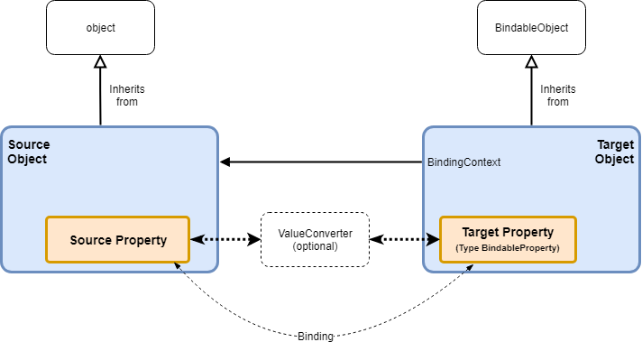
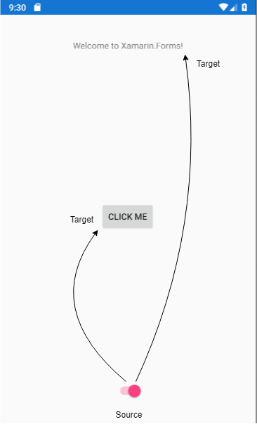
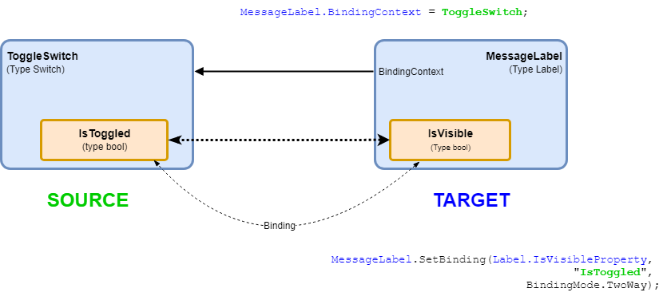
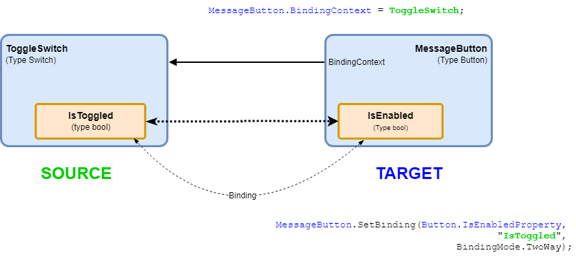

[Contents](README.md)

----

## Part 2 - Binding Between UI Elements using Code
[Part 2 is here](/code/Chapter2/Bindings/HelloBindings-02). Build and run this to see what it does. Note the strange behaviour once you get back to the first saying. This was added to illustrate a point and will be removed later.

This step is simply to illustrate the mechanism of two-way _binding_. I have purposely used code to set up the bindings as it exposes the APIs that are leveraged by XAML in subsequent sections. This can be very helpful for demystifying what is going on.

To begin with, a three way binding will be set up between the `MessageLabel`, the `ToggleSwitch` and the `MessageButton`.           

We will bind `ToggleSwitch.IsToggled` to both the `MessageLabel.IsVisible` and `MessageButton.IsEnabled`. We will also set this up initially as a two-way binding. _A change in one will result in an automatic change in the others_. 

1. A change to `TooglSwitch.IsToggled` will _automatically_ change both `MesageLabel.IsVisible` and `MessageButton.IsEnabled`
1. A change to `MesageLabel.IsVisible` will _automatically_ change both `ToogleSwitch.IsToggled`. This in turn will activate (1)
1. A change to `MesageButton.IsEnabled` will _automatically_ change both `ToogleSwitch.IsToggled`. This in turn will activate (1)

### Bindings and Relationship Types
The figure below captures the necessary relationships to establish a binding between two properties



Becoming familiar with the notation is important here as it can otherwise get confusing. Some points to observe:

- The _Target_ is typically a UI object, and must interit from `BindableObject` (which provides the property `BindingContext`)
- The `BindingContext` is a reference to the source - the source can be any type of object (hence is more loosely coupled)
- A binding is setup between specified properties of the source and target objects
    - The target property is of type BindableProperty
    - The source property is loosely specified by name (as a string). 
    
As you can probably infer, the requirements for the target are much more constrained than the source. The target does not know the concrete type of the source or it's bound property (just it's name). This means _the source can by almost any type object_.  It is commonly either a ViewModel or another UI component. Equally the source property is only known by name (type `string`). Behind the scenes, something known as [reflection](https://docs.microsoft.com/en-us/dotnet/csharp/programming-guide/concepts/reflection) will be used to find a property matching this name at run-time and bind to it.

### Binding Properties of the Switch to the Label and Button
The first point to note is that the event handler for the Switch has been removed. We still have the button handler (for now).

```XAML
     <Switch x:Name="ToggleSwitch"  
             HorizontalOptions="Center"
             VerticalOptions="End"
             IsToggled="true"
             />
```     

Next, look at the code-behind where the bindings are set up in code.

```C#
  public MainPage()
  {
      InitializeComponent();

      MessageLabel.BindingContext = ToggleSwitch; //Source
      MessageLabel.SetBinding(Label.IsVisibleProperty, "IsToggled", BindingMode.TwoWay);

      MessageButton.BindingContext = ToggleSwitch;
      MessageButton.SetBinding(Button.IsEnabledProperty, "IsToggled", BindingMode.TwoWay);
  }
```        

The `Switch` will be the source object. The `MessageLabel` and `MessageButton` will be targets. This creates a one-to-many realationship



Note that _a target object can only have one source_, so this topology makes sense. Had we made the Switch the target, we would have a problem. In code we can set the source for each target by specifying the `BindingContext` property. 

```C#
   ...
   MessageLabel.BindingContext = ToggleSwitch;
   ...
   MessageButton.BindingContext = ToggleSwitch;
   ...
```

Here the _targets_ are `MessageLabel` and `MessageButton`. These meet all requirements: both are UI objects, so inherit from `BindableObject` and have properties of type `BinableProperty` (discussed below). The source object (instance of `Switch`) is a reference type, so derived from object, so that's fine. 

Now for the interesting bit, the [SetBinding](https://docs.microsoft.com/en-us/dotnet/api/xamarin.forms.bindableobjectextensions.setbinding?view=xamarin-forms) API.
```C#
   ...
   MessageLabel.SetBinding(Label.IsVisibleProperty, "IsToggled", BindingMode.TwoWay);
   ...
   MessageButton.SetBinding(Button.IsEnabledProperty, "IsToggled", BindingMode.TwoWay);
   ...
```

You always start with the target, or put another way, you always _set the binding on the target_ (to rememer this, I like to visualise a cross-hair on each of the UI components I want to bind to). 


_Binding `ToggleSwitch.IsToggled` to `MessageLabel.IsVisible`. Green is related to the source and blue is related to the target_


_Binding `ToggleSwitch.IsToggled` to `MessageButton.IsEnabled`_

Consider each parameter in turn:

- The first parameter is the **target property** of type `BindableProperty`. On inspecton, the code might seem confusing (because it is!). For a start, _static properties_ on the target type. 
    - For any (bindable) property, there will be a static class property of the same name + suffix `Property`.
    - You always pass the static property (never an instance property)
    - Why? Err... I'll get back to you on that ok?
- The second property is the _name_ of the **source property**, specified as a `string`.    
- Finally, there is the direction. This enumerable type is can set to:
    - Default
    - TwoWay (changes are communicated in both direction)
    - OneWay (changes are only communicated from source to taget)
    - OneWayToSource (changes are only communicated from target to source)
    - OneTime (changes only communicated when the `BindingContext` changes)

### Two-Way Binding in Action
Run the application and click the button until it recycles back to the first message. Let's examine what happens in the code at this point:

```C#
     private void MessageButton_Clicked(object sender, EventArgs e)
     {
         MessageLabel.Text = Sayings[next];
         next = (next + 1) % Sayings.Count;

         //Sneaky trick
         if (next == 0)
         {
             MessageLabel.IsVisible = false;
         }
     }
```

The line of interest is this `MessageLabel.IsVisible = false;` Note that `MessageLabel` is a binding _target_. However, the binding between the switch and label was set to `BindingMode.TwoWay`. 

- By changing `MessageLabel.IsVisible`, the two-way binding automatically changes `ToggleSwitch.IsToggled`, which in turn changes `MessageButton.IsEnabled`.
- You might be worried that this could get into a ever-lasting loop. You would be right to be concerned and later we will have to be mindful to avoid such a trap. However, when binding between UI elements, checks are put in place to only update a bound property if it's value is actually going to change.

----
[Contents](/docs/README.md)
