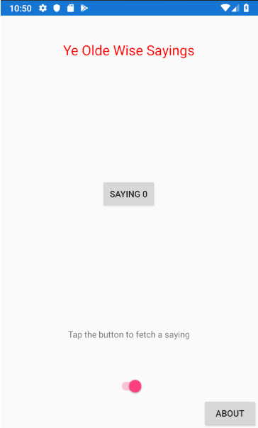

[Contents](README.md)

----

[Prev](mvvm-7.md)

## Part 8 - Improving the User Experience

[Part 8 is here](/code/Chapter2/Bindings/HelloBindings-08). Inspect and familiarise yourself with the code fully before proceeding. 

In this last section, we look at how to better communicate with the user. This include:

- Handling network error conditions gracefully. 
- Giving feedback that during a network transaction, something is happening

A demo of the final application is here

<p align="center">
<a href="http://www.youtube.com/watch?feature=player_embedded&v=tDCPw1KSoUc" target="_blank"></a>
</p>


### Updating the View
Let's start with what we want the application to look like:



The XAML for this interface is slightly modified:

```XAML
<?xml version="1.0" encoding="utf-8" ?>
<ContentPage xmlns="http://xamarin.com/schemas/2014/forms"
             xmlns:x="http://schemas.microsoft.com/winfx/2009/xaml"
             xmlns:d="http://xamarin.com/schemas/2014/forms/design"
             xmlns:mc="http://schemas.openxmlformats.org/markup-compatibility/2006"
             xmlns:local="clr-namespace:HelloBindings;assembly=HelloBindings"
             mc:Ignorable="d"
             x:Class="HelloBindings.MainPage">
    <!--        
    <ContentPage.BindingContext>
        <local:MainPageViewModel/>
    </ContentPage.BindingContext>
    -->
    
    <ContentPage.Resources>
        <ResourceDictionary>
            <local:ColorConverter x:Key="ColorConv"/>
        </ResourceDictionary>
    </ContentPage.Resources>
    
    <StackLayout Padding="0,40,0,0">
        
        <Label x:Name="MessageLabel" 
               FontSize="Large"
               Text="{Binding Path=CurrentSaying}" 
               IsVisible="{Binding Path=UIVisible}"
               TextColor="{Binding Path=SayingNumber, Converter={StaticResource ColorConv}}"
               HorizontalOptions="Center"
               VerticalOptions="Start" 
               />

        <Button x:Name="MessageButton"
                Text='{Binding Path=SayingNumber, StringFormat="Saying {0:d}"}'
                Command="{Binding Path=FetchNextSayingCommand}"
                HorizontalOptions="Center" 
                VerticalOptions="CenterAndExpand"
                />
        
        <Label Text="Tap the button to fetch a saying"
               VerticalOptions="Start"
               HorizontalOptions="Center"
               IsVisible="{Binding HasNoData}"
               />

        <ActivityIndicator x:Name="Activity"
                           HorizontalOptions="Center"
                           VerticalOptions="Start"
                           IsRunning="{Binding Path=IsRequestingFromNetwork}"
            />
            
        <Switch x:Name="ToggleSwitch"  
                HorizontalOptions="Center"
                VerticalOptions="End"
                IsToggled="{Binding Path=UIVisible, Mode=TwoWay}"
                />

        <Button Text="About" 
                Clicked="DoAboutButtonClicked"
                VerticalOptions="End"
                HorizontalOptions="End"
                />
        
    </StackLayout>

</ContentPage>

```

- The ViewModel is no longer instantiated via XAML. Instead this is performed in the code-behind.
- A label saying "Tap the button to fetch a saying" is displayed. 
    - It's `IsVisible` property is bound to the (new) ViewModel property `HasNoData`
    - `HasNoData` is a property on the view model which is derived from the `HasData` property on the Model
- An activity indicator (hidden by default) is added. It appears when it's `IsRunning` property is set to true.
    - `IsRunning` is bound to the ViewModel property `IsRequestingFromNetwork`
    - You may recall from the previous section this is set true before a network trasnaction, and false once completed or failed. 
    - This property is simply _passed through_ via the ViewModel as it needs no modification or conversion.
- New Button has been added
    - The Clicked event handler is set to `DoAboutButtonClicked`. Shock and horror I hear you cry...this is not using a binding!
    - The view that presents itself modally (the About information) is not in _this_ XAML file, but another as we shall see.
    - Pragmatism rules here ;)
- When a network error occurs, a message window appears. This does not feature in the XAML, so where is it?
    - It is view related, so _belongs_ in the view code. All will be revealed!

Not let's look at the code behind. As you can see, the notion of everything in XAML with no-code-behind was quickly dropped. 

```C#
    public partial class MainPage : ContentPage, IMainPageViewHelper
    {
        private MainPageViewModel ViewModel { get; set; }

        public MainPage()
        {
            InitializeComponent();

            //Create ViewModel
            ViewModel = new MainPageViewModel(new MockedRemoteModel(), this);
            BindingContext = ViewModel;
        }

        public ICommand CreateConcreteCommand(Action execute, Func<bool> canExecute)
        {
            return new Command(execute, canExecute);
        }

        public void ChangeCanExecute(ICommand cmd)
        {
            Command c = cmd as Command;
            c.ChangeCanExecute();
        }

        //Show error message dialog
        public async Task ShowErrorMessageAsync(string ErrorMessage)
        {
            await DisplayAlert("Error", ErrorMessage, "OK");
        }

        //Show modal AboutPage (could be called from the ViewModel)
        public async Task ShowModalAboutPageAsync()
        {
            var about = new AboutPage();
            await Navigation.PushModalAsync(about);
        }

        //View-specific event handler
        private async void DoAboutButtonClicked(object sender, EventArgs e)
        {
            await ShowModalAboutPageAsync();
        }
    }
```

First the declaration

```c#
  public partial class MainPage : ContentPage, IMainPageViewHelper
```

The View now implements an interface `IMainPageViewHelper`. The consolidated list of methods implemented by anything of type `IMainPageViewHelper` is as follows:

```C#
  Task ShowModalAboutPageAsync();
  Task ShowErrorMessageAsync(string ErrorMessage);
  ICommand CreateConcreteCommand(Action execute, Func<bool> canExecute);
  void ChangeCanExecute(ICommand obj);    
```

You should see that all these methods are indeed implemented in the View code behind. Why is another matter! Consider what each of these methods does:

#### Interface method `Task ShowModalAboutPageAsync()`
This pushes another view (see `AboutPage.xaml` and `AboutPage.xaml.cs`) onto the **Modal View Stack**. 
```C#
    public async Task ShowModalAboutPageAsync()
    {
        var about = new AboutPage();
        await Navigation.PushModalAsync(about);
    }
```
The `Navigation` property is a property of a Page, and **not** a view model. This **has** to be performed from within a View class. However, we _might_ want to invoke it from our ViewModel.

#### Interface method `Task ShowErrorMessageAsync(string)`
This displays an alert box (as shown in the video). 
```C#
    public async Task ShowErrorMessageAsync(string ErrorMessage)
    {
        await DisplayAlert("Error", ErrorMessage, "OK");
    }
```
Again, the `DisplayAlert` API is only available as a method on a View object, but does not exist in a ViewModel. We might however wish to invoke this from a ViewModel.

#### Interface methods - `Command` related APIs
The last two are less obvious, but both relate to the concrete class `Command`

```C#
  ICommand CreateConcreteCommand(Action execute, Func<bool> canExecute);
  void ChangeCanExecute(ICommand obj);   
```

Recall that the button command property is bound to a ViewModel property of type `ICommand`. Now, `ICommand` is an _interface_, so this needs to be assigned to an instance of a concrete derivative. In our case, this the concrete _class_ is type `Command` which is part of Xamarin Forms, and is strictly a view object. 

- The View is given the responsibility of instantiating Xamarin.Forms concrete objects.
- As `ChangeCanExecute` is not part of `ICommand` but `Command`, then this is handled in the View as well

> Take a sneaky peek at the ViewModel and you will see the following line is no longer present at the top of the source file: `using Xamarin.Forms;`  This is possible as there is no longer any reference to any concrete Xamarin.Forms classes - it has all been delegated to the View object.

I appreciate this is pedantic (in my humble opinion) and in this simple application only serves to complicate matters, but it was done to simply illustrate the _idea_ that we have a clear _separation of concerns_.

Remember the following stated right back at the start:

- The ViewModel knows nothing of the View (or it's concrete data types)
- The Model knows nothing of the ViewModel

Well, here you have it!

ViewModels can of course instantiate and call methods on View objects, and the world will continue to revolve, but that does make them harder to test if we pursue the idea of unit testing the ViewModel (maybe using CIT?). If the code can be kept to pure C#.NET, then in one sense we can expect less problems with testing. Actually Commands prove to be quick tricky to test however you access them, but that's for another time.

As we also saw, some tasks (such as navigation) can only be performed by the view layer. Therefore, we need a way to invoke such behaviours from the ViewModel.

### Reverse Reference to the View
In the view code, we see the ViewModel being instantiated:

```C#
    private MainPageViewModel ViewModel { get; set; }

    public MainPage()
    {
        InitializeComponent();

        //Create ViewModel
        ViewModel = new MainPageViewModel(new MockedRemoteModel(), this);
        BindingContext = ViewModel;
    }
```

Note the second parameter, `this`. You might thing, hang on - you've giving the ViewModel a concrete class! We have not.
Take a look at the ViewModel constructor:

```C#
        ...
        private SayingsAbstractModel DataModel {get; }                  //Model object 
        public event PropertyChangedEventHandler PropertyChanged;       //Used to generate events to enable binding to this layer
        public IMainPageViewHelper MainPageViewHelper { get; private set; }
        public ICommand FetchNextSayingCommand { get; private set; }    //Binable command to fetch a saying

        public MainPageViewModel(SayingsAbstractModel WithModel, IMainPageViewHelper pvh)
        {
            //Reference back to ViewHelper (typically the View, but might be a unit test framework)
            MainPageViewHelper = pvh;
            
            //Set chosen data model (this may different, depending if instantiated by the view or a unit test framework
            DataModel = WithModel;

            //Hook up event handler for changes in the model
            DataModel.PropertyChanged += OnPropertyChanged;

            //Hook up button command (typically created by the view as Command is part of Xamarin.Forms)
            FetchNextSayingCommand = MainPageViewHelper.CreateConcreteCommand(  execute: async () => await DoFetchNextMessageCommand(), 
                                                                             canExecute: () => ButtonEnabled);
        }
        ...
```
The second parameter is has an _interface_ type `IMainPageViewHelper`. The ViewModel has no idea that it is also of (concrete) type `ContentPage`, and neither does it need to know. 

> Using an interface type in this way means that **any** conrete type can be passed as a parameter, as long as it implements the interface. This is sometimes referred to as loose coupling. The ViewModel only knows about the methods declared in the interface(s). These methods are pure C#.NET that happen to perform View related tasks on behalf of the ViewModel (and have access to View related objects and methods). The specifics of implementation are hidden from the ViewModel.

For test purposes, we could easily pass a fake user interface object, presenting the same interface, but mimicking the View logic. Similarly, we can more easily change the View code without needing to change the ViewModel.
 
Note how the property `MainPageViewHelper` is set to maintain a reference back to the view.
 
The main _takeaway_ (sic) here is separation of concerns. If we compartentalise code, it helps us maintain and test. From a more humanistic perspective, it may even help others navigate your code.

### Handling Network Errors
Coming back to graceful handling of network errors, the discussion begins back in the model base class with the following method:

```C#
  //Wrapper around the specific implmentation for fetching a saying
  protected async Task<(bool success, string status)> FetchSayingAsync(int WithIndex = 0)
  {
      try
      {
          PayLoad p = await FetchPayloadAsync(WithIndex);
          if (p != null)
          {
              Count = p.From;
              CurrentSaying = p.Saying;
              SayingNumber = WithIndex;
              HasData = true;
              return (success: HasData, status: "OK");
          }
          else
          {
              HasData = false;
              return (success: HasData, status: "Invalid Response");
          }
      }
      catch
      {
          HasData = false;
          return (success: HasData, status: "Permission Denied");
      }
  }
```

Note the following:

- The return type of this asynchronous method is a tuple `(bool, string)`. 
- The (bindable) `HasData` property is also set should that be needed.
- In the event of an error, all other properties are unchanged
- This method is invoked via the public model API  `Task<(bool success, string status)> FetchSayingAsync(int)` from the ViewModel code

Somehow, the return values need to be marshalled by the ViewModel (that's it's role) and displayed by the View (again, that's it's job).
Some of this can be done through seamlessly through bindings, and some tasks will need to delegated to the View.

It all starts with a button command, which invokes the following UI logic in the ViewModel

```C#
    public async Task DoFetchNextMessageCommand()
    {
        NetworkOutcome = await DataModel.NextSaying();
        if (NetworkOutcome.success == false)
        {
            await MainPageViewHelper.ShowErrorMessageAsync(NetworkOutcome.ErrorString);
        }
    }
``` 

The line `await MainPageViewHelper.ShowErrorMessageAsync(NetworkOutcome.ErrorString);` invokes a method on the View to display the error string in an alert dialog. Remember that `MainPageViewHelper` is effectively a reverse reference back to the View.

The label that displays "Tap the button to fetch a saying" will also be made visible when such an error occurs. This is achieved through binding the label property `isVisible` to the `HasNoData` property on the ViewModel, which is derived from the bound Model property `HasData`.

```C#
    ...
    private void OnPropertyChanged(object sender, PropertyChangedEventArgs e)
    {
        ...
        else if (e.PropertyName.Equals(nameof(DataModel.HasData)))
        {
            PropertyChanged?.Invoke(this, new PropertyChangedEventArgs(nameof(HasNoData)));
        }            
        ...
    }
    
    ...
    
    public bool HasNoData => !DataModel.HasData;
    ...
```        
 
Note how the ViewModel _converts_ the bound Model property `HasData` to it's inverse `HasNoData` and exposes it to the view via bindings. Conversion is one of the roles ViewModel's tend to play

### The About Page
Finally, there is the button in the bottom right of the screen which presents the About page.

- This button is always available
- There is no UI state logic top consider

Therefore, there is not specific role for the ViewModel to play! Therefore, all the code for presenting the About page is contained in the view:

```C#
    public async Task ShowModalAboutPageAsync()
    {
        var about = new AboutPage();
        await Navigation.PushModalAsync(about);
    }

    //View-specific event handler
    private async void DoAboutButtonClicked(object sender, EventArgs e)
    {
        await ShowModalAboutPageAsync();
    }
```

The `ShowModalAboutPageAsync()` is part of the `IMainPageViewHelper` public interface, and therefore accessible from the ViewModel. This might prove important should the logic change. For now, it's unused.

### Reflection
We started with a very simple application "HelloBindings" modelled on something that resembled a "Model View Controller" architecture. Through the addition of a bindings, this migrated to an architecture known as "Model View ViewModel" (MVVM). For such a simple example, this would seem like overengineering until you begin to scale the application.

The data model was switched to one that leveraged a [Azure Function](https://azure.microsoft.com/services/functions/). This was a static method in the cloud which could be invoked through HTTP (known as an HTTP trigger). This addded a new level of complexity to the application as the model interface became asynchronous.

A principle adhered to was [separation of concerns](https://en.wikipedia.org/wiki/Separation_of_concerns). 
- The View both instanatiated view objects, but also (in this case) instantiated the view model. All view related tasks, including any that required access to concrete objects in Xamarin.Forms, were implemented within the view objects. The view presented an interface to the ViewModel and bound to it's properties using a bindings layer (which itself uses reflection to avoid the need for tight-binding).
- The view model is the glue between the View and the Model. It exposes bindable properties to form a loose coupling with the view. It observes events from the Model. An abstract class was used to allow easy switching between different concrete models. Further abstraction with interfaces could have been used. However, the trade would be additional code and complexity. It is also very unlikely any of the code would be reused except in unit tests.
- The Model was developed to focus on it's specific task, that of encapsulating data, fetching data from the cloud and methods that operate on the data. Exposes bindable properties that communicated status changes that any other object might choose to observe. This is done without knowledge of the objects themselves. This makes it very easy to write unit tests.

MMVM seems like a lot of extra work? - a simple application was used here to an educational vehicle, and to hopefully help explain MVVM and the different roles played by each layer. As applications scale, so architecture becomes more important. Now, if this _was_ the final application, one might question if MVVM was worth all the extra effort. I'm not going to dare even try to answer this for fear of starting a heated debate or even a [flame-war](https://en.wikipedia.org/wiki/Flaming_(Internet)). This application is simply not worth debating.

What about Design Patterns? If you are well versed in design patterns, you may well have taken issue with some of the code in this section. If you do have views and wish to share them, by all means post a comment. However, please keep it polite and understand the author is self-taught, has a formal background in electronics and digital signal processing and is not really a computer scientist ( so please be gentle with me :)

### Further Reading
[XAML Basics - Part 4 - Data Binding Basics](https://docs.microsoft.com/xamarin/xamarin-forms/xaml/xaml-basics/data-binding-basics), Accessed 30/07/2-019
[XAML Basics - Part 5 - From Data Bindings to MVVM](https://docs.microsoft.com/en-us/xamarin/xamarin-forms/xaml/xaml-basics/data-bindings-to-mvvm), Accessed 30/07/2-019

### Going Deeper
[The Model-View-ViewModel Pattern](https://docs.microsoft.com/xamarin/xamarin-forms/enterprise-application-patterns/mvvm), Accessed 30/07/2019

### Challenge
Try writing some Unit tests for Model and ViewModel. Feel free to refactor the code if you strongly believe it to be necessary or beneficial. For example, you might decide to replace the button Command binding with an event handler.

----

[Contents](README.md)
