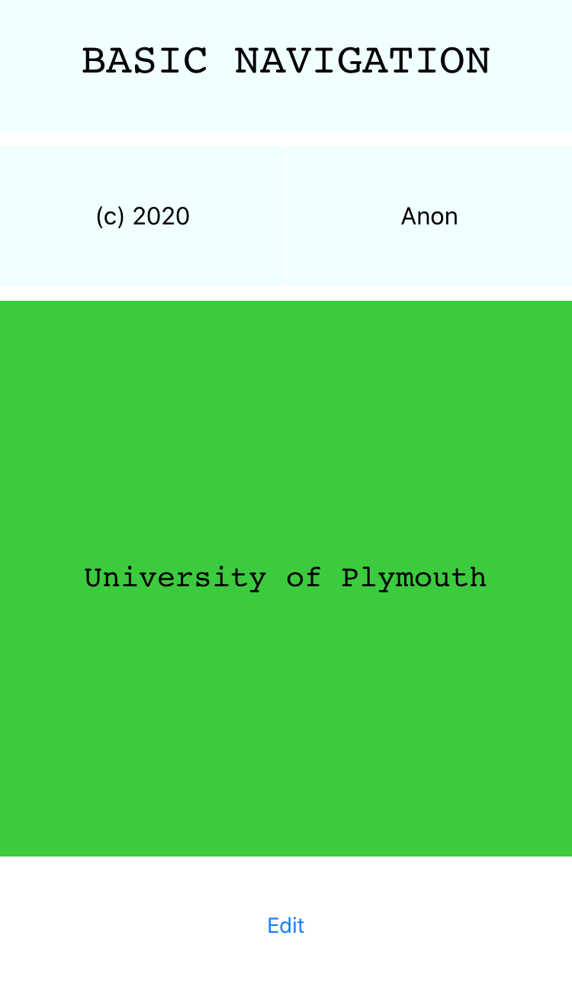
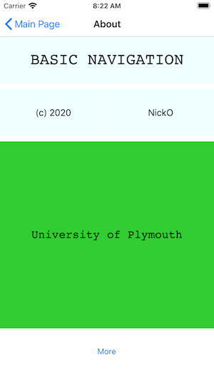

[Contents](README.md)

---

The code examples for this section are to be [found in this folder](/code/Chapter3/NavigationControllers)

# Hierarchial Navigation
One of the most apparent differences between a desktop computer and a mobile device is screen size. It is therefore common to limit the information on screen. One popular approach on both iOS and Android is to organize and display information hierarchically.

The first page may display the highest level, skipping many details

A user interaction may select an item so they can drill down to a finer grained level of detail. This process might even repeat again, displaying finer and finer grained levels of detail.

> The settings application on both iOS and Android are examples of this. At the top level, there are broad categories. As you tap these items, you are taken to a deeper level of information. This process can go several layers deep until you find the information or setting of interest.

## A Navigation Stack
The most common type if hierarchial navigation ....

> As each page is _pushed_ on top of the other, a Navigation Controller maintains a _stack_ of **views**. As the user navigates back, the top view is popped off the stack.

As each page is displayed, so few things happen:

* A new page of information is pushed onto the navigation _stack_ and displayed
* A title bar informs the user of the page title and often provides a button to navigate back to the previous page
* Animations are run between pages to help the user visualize where they are in the page hierarchy.

Very often this design is used in conjunction with tables or types of 'collection views'. A common pattern is to tap a table row and drill down into finer detail.

We are going to focus on just the navigation aspects first and introduce collection views (including tables) later.

## Key Issues with Hierarchial Navigation
When an application is broken into a hierarchy of pages, there are some _architectural_ challenges to consider: 

* When a user interacts with an app (e.g. selects a table row, button etc.), a new page has to be selected and pushed on the stack for presentation.
    * Very often, some relevant data may need to be passed forward for display and editing purposes
    * At this point, the user may add,edit or delete information.
    * It needs to be decided whether edits are immediate or reversible
* As a user navigates back up the hierarchy, edited or new information may need to be passed back up the chain and _before_ the view is destroyed.
   * The default 'back button' typically cannot be intercepted (let's get that one in early!)
   * We need to decide early if any changes are saved or discarded
   * Additional interface elements may be needed to 'save / commit / undo' changes.
* We will also try and keep to the MVVM pattern. 
   * Strictly, it should be the ViewModel that contains the navigation logic and it should be unit-testable.
   * Ideally a ViewModel should not depend on any views. However, we at this stage, we might need to compromise.
   * Xamarin.Forms navigation is _view based_. You need a reference to the view to push it on the navigation stack

Navigation in Xamarin.Forms has a reputation of being complicated. The underlying reason for this is related to strict adherence to the MVVM pattern to support unit testing of ViewModels.

> As we will soon learn, Xamarin.Forms navigation is _view based_ making _pure_ MVVM complex to implement.
>
> There are third-party libraries that build upon Xamarin.Forms and .NET to make pure MVVM navigation much easier. Examples include [the prism library](https://prismlibrary.github.io/), [mvvm lite](http://www.mvvmlight.net/) and [mvvmcross](https://www.mvvmcross.com)

I am going to try and maintain the essence of MVVM but forgo being purist. They key message is to be aware of the issues and limitations of the simpler approach.
I am also keen to minimize the number of 3rd party dependencies (from a teaching point of view, this can cause logistical headaches).

## Basic Navigation - 1
Open the solution in the folder BasicNavigation-1, build and run.

The basic navigation scheme is illustrated in the figure below:


The three views are made up of three simple subclasses of `ContentPage`:

* `MainPage` (title: Main Page)
* `AboutPage` (title: About)
* `AboutAbout` (title: More Info)

> Each of these views is contained in another page of type `NavigationPage`. 

The `NavigationPage` is assigned as the application's `MainPage` property (not to be confused with the MainPage class above).

The `NavigationPage` is responsible for the following:

* Displaying the title bar
* Displaying the currently visible page on the top of the stack in the content area below the title
* Maintaining a 'stack' (last-in-first-out list) of pages
* Animating pages and title bars on and off the screen

If we have navigated to the last of the three content pages, you might visualize this as follows:


The title bar shows the title of each page and a back button. Pages are resized and drawn in the space below.

Let's see how this is done

## The Application MainPage Property
In this application, we want a `NavigationPage` to be the root page in the application. This can be seen in `App.xaml.cs`

```C#
public App()
{
   InitializeComponent();

   MainPage firstPage = new MainPage();

   this.MainPage = new NavigationPage(firstPage);
}
```

> Try to not confuse the class `MainPage` (created by Visual Studio) and the `MainPage` property of the `Application` class. I have left in `this` to clarify this point

The key points here are:

* The application `MainPage` property is set to a new instance of `NavigationPage`
* NavigationPage has been passed a reference to a new instance of the class `MainPage` which is the top level view

The result of this is to display the following:



Notice that the title bar displays the title of the page, but there is no back button (because this page is at the bottom of the stack).

Before we move to the next view, let's also take a look at `App.xaml`

```XML
<?xml version="1.0" encoding="utf-8"?>
<Application xmlns="http://xamarin.com/schemas/2014/forms"
             xmlns:x="http://schemas.microsoft.com/winfx/2009/xaml"
             xmlns:d="http://xamarin.com/schemas/2014/forms/design"
             xmlns:mc="http://schemas.openxmlformats.org/markup-compatibility/2006"
             mc:Ignorable="d"
             x:Class="BasicNavigation.App">
    <Application.Resources>
        <Style TargetType="Button">
            <Setter Property="VerticalOptions" Value="CenterAndExpand"/>
            <Setter Property="Padding">
                <Setter.Value>
                    <OnPlatform x:TypeArguments="Thickness" Android = "0,0,0,0" iOS = "0,0,0,20"/>
                </Setter.Value>
            </Setter>
        </Style>
    </Application.Resources>
</Application>
```

It's a bit of an aside, but note the resources contains a style for `Button`. It also contains some adjustments based on platform, a topic that will be covered later. For now, consider this style to be inherited throughout the application.

Moving on, let's look at the `MainPage` class, which is the first visible page in the app.

## The `MainPage` Class
In the preceding section, we saw an instance of the first page `MainPage` passed as a parameter to the `NavigationPage`

On it's own, it would appear without the title bar. However, when presented by a `NavigationPage`, we also get the title bar.

> The title bar is part of the chrome that comes with `NavigationPage` 

So where does `NavigationPage` pick up the title? Take a look at the XAML for `MainPage`

```XML
<?xml version="1.0" encoding="utf-8"?>
<ContentPage xmlns="http://xamarin.com/schemas/2014/forms"
             xmlns:x="http://schemas.microsoft.com/winfx/2009/xaml"
             xmlns:d="http://xamarin.com/schemas/2014/forms/design"
             xmlns:mc="http://schemas.openxmlformats.org/markup-compatibility/2006"
             mc:Ignorable="d"

             Title="Main Page"
             
             x:Class="BasicNavigation.MainPage">

    <StackLayout>
        <Label Text="Welcome to Xamarin.Forms!"
               HorizontalOptions="Center"
               VerticalOptions="CenterAndExpand" />
        <Button Text="About this App"
                x:Name="ButtonAbout"
                Clicked="ButtonAbout_Clicked" />
    </StackLayout>
</ContentPage>
```

Note that `ContentPage` has a property `Title` set in the XAML. You can also set it in the code-behind as well of course. The `NavigationPage` uses this property to display the title.

> It is important to remember to include the title property when using `NavigationPage`. Failure to do so will result in a blank title bar.

#### View Based Navigation
Next we turn our attention to the button, and specifically the event handler. This is set to `ButtonAbout_Clicked` in the XAML using the `Clicked` property. 

When this button is tapped, the we will navigate to the next page `AboutPage`. Let's look at the event handler in the code-behind to see how this works:

```C#
public partial class MainPage : ContentPage
{
    public MainPage()
    {
        InitializeComponent();
        //NavigationPage.SetBackButtonTitle(this, "Start");
    }

    private async void ButtonAbout_Clicked(object sender, EventArgs e)
    {
        //Push about page on the navigation stack with animation.
        AboutPage about = new AboutPage("NickO");
        await Navigation.PushAsync(about,true);
    }
}
```

It's actually very simple, but a few things probably need highlighting here:

* The event handler is part of the code behind, so currently navigation logic is part of the view object. Later we would prefer it to be in the ViewModel.
* The next page (view object) we navigate to is first instantiated. A parameter is passed so it can be displayed in the next view. In this case, it is a literal string, but it could have been a property of the current view. _This is an example of passing data down the view hierarchy_.
* A property inherited in every `ContentPage` is `Navigation`. In effect this is a proxy for navigation in general. As we will see, this is also used in the absence of a `NavigationPage`.
* The navigation is performed by `Navigation.PushAsync`. As the name suggests, this is asynchronous so you need to `await` this method. Note the second parameter indicates if animation is used.

So far there are no ViewModel or Model classes. We will come to this later.

## The `AboutPage` class
The second page in the hierarchy is the AboutPage shown here:



This view is layed out using a grid as we saw in a previous section.

* Take some time to study the XAML. We will not go through this as there is nothing particularly new.

Instead, let's look at some of the code behind:

First the constructor

```C#
public AboutPage(string AuthorName)
{
    InitializeComponent();
    NavigationPage.SetBackButtonTitle(this, "Prev");
    LabelAuthor.Text = AuthorName;
}
```

Remember that the previous page passed in a string as a parameter. This is now used to initialise the view.

### The Back Button

Look at the back button in the screenshot above. You will see it says "Main Page". However, the following line in the constructor would appear to be setting the back button title to "Prev" ?

```C#
NavigationPage.SetBackButtonTitle(this, "Prev");
```

> You may have guessed this (or you already knew), but the back button title is always set by the previous page. By default, it is the title of the previous page but you can override it.

This makes sense. A page does/ not know about the page before it. In fact, there may be many routes to the same page, in which case, the back button would be different for each.

In this example, on the next page, we expect the back button to read "Prev".

### OnAppearing and OnDissapearing
In the code behind, we also see the following:

```C#
protected override void OnAppearing()
{
    base.OnAppearing();
    Console.WriteLine("OnAppearing - do not count on this!");
}
protected override void OnDisappearing()
{
    base.OnDisappearing();
    Console.WriteLine("OnDisappearing - do not count on this!");
}
```

* Run the application for Android (and if possible, iOS). Watch the Application Output panel as you navigate to and from this view.

The documentation warns us about these methods however.

> When the PushAsync method is invoked, the following events occur:
>
> * The page calling PushAsync has its OnDisappearing override invoked.
>
> * The page being navigated to has its OnAppearing override invoked.
>
> * The PushAsync task completes.
>
>However, the precise order in which these events occur is platform dependent. For more information, see Chapter 24 of Charles Petzold's Xamarin.Forms book.
>
> [Microsoft Documentation](https://docs.microsoft.com/xamarin/xamarin-forms/app-fundamentals/navigation/hierarchical)


## The AboutAbout Page
Tapping the button navigates to the `AboutAbout` page, the third and final page in the hierarchy.


Note the back-button title. It is not the title of the previous page as it was previously set to "Prev".

What is slightly different in this page is the navigation behavior when you tap the button:


---

Next
