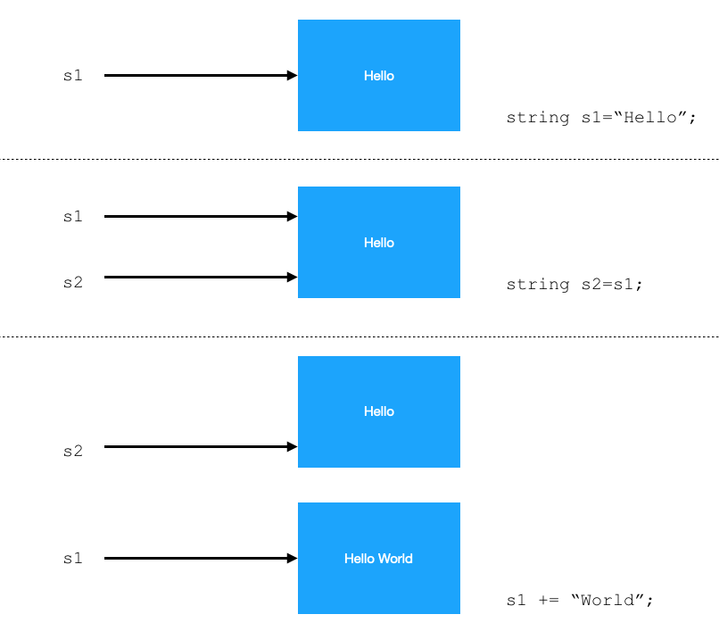
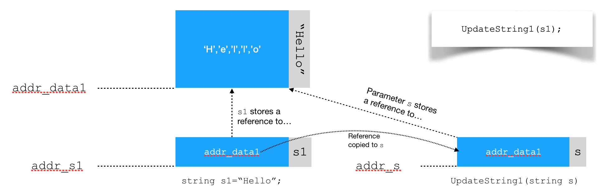
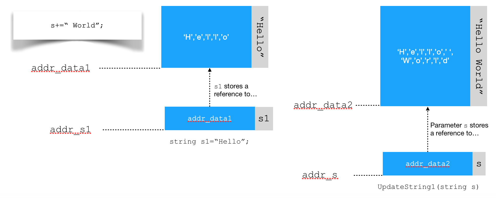
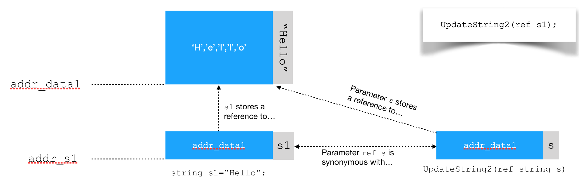
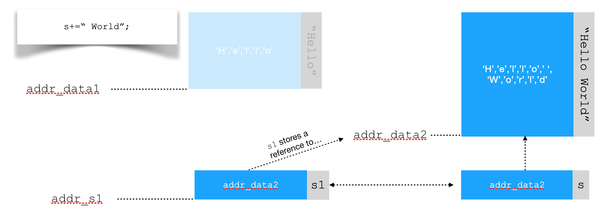

[Contents](readme.md)

---

The code for this section can be found in the folder [ValueReference](/code/Chapter3/ValueReference)

Open the solution file and note there are a number of projects (one for each section below).

## Value Types and Semantics
Build the project `ValueReference1` and using the debugger, step through line by line to follow the logic.

In this example we first define an integer variables `a` and initialise its value to 10.

```C#
int a = 10;         
```

Next we create a second variable `b`, and initialize it with the _value_ stored in `a`

```C#
int b = a;
```

Under the hood, the following logical operations are performed:

* A unique space for `b` is created in memory
* The value of `a` is read from memory and copied into the memory location for `b`

Both `a` and `b` are separate independent variables that exist in memory. They just happen to hold the same value.

> When one value type variable is assigned to another, then the value of one is copied into the other. Both variables remain independent.

We can see this when we change one of the variables `a`

```C#
a+=1;
```

The value of `a` is now 11, but `b` remains at 10. The variables `a` and `b` exist at separate memory locations.

These behaviors are also referred to as __value semantics__. The simple types (`char`, `short`, `int`, `long`, `float`, `double` etc.) all use value semantics.


## Using references to value types
The next example is in the project `ValueReference-2`. Build and step through the code, making note of how the variables change.

We start with a simple value type `a`

```C#
int a = 10;
```

Next, we create another variable, only this time we tell the compiler to use _reference semantics_

```C#
ref int b = ref a;
```

The variable `b` is now just another name for variable `a`. If we imagine `a` and `b` as variables in memory, then each has the exact same address (and therefore, they reference the same data).

If we now modify `a`, we see the same change reflected in `b`. The following line:

```C#
a += 1;
```

will result in BOTH `a` and `b` being equal to `11`. Similarly, if we modify `b`:

```C#
b += 10;
```

Now both `a` and `b` return the value `21`.

This example also demonstrates how this can be used to perform in-line modification. The following function takes two parameters:

* a reference to an integer
* a value `delta`

```C#
public void updateInplace(ref int u, int delta)
{
    u += delta;
}
```

When we invoke this function, we can see how reference semantics differ from value.

```C#
int a = 10;
updateInplace(ref a, 10);
```

A reference to `a` is passed as the first parameter (so the parameter `u` is synonymous with `a`). A copy of the literal value 10 as the second.

When the function returns, `a` will now equal `20`.

> Passing by reference can be confusing / ambiguous for others, so use sparingly.

## Classes and Structures
Build the project `ValueReference-3` and step through the code with the debugger.

Consider the following class and structure:

```C#
public class MyObj 
{
    public int a;
    public int b;
    public MyObj(int aa, int bb) => (a, b) = (aa, bb);
    public override string ToString() => $"a={a}, b={b}";
}

public struct MyStruct
{
    public int a;
    public int b;
    public MyStruct(int aa, int bb) => (a, b) = (aa, bb);
    public override string ToString() => $"a={a}, b={b}";
}
```

They look almost identical, but there is an important difference.

> Instances of a **class** (objects) are **reference types**
>
> Instances of a **structure** are **value types** (although they may encapsulate reference types within them)

We can see this behavior demonstrated in the code.

```C#
MyObj r1 = new MyObj(2, 3);
MyObj r2 = new MyObj(10, 20);
MyObj r3 = r1;
```

In this case, `r3` is not synonymous with `r1`, but references the same data in memory. Any change to the data of one is reflected in the other.

Contrast this with the structure:

```C#
MyStruct s1 = new MyStruct(2, 3);
MyStruct s2 = s1;
```

The structure `s2` is first created, then all the elements of `s1` are _copied_ into `s2`. From this point onwards, both are entirely independent data structures.

> A change in `s1` will have no impact on `s2` and vice-versa.

This is demonstrated in the code.

Note how we get both the copy behavior and independence we saw with simple value types (`int`, `float` etc..). Contrast this with a class where no new objects are created and therefore no data needs to be copied.

### Passing Parameters
A very common process is to pass either reference or value types as parameters to a method. It is important to understand the difference in behavior. To add more confusion, we also have the `ref` keyword which can be applied to either as well.

Let's start with a reference type. When you pass a reference type, the method has access to the original object. For example:

```C#
MyObj r1 = new MyObj(2, 3);
ReferenceSemantics.NegateObjInline(r1);
//r1 is now changed

...

static void NegateObjInline(MyObj obj)
{
    obj.a *= -1;
    obj.b *= -1;
}
```

Note how the method does not need to return a new object. Instead, it was possible to modify the original object via the reference provided. This needs to be used with caution as such behavior can seem ambiguous.

Contrast this with value types:

```C#
MyStruct s1 = new MyStruct(2, 3);
s1 = NegateStruct(s1); //pass a copy
//s1 overwritten
...
static MyStruct NegateStruct(MyStruct s)
{
    MyStruct res = new MyStruct(-1 * s.a, -1 * s.b);
    return res;
}
```

Value type parameters are copied. Note how a new copy is returned and overwrites `s1`.

Now look what happens when you use the `ref` keyword.

```C#
MyStruct s2 = new MyStruct(2, 3);
NegateStructInline(ref s2); 
//s2 now modified
...
static void NegateStructInline(ref MyStruct s)
{
    s.a *= -1;
    s.b *= -1;
}
```

One might argue that the explicit use of the keyword `ref` helps communicate the intent both in the method and at the point it is invoked. It is clear to the reader that a reference is being passed (presumably for a reason), and therefore you might expect it to perform an in-place modification.

There is a subtle but important difference between a reference type and `ref`. We will talk more about `ref` later in this section.

## Equivalence

Build and step through the project `ValueReference-4`.

We sometimes want to compare objects for equivalence. We need to be clear about what we mean by equivalence. 

For reference types, we could mean either of the following:

* both references are identical, in that they reference the same data object in memory
* the references may be different, they may be equivalent in some other sense, such as equal properties and/or type etc.

For value types, two variables cannot reference the same object in memory (one of the key features of value types). However, as with reference types, they may be equivalent in terms of having equal properties and/or type.

In this example, we define a custom `Equals` method by implementing the interface `IEquatable<>`

```C#
public class MyObj : IEquatable<MyObj>
{
    public int a;
    public int b;
    public MyObj(int aa, int bb) => (a, b) = (aa, bb);

    //To perform a bespoke member by member comparison
    public bool Equals([AllowNull] MyObj other)
    {
        if (other == null) return false;
        return ((other.a == a) && (other.b == b));
    }

    public override string ToString() => $"a={a}, b={b}";
}
```

### The `==` operator

We need to be careful in our assumptions about testing for equality.

> From the [Microsoft documentation](https://docs.microsoft.com/dotnet/csharp/language-reference/operators/equality-operators), we learn that:
>
>  _By default, two reference-type operands are equal if they refer to the same object
> ...
> However, a reference type can overload the == operator. If a reference type overloads the == operator, use the `Object.ReferenceEquals` method to check if two references of that type refer to the same object._

For our own classes, we can simply use the `==` operator to check if two variables reference the same object. If we wish to be certain, then use the `Object.ReferenceEquals` method`.

Two instances of this class can be compared in the following way:

* Using the == operator, which will test if the references are to the same data (same object in memory)
   * If it's possible that `==` has been overridden, then use the `Object.ReferenceEquals` method`.

* Using the `Equals` method. 
   * There is also a default implementation in [`System.Object`](https://docs.microsoft.com/dotnet/api/system.object.equals?view=netframework-4.8) 

You need to be careful when testing for equality: make sure you are clear what you mean by equality and whether your code really tests this.

For structures, we get a bit more help:

```C#
public struct MyStruct
{
    public int a;
    public int b;
    public MyStruct(int aa, int bb) => (a, b) = (aa, bb);
    public override string ToString() => $"a={a}, b={b}";
}
```

We cannot compare with `==` as this would always return false (unless we override it).

We can use the default `Equals` method however:

```C#
MyStruct s1 = new MyStruct(10, 20);
MyStruct s2 = new MyStruct(10, 20);
//if (s1 == s2) does not compile
if (s1.Equals(s2))
{
    Console.WriteLine("s1 and s2 are the same!");
}
else
{
    Console.WriteLine("s1 and s2 are not the same!");
}
```

This results in a positive result (they are considered equal). This performs an element-by-element comparison which can be convenient (assuming this is what you want).

From the [Microsoft documentation](https://docs.microsoft.com/dotnet/api/system.valuetype.equals?view=netframework-4.8):

> The `ValueType.Equals(Object)` method overrides `Object.Equals(Object)` and provides the default implementation of value equality for all value types in the .NET Framework.
>
> The default implementation calls `Object.Equals(Object)` on each field of the current instance and obj and returns true if all fields are equal.

Again, if you want to fully define the meaning of `Equals`, override and write one yourself.

## Immutable Reference Types

For this section, build and step through the project `ValueReference-5`

The key point in this example is a simple one:

> Careful what you assume!

We are going to focus on a fairly well known reference type, the `System.String` class, also known as `string`

> The type `string` is a class, but it _behaves_ as a value type!

Consider the first line:

```C#
string s1 = "Hello";
```

You can consider literal strings are instances of `string` objects. We could have equally written

```C#
string s1 = new string("Hello"); 
```

Next, we create a second reference `s2`

```C#
string s2 = s1;
```

At this point, `s2` is simply a reference to the same data as `s1`. These are both reference types, so no data needs to be copied (so it's fast). If we are curious, we can test this using `Object.ReferenceEquals(s1,s2)`

Next, `s1` is 'modified':

```C#
s1 += " World";
```

You might expect that `s2` is also updated, as after all `string` is reference type. However, the type `string` is written to be _immutable_ (meaning it's contents cannot be changed once initialized). 

> Every time you attempt to change a `string` type, a completely new string is instantiated with the updated value.

The `+=` operator is overridden to create a new string containing the two concatenated strings. It is equivalent to the following:

```C#
s1 = new string("Hello World");
```

The old string is still referenced by `s2`, so remains in memory. This is depicted in the image below.



Note that throughout, `s1` and `s2` are still distinct variables. It is simply a question of what data they refer to.

### Using `ref` with reference types
The `ref` keyword can be used for both reference types and value types, which may surprise you.

> `ref` and reference types are not the same thing!
>
> "Do not confuse the concept of passing by reference with the concept of reference types. The two concepts are not the same. A method parameter can be modified by ref regardless of whether it is a value type or a reference type. There is no boxing of a value type when it is passed by reference."
>
> [Microsoft Documentation](https://docs.microsoft.com/dotnet/csharp/language-reference/keywords/ref) 

So what is the meaning of passing a reference type by reference? From the same documentation source:

> "You can also use the `ref` keyword to pass reference types by reference. Passing a reference type by reference enables the called method to replace the object to which the reference parameter refers in the caller. The storage location of the object is passed to the method as the value of the reference parameter. If you change the value in the storage location of the parameter (to point to a new object), you also change the storage location to which the caller refers."

Here is a simple example:

```C#
string s1 = "Hello";
UpdateString1(s1); //Does nothing
UpdateString2(ref s1); //Replaces s1
...

void UpdateString1(string s)
{
    //equivalent to s = new string("Hello World");
    s += " World"; 
}

//This has no compiler warning
void UpdateString2(ref string s)
{
    s+ = " World";
}
```

In the  case of the `UpdateString1` method, a reference type is passed as a parameter `s`. 

> At this point, the reference type `s` now references the same data as `s1`, but is still a distinct (local) variable and separate to `s1`. Furthermore, `s` is in scope whereas `s1` is out of scope, so `s1` cannot be modified.



Next the line `s += " World";` is executed.

Ordinarily, this would allow the method to change the object data being referenced (currently by both `s1` and `s`), _except_ string types are *immutable* and `+=` is overloaded to create a new string. Therefore, `s` now references a new string `"Hello World"` while `s1` still references the original `"Hello"`. 



When the function finishes, `s` goes out of scope so this method has no lasting effect (you will note the compiler issue a warning to this effect).

> If you are a C or C++ programmer, you can think of this approach as passing a copy of the address stored in `s1` (an integer) into `s`. This might allow you to access and change the data at that memory address, but not the pointer `s1` itself. You cannot change where `s1` points to in this way.

Now consider the method `UpdateString2`. The parameter `ref string s` is synonymous with `s1`. This gives this method direct access to `s1` via the parameter `s`.



The local parameter `s` is synonymous with `s1`, so when the reference `s` is updated by the `+=` operator, so is `s1`.



> Again for C and C++ programmers, the pointer variables `s1` and `s` have the same address (similar concept to a union). The address stored in `s1` can now be updated via it's in-scope alias `s`. When the method exits, `s1` now points to a different area in memory and the original can be de-allocated.

Don't be surprised if this is confusing. Even if you can grasp all of this, it is worth considering that others may not. Consider avoiding such strategies and doing things in a more straightforward way.

## Encapsulating Immutable and Value Types

For this section, build and step through the project `ValueReference-6`

If you want to pass value type or immutable reference type data by reference, you can always encapsulate the data in a class.

For example, let's say we wished to pass an `int` and `string` to a method so both can be modified. We might encapsulate both data elements inside a class as follows:

```C#
public class DataModel
{
    private string _stringData; 
    public string StringData {
        get => _stringData;
        set
        {
            if (_stringData == value) return;
            _stringData = value;
        }
    }
    public int IntData { get; set; } = 0;

    public override string ToString() => $"{StringData}, {IntData}";

    public DataModel(string str, int u) => (StringData, IntData) = (str,u);
}
```

From another context, we might write a method to accept a parameter of type `DataModel`

```C#
void UpdateDataInline(DataModel model)
{
    Console.WriteLine("Updating model data");
    model.StringData += " World";
    model.IntData += 1;
}
```

We can now pass data to this method and have it updated:

```C#
DataModel m1 = new DataModel("Hello",99);
Console.WriteLine($"Model: {m1}");
UpdateDataInline(m1);
Console.WriteLine($"Model: {m1}");
```

The reference `m1` has not changed, but the data it references inside has changed. We can see this from the output.

## Before we move on...

There is something to be said for preferring value-semantics over reference. Value semantics are less ambiguous and in some circumstances safer. Do not get overly concerned about the overheads of value-semantics, including concerns about making (logical) copies of data. To a some extent, you can probably trust the optimizing compiler to keep the code efficient and fast in most situations (which often passes by reference anyway, utilizing copy on write etc..).

If you want to know more about writing safe and efficient code, see [this document](https://docs.microsoft.com/dotnet/csharp/write-safe-efficient-code).

For additional reading, see also [Boxing and Unboxing](https://docs.microsoft.com/dotnet/csharp/programming-guide/types/boxing-and-unboxing)


---

[Next - Navigation Controllers](Chapter_3_Navigation/NavControllers.md)