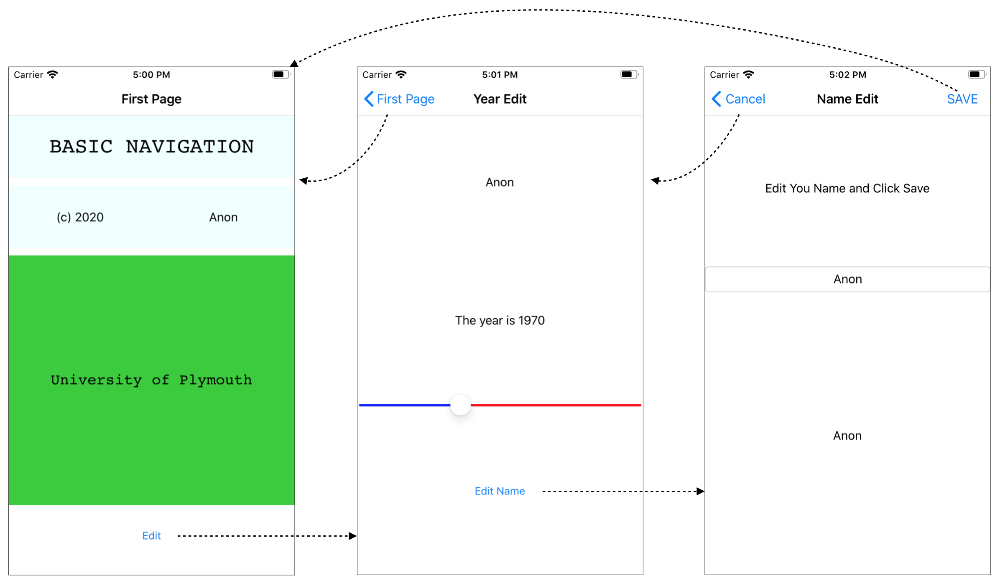
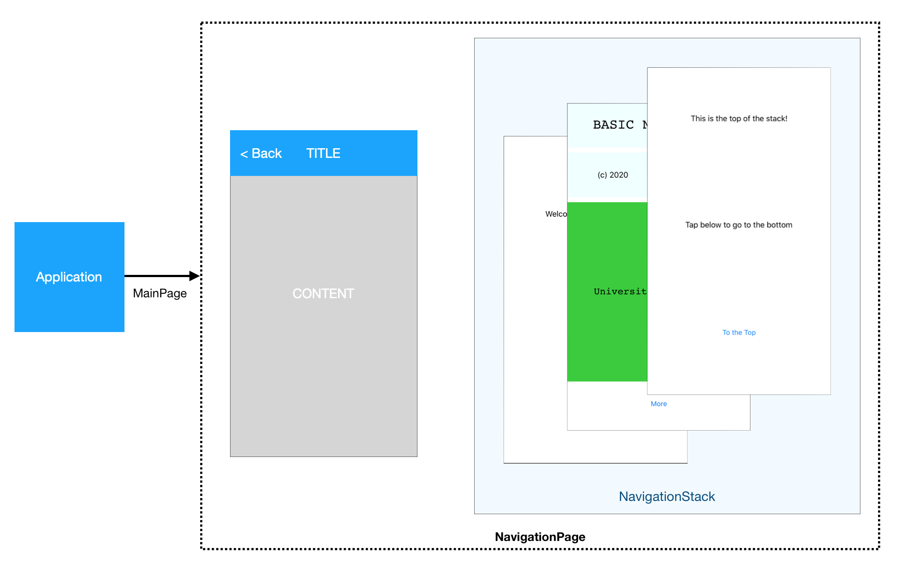
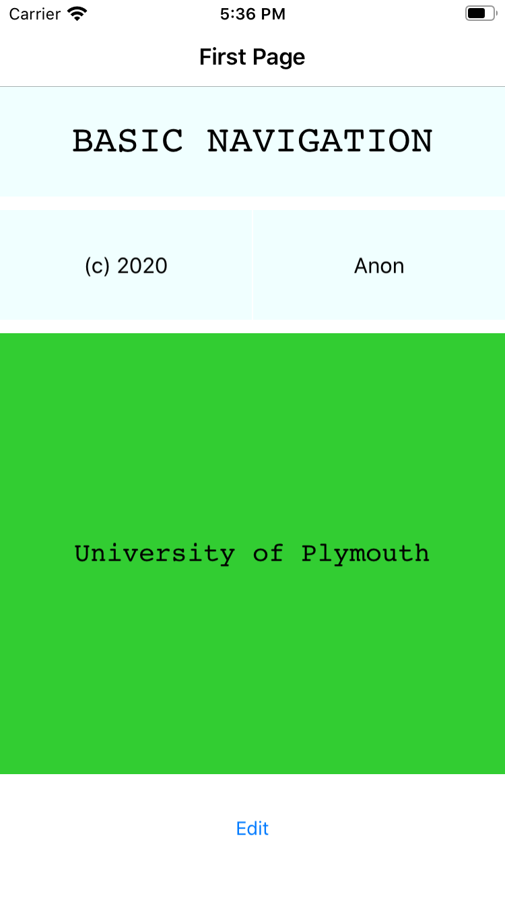
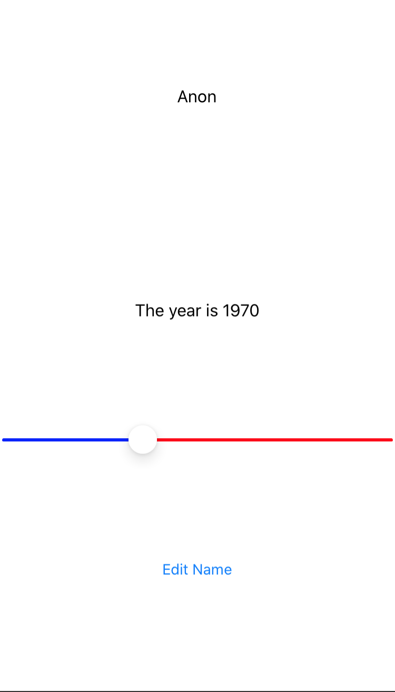
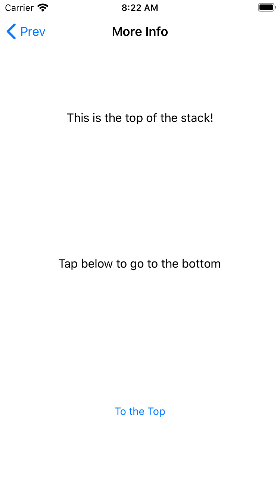
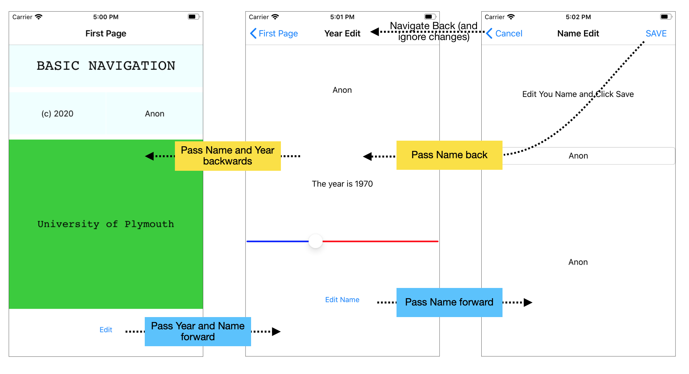

[Previous - Navigation Controllers](NavControllers.md)

---
# View Based Navigation
All examples can be found within [this folder](/code/Chapter3/NavigationControllers/1-View_Based)

## Basic Navigation - 1
Open the solution in the sub-folder BasicNavigation-1, build and run.

> Note that these examples are somewhat contrived and stripped down to the minimum for educational and illustrative purposes. They certainly won't attract any design awards :)

The basic navigation scheme is illustrated in the figure below:



The three views are made up of three simple subclasses of `ContentPage`:

* `FirstPage` (title: First Page)
* `YearEditPage` (title: Year Edit)
* `NameEditAbout` (title: Name Edit)

> Each of these views is **contained** in another page of type `NavigationPage`. 

The `NavigationPage` is assigned as the application's `MainPage` property and is responsible for the following:

* Maintaining a 'stack' (last-in-first-out list) of pages
* Displaying the title bar and back button
* Displaying the currently visible page on the top of the stack in the content area below the title
* Animating pages and title bars on and off the screen

If we have navigated to the last of the three content pages, you might visualize this as follows:



> A *stack* is a well known data structure. If you are unfamiliar with the term, you might want to [read up on this](https://en.wikibooks.org/wiki/Data_Structures/Stacks_and_Queues).

The title bar shows the title of the currently visible page and a back button (unless it's the first page). Pages are resized and drawn in the space below.

Let's see how this is done

## The Application MainPage Property
In this application, we want a `NavigationPage` to be the root page in the application. This can be seen in `App.xaml.cs`

```C#
public App()
{
   InitializeComponent();
   FirstPage firstPage = new FirstPage();
   MainPage = new NavigationPage(firstPage);
}
```

The key points here are:

* The application `MainPage` property is set to a new instance of `NavigationPage`
   * It is helpful to remember that the `NavigationPage` is still a Page.

* NavigationPage has been passed a reference to a new instance of the class `FirstPage` which is the root view (what will become the bottom item on the stack)

The result of this is to display the following



If you inspect the XAML, you will see this view is laid out using a grid as we saw in a an earlier section.

Notice that the title bar displays the title of the page, but there is no back button (because this page is at the bottom of the stack). The title bar is part of the `NavigationPage`. The page on the top of the stack is resized to fit in the space below.

Before we move to the next view, let's also take a look at `App.xaml`

```XML
<?xml version="1.0" encoding="utf-8"?>
<Application xmlns="http://xamarin.com/schemas/2014/forms"
             xmlns:x="http://schemas.microsoft.com/winfx/2009/xaml"
             xmlns:d="http://xamarin.com/schemas/2014/forms/design"
             xmlns:mc="http://schemas.openxmlformats.org/markup-compatibility/2006"
             mc:Ignorable="d"
             x:Class="BasicNavigation.App">
    <Application.Resources>
        <Style TargetType="Button">
            <Setter Property="VerticalOptions" Value="CenterAndExpand"/>
            <Setter Property="Padding">
                <Setter.Value>
                    <OnPlatform x:TypeArguments="Thickness" Android = "0,0,0,0" iOS = "0,0,0,20"/>
                </Setter.Value>
            </Setter>
        </Style>
    </Application.Resources>
</Application>
```

It's a bit of an aside, but note the resources contains a style for `Button`. It also contains some adjustments based on platform, a topic that will be covered later. For now, consider this style to be inherited throughout the application. It will help us keep the rest of the application less cluttered.

Moving on, let's look at the `FirstPage` class, which is the first visible page in the app.

## The `FirstPage` Class
In the preceding section, we saw an instance of the first page `FirstPage` passed as a parameter to the `NavigationPage`

On it's own, it would appear without the title bar. However, when presented by a `NavigationPage`, we also get the title bar.

> The title bar is part of the chrome that comes with `NavigationPage` 

So where does `NavigationPage` pick up the title? Take a look at the `ContentPage` element in the XAML for `FirstPage`

```XML
<?xml version="1.0" encoding="utf-8"?>
<ContentPage xmlns="http://xamarin.com/schemas/2014/forms"
             xmlns:x="http://schemas.microsoft.com/winfx/2009/xaml"
             xmlns:d="http://xamarin.com/schemas/2014/forms/design"
             xmlns:mc="http://schemas.openxmlformats.org/markup-compatibility/2006"
             mc:Ignorable="d"
             Title="First Page"
             x:Class="BasicNavigation.FirstPage">

             ...
```

Note that `ContentPage` element has an attribute `Title` set in the XAML. You can also set it in the code-behind as well of course. The `NavigationPage` uses this property to display the title.

> It is a good habit to include the title property with all pages. Failure to do so will result in a blank title when using `NavigationPage`.

### Navigating to the Next Page
Next we turn our attention to the button which can be seen in the XAML below:

```XML
...
<Label Text="BASIC NAVIGATION"
        Grid.Row="0" Grid.Column="0" Grid.ColumnSpan="2"
        FontSize="Title" FontFamily="Courier"
        />
<Label Text="(c) 2020"
        Grid.Row="1" Grid.Column="0"
        />
<Label Text="Anon"
        Grid.Row="1" Grid.Column="1"
        />
<Label Text="University of Plymouth"
        Grid.Row="2" Grid.Column="0" Grid.ColumnSpan="2"
        BackgroundColor="LimeGreen"
        FontSize="Large"
        FontFamily="Courier"
        />
<Button Text="Edit"
        Grid.Row="3" Grid.Column="0"
        Grid.ColumnSpan="2"
        x:Name="EditButton"
        />
...
```

In the code behind, we see the event handler being attached in the constructor:

```C#
public partial class FirstPage : ContentPage
{
    public FirstPage()
    {
        InitializeComponent();

        //Attach event handlers
        EditButton.Clicked += EditButton_Clicked;
    }

    private async void EditButton_Clicked(object sender, EventArgs e)
    {
        var nextPage = new YearEditPage();
        await Navigation.PushAsync(nextPage, true);
    }
}
```

In this example, it is the button event handler that controls the navigation process, resulting in the next page to be animated over the current page. The code in the event handler is actually very simple, but a few things probably need highlighting here:

* A property inherited in every `ContentPage` is `Navigation`. In effect this is a proxy for navigation in general. 
   * As we will see, this can also used for modal presentation.

* The next page we navigate to is first instantiated then pushed onto the navigation stack using `Navigation.PushAsync`. 
   * The next view is animated onto the screen.
   * As the name suggests, this is asynchronous so you need to `await` this method. This also makes the event handler asynchronous.

* The navigation is performed from within the event handler, which is part of the code behind. The code-behind is considered a view object.

So far there are no ViewModel or Model classes. We will come to this later.

## The `YearEditPage` class
The second page in the hierarchy is the `YearEditPage` shown here:



Take some time to study the XAML and code-behind. Take note of the comments in the XAML, especially the slider. You must set the `Maximum` before the `Minimum` to avoid an exception (this had be going for over an hour!)

```XML
<Slider 
        x:Name="YearSlider"
        Maximum="2100"
        Minimum="1900"
        Value="1970"
        MinimumTrackColor="Blue"
        MaximumTrackColor="Red"
/>
```

There is not much else that is different about this XAML, so turing our attention to the code behind:

First the constructor where we connect up the event handlers.

```C#
public YearEditPage()
{
    InitializeComponent();

    NavigationPage.SetBackButtonTitle(this, "Cancel");

    EditButton.Clicked += EditButton_Clicked;
    YearSlider.ValueChanged += YearSlider_ValueChanged;
}
```

### The Back Button

Run and the app and note the back button for each page. For the `YearEditPage` you will see it says "Main Page", which is the title of the _previous_ page. 

You might think the following line in the constructor would override the back button title to "Cancel":

```C#
NavigationPage.SetBackButtonTitle(this, "Cancel");
```

> You may have guessed this (or you already knew), but the back button title is always set by the _previous page_.
>
>Navigate to the last page and you will see the button label being overridden to "Cancel".

By default, the back button label is the title of the previous page, so it is role of the previous page to provide this information.

This makes sense. A page does/ not know about the page before it. In fact, there may be many routes to the same page, in which case, the back button would probably be different for each.

### OnAppearing and OnDissapearing
In the code behind, the following was also added (for demonstration purposes):

```C#
protected override void OnAppearing()
{
    base.OnAppearing();
    Console.WriteLine("OnAppearing - do not count on this!");
}
protected override void OnDisappearing()
{
    base.OnDisappearing();
    Console.WriteLine("OnDisappearing - do not count on this!");
}
```

* Run the application for Android (and if possible, iOS). Watch the Application Output panel as you navigate to and from this view.

The documentation warns us about these methods however.

> When the `PushAsync` method is invoked, the following events occur:
>
> * The page calling `PushAsync` has its `OnDisappearing` override invoked.
>
> * The page being navigated to has its `OnAppearing` override invoked.
>
> * The `PushAsync` task completes.
>
>However, the precise order in which these events occur is platform dependent. For more information, see Chapter 24 of Charles Petzold's Xamarin.Forms book.
>
> [Microsoft Documentation](https://docs.microsoft.com/xamarin/xamarin-forms/app-fundamentals/navigation/hierarchical)

Examining the event handler for the edit button, we see the same navigation scheme

```C#
private async void EditButton_Clicked(object sender, EventArgs e)
{
    var nextPage = new NameEditPage();
    await Navigation.PushAsync(nextPage, true);
}
```

In terms of the slider events, we will deal with those later. For now, we focus on the navigation aspects.

## The NameEditPage Page
Tapping the edit button navigates to the `NameEditPage` page, the third and final page in the hierarchy.



Note the back-button title. It is not the title of the previous page as it was previously set to "Cancel".

Note also an additional "Save" button in the navigation bar.

> The idea here will be to adopt non-destructive editing (see later example) where cancel will undo any changes to the name, whereas the save button will commit any changes.

```C#
public NameEditPage()
{
    InitializeComponent();

    NameEntry.TextChanged += NameEntry_TextChanged;
    SaveButton.Clicked += SaveButton_Clicked;
}
```

What is slightly different in this page is the navigation behavior when you tap the save button:

```C#
private async void SaveButton_Clicked(object sender, EventArgs e)
{
    Console.WriteLine("Save Clicked");
    await Navigation.PopToRootAsync();
    //await Navigation.PopAsync();
}
```
Unlike the back button, we programmatically navigate back. There are two methods:

* `Navigation.PopAsync()` navigates back to the previous page (same as the default back button)
* `Navigation.PopToRootAsync()` navigates back to the root view.

The advantage of this approach is that unlike the back button, we can intercept the event.

## Summary
That covers the basics of hierarchial navigation in Xamarin.Forms. As I hope is made clear, the mechanism is fairly simple. 

So far, we've focused only on the mechanics of hierarchial view navigation. What may be apparent is that none of the changes in the UI yet persist.

An important topic is how accompanying data is moved forwards and backwards through the navigation scheme. 

* As we push views onto the stack, we typically want to pass data forward
* As we pop views off the stack, we may need to communicate changes/edits back to the previous view (typically without knowledge of it's class)

For example, we might aim to achieve something similar to that depicted in the figure below:



For demonstration purposes, we are going to build on this application and adopt the scheme shown above.

* Editing the year will be immediate (destructive editing)
* When Editing the name, we will allow the user to undo/cancel any changes

There is an important detail with hierarchial navigation you need to keep in mind:

> You cannot (reliably) intercept the back button. There is no event handler you can hook into. Therefore, any changes you make to data must be already committed unless you wish to undo them.

There are a few options and some of these will be covered in subsequent sections.

What can be both challenging and helpful is when we (later) bring in the MVVM pattern. Although this has a _reputation_ for being highly complex (especially if you want to be purist), there is a middle ground which (in my view) is simple, consistent and will serve us well for the purposes of this course. First, let's keep our focus on view-based approaches.

--- 

[Next - Basic Navigation Part 2](basic_navigation_2.md)
