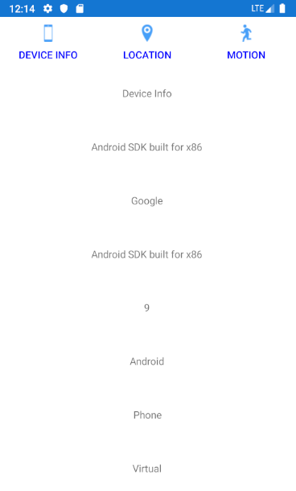

[Back](README.md)

---

## PhoneFeatureApp
If you've worked (ok laboured) through the section on Hierarchial Navigation, this is going to seem simple as most of the issue have already been discussed.

Open the solution in the folder [TabControllers](/code/Chapter3/TabControllers/PhoneFeatureApp). Build and run the application, **preferably on a real device**. If you use a simulator, the Android simulator has slightly better support for motion sensors.

The app has three pages:

* Device Info
* Location
* Motion

Each of these allows you to explore different aspects of a device by touching on a relatred tab icon. The view layout is very basic in order to keep it short and simple.



iOS will look slightly different with the tab bar positioned at the bottom of the screen.

> If you are using a real device, try shaking your device to change the background colour. Alternatively, if using a simulator, head over to the Motion tab and click the Shake button

Note how the background colour of all pages is updated.

### App Class
Look inside `App.xaml.cs` to see the start up code:

```C#
   public App()
   {
      InitializeComponent();
      MainPage = new TopLevelPage();
   }
```        

The `MainPage` is an instance of `TopLevelPage`. 

### TopLevelPage Class
For this example, I have chosen not to use XAML (although I could have), mainly because it is so simple. Here is the code:

```C#
    public class TopLevelPage : TabbedPage
    {
        public TopLevelPage()
        {
            Title = "Phone Feature App";
            Children.Add(new DeviceInfoPage());
            Children.Add(new LocationPage());
            Children.Add(new MotionPage());
            if (Device.RuntimePlatform == Device.Android)
            {
                BarBackgroundColor = new Color(1.0, 1.0, 1.0);
                BarTextColor = new Color(0.0, 0.0, 1.0);

                //Try this instead of the above two lines
                //Xamarin.Forms.PlatformConfiguration.AndroidSpecific.TabbedPage.SetToolbarPlacement(this, Xamarin.Forms.PlatformConfiguration.AndroidSpecific.ToolbarPlacement.Bottom);
            }
        }
    }
```

The top level page is a subclass of `TabbedPage`. Like [`NavigationPage`](https://docs.microsoft.com/dotnet/api/xamarin.forms.navigationpage?view=xamarin-forms), it maintains a collection of other pages and manages which is displayed on the screen. The collection is the property `Children`

> [See the documentation on `TabbedPage` here](https://docs.microsoft.com/xamarin/xamarin-forms/app-fundamentals/navigation/tabbed-page)

Some key points:

* Unlike `NavigationPage`, all the child pages are instantiated in memory from the start. This has may have an impact on startup time and memory.
* Each child page should have a Title property set.
* Each child page is standalone, with no references to each other.
* Each child page has an associated icon set via the `IconImageSource` property (either in the code-behind or XAML).
   * The icon graphic assets for iOS and Android are in the platform specific projects
   * Each platform specific project has a Resources folder that contains the icons
* The tab button bar is usually at the top for Android and the bottom for iOS
* Any communication between pages is performed with `MessagingCenter` (for loose coupling)
* All pages have a ViewModel. Each inherits common properties and methods from `ViewModelBase` (in the MVVM folder)
* These pages also demonstrate some of the [Xamarin.Essentials](https://docs.microsoft.com/en-us/xamarin/essentials/) features. Do take some time to browse this.

Let's look at the individual pages to highlight some of the key aspects.

### Device Info Page
For the view, we have two files. Let's first look at the XAML

```XML
<?xml version="1.0" encoding="UTF-8"?>
<ContentPage xmlns="http://xamarin.com/schemas/2014/forms"
             xmlns:x="http://schemas.microsoft.com/winfx/2009/xaml"
             Title="Device Info"
             IconImageSource="device.png"
             BackgroundColor="{Binding BackgroundColor}"
             x:Class="PhoneFeatureApp.DeviceInfo.DeviceInfoPage">

    <ContentPage.Resources>
        <ResourceDictionary>
            <!-- See App.xaml for global styles inherited here -->
        </ResourceDictionary>
    </ContentPage.Resources>

    <ContentPage.Content>
        <StackLayout>
            <Label Text="Device Info"/>
            <Label Text="{Binding Device}"/>
            <Label Text="{Binding Manufacturer}"/>
            <Label Text="{Binding DeviceName}"/>
            <Label Text="{Binding Version}"/>
            <Label Text="{Binding Platform}"/>
            <Label Text="{Binding Idiom}"/>
            <Label Text="{Binding DeviceType}"/>
        </StackLayout>
     </ContentPage.Content>
</ContentPage>
```

The points to note are the following three attributes:

* `Title` which sets the text title on the tab bar
* `IconImageSource` which specified the icon filename (without the .png extension)
* `BackgroundColor` which is a property in the ViewModel

The `BindingContext` is hooked up in the code-behind:

```C#
   public DeviceInfoPage()
   {
      InitializeComponent();
      BindingContext = new DeviceInfoPageViewModel();
   }
```      

The ViewModel class is `DeviceInfoPageViewModel` which is a subclass of `ViewModelBase`. It mostly contains code to use Xamarin.Essentials, but in all other respects, it is very similar to other ViewModels we have seen before.

> The `ViewModelBase` contains a property `BackgroundColor` alongside the method `subscribeToBackgroundColChange`

```C#
   protected void subscribeToBackgroundColChange()
   {
      MessagingCenter.Subscribe<ViewModelCommon, Color>(this, "BackgroundColorChange", (sender, arg) => BackgroundColor = arg);
   }
```        

This method is called from the constructor of the ViewModel (`DeviceInfoPageViewModel`) in order to subscribe to shake events detected in the Motion page (See below).

### Location Page
This is similar to the Device Info page, except in this example, the `IconImageSource` property is set in the code-behind (for demonstration purposes):

```C#
   public LocationPage()
   {
      InitializeComponent();
      BindingContext = new LocationPageViewModel();
      this.IconImageSource = "location.png";
   }
```        

Other than that, again it uses Xamarin.Essentials to get information about device location in a platform-indepdnent way. If you are interested in how to set this up, see the Xamarin.Essentials documentation for specifics.

### Motion Page
Again, most of the code is in the ViewModel and is focused around Xamarin.Essentials.

There is one method of particuar interest however:

```C#
   private void DoShake()
   {
      BackgroundColor = Color.FromRgba(rnd.Next(0, 255), rnd.Next(0, 255), rnd.Next(0, 255), 64);
      MessagingCenter.Send<ViewModelCommon, Color>(this, "BackgroundColorChange", BackgroundColor);
   }
```    

This is called when a device shake is detected. I've also added a button to invoke this in case you cannot get the shake gesture to work (this works on a real phone and the iOS simulator, but I've yet to get it working on the Android simulator )

Again, note the use of `MessagingCenter` to communicate to the other pages. We don't need to know about the recipients. We can just 'broadcast' events to whatever is listening!

### Tab Icons
One of the main problems I personally encountered was creation of the image sets for the tab icons.

* You should provide icons for all screen densities, and for each platform
* The image backgrounds must be transparent
* I use the free [ImageMagick](https://imagemagick.org/index.php) to resize images. Other tools may be available.

> Look inside the Resources folder in each native project.
>
> For Android, there are a number of `drawable` folders, each with an icon of the appropriate size
>
> For iOS, you can see the 1x, 2x and 3x density images for each tab.

You can find the image sizes within my ImageMagick unix script (for MacOS and Linux) [here](/code/scripts/tabicons.sh). **This comes with no guarantees - use at at your own risk**
* You might be able to reuse this script on Linux, Mac OS or WSL - always back up your work before doing so!
* It does NOT work on Windows. If you wish to write a Windows script, note that the  ImageMagick `convert` command is renamed `magick` on Windows

See the following for more details:

[iOS Human Interface Guidelines](https://developer.apple.com/design/human-interface-guidelines/ios/icons-and-images/system-icons/#tab-bar-icons)

[Design for Android](https://developer.android.com/design)

## Hierarchy of Navigation Controllers
The `TabbedPage` is relatively simple to implement. Loose coupling between pages was achieved with `MessagingCenter`.

Sometimes, you may with to use both `TabbedPage` and `NavigationPage`.  In the next section, we look at an example of just this. 

----

[Next - Hierarchial Navigation within Tabbed Pages](nav-tab.md)