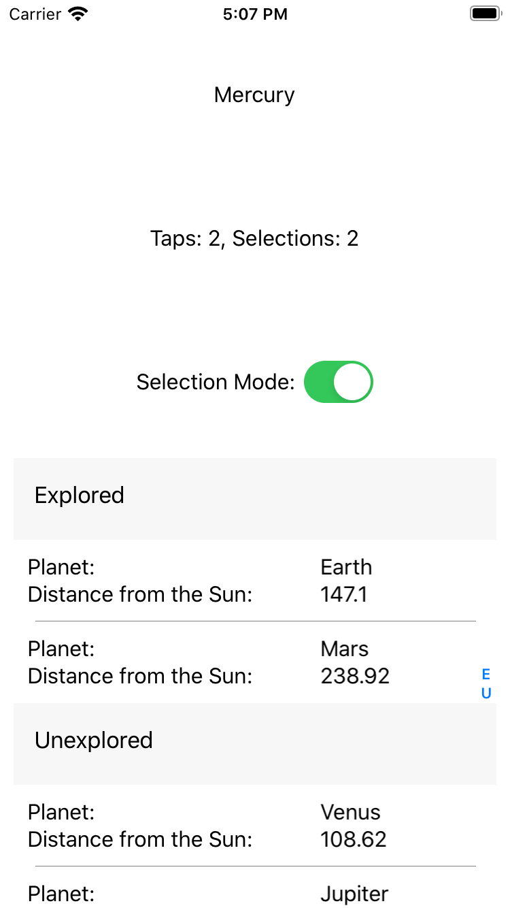

[..](listview.md)

[back](listview-bindableprops.md)

---

# ListView - Organizing and Listing Data in Groups

The example for this section is found in the [/code/Chapter4/ListView/K_SimpleListView_Groupings](/code/Chapter4/ListView/K_SimpleListView_Groupings) folder.

> * Build and run the code
> * Click on a planet to move it to the other group
> * Familiarize yourself with the code, noting the changes in XAML, the ViewModel and the new class PlanetGroup

In the section, the `ListView` displays the data in grouped mode, as shown in the figure below: 



For illustrative purposes, there are two groups:

* Explored
* Unexplored

Clicking on an planet relocates it to the other group.

The procedure for grouping data requires a few changes:

* The `IsGroupingEnabled` property of ListView must be set to "True"
* The collection referenced by `ItemsSource` must be a collection of N collections, where N is the number of groups
* Each of the N collections needs a couple extra string properties for the group title and short name.

The last point can be quite confusing, but hopefully an example will clarify.

## MainPage.xaml
The XAML has been updated to enable groups. Note also the `ItemSource` is bound to a new property, `PlanetGroups`. This is a collection of collections, which will be looked at in detail below.

```XML
        <ListView ItemsSource="{Binding PlanetGroups}"
                  x:Name="PlanetListView"
                  HorizontalOptions="Center"
                  VerticalOptions="FillAndExpand"
                  SeparatorVisibility="Default"
                  HasUnevenRows="False"
                  RowHeight="60"
                  IsGroupingEnabled="True"
                  GroupDisplayBinding="{Binding GroupTitle}"
                  GroupShortNameBinding="{Binding GroupShortName}"
                  SelectionMode="{Binding SelectionModeOn, Converter={StaticResource bool2mode}, Mode=TwoWay }"
                  SelectedItem="{Binding SelectedPlanet}">
```                  
Note also the following properties:

* `IsGroupingEnabled` is set to true to use groups
* `GroupDisplayBinding` is bound to a string property (one per group) and displayed in the header of each group. 
    * The binding context will be one of the N individual _collections_
    * You might be wondering "do collections have string properties?".... not by default, but read on....
* `GroupShortNameBinding` is similar to  `GroupDisplayBinding`, except it is a short version used to jump quickly to a section.
* `Selected Item` has not changed from previous sections. The binding context will be a single data item.

With the XAML in mind, let's now look at how the data is restructured.

## The PlanetGroup Collection
For each group of data, you need a separate collection (`List<>` or `ObservableCollection<>`). However, as you may have noticed from the XAML, this collection also needs a title (and optionally, a short name title).

The approach often shown is to create a new collection type by sub-classing `List<>` or `ObservableCollection<>` and adding some string properties, as shown below:

```C#
    public class PlanetGroup : ObservableCollection<SolPlanet>
    {
        public string GroupTitle { get; private set; }
        public string GroupShortName { get; private set; }
        public PlanetGroup(string title, string shortname)
        {
            GroupTitle = title;
            GroupShortName = shortname;
        }
    }
``` 

Just to clarify, `PlanetGroup` is simply an `ObservableCollection<SolPlanet>` with two additional string properties, `GroupTitle` and `GroupShortName`.

A constructor has also been added for convenience.
Now let's look at the ViewModel to see how the data is built up.

## View Model and Model Data
The model data (instantiated in the ViewModel) is now slightly different.

We have an outer collection, `PlanetGroups` (note the plural) is a list of items of type ObservableCollection<PlanetGroup>

> `ObservableCollection` is a collection of `PlanetGroup` items, which are also collection types
>
> If we did not need the group titles, we could have used `ObservableCollection<ObservableCollection<SolPlanet>>`

```C#
    ...
    public ObservableCollection<PlanetGroup> PlanetGroups {
        get => _planetGroups;

        set
        {
            if (_planetGroups == value) return;
            _planetGroups = value;
            OnPropertyChanged();
        }
    }    
    ...
    PlanetGroups = new ObservableCollection<PlanetGroup>()
    {
        new PlanetGroup("Explored", "E") {
            new SolPlanet("Earth", 147.1),
            new SolPlanet("Mars", 238.92)
        },
        new PlanetGroup("Unexplored","U") {
            new SolPlanet("Mercury", 69.543),
            new SolPlanet("Venus", 108.62),
            new SolPlanet("Jupiter", 782.32),
            new SolPlanet("Saturn", 1498.3),
            new SolPlanet("Pluto", 5906.4)
        }
    };
```            

## Adding,removing and moving grouped data
Grouping can make lists of data much easier to navigate, bit it does require a bit more management under the hood.

Consider the row-tap event:

```C#
    public void UserTappedList(int row, SolPlanet planet)
    {
        SelectedRow = row;
        TapCount += 1;

        //Find which group the planet is in
        (PlanetGroup _, int idx) = groupWithPlanet(planet);

        //Swap the groups
        PlanetGroups[idx].Remove(planet);
        PlanetGroups[1 - idx].Add(planet);

        //Update display
        _viewHelper.ScrollToObject(planet);
    }
```        

The specific data item (`planet`) and the row are passed by parameter, but which group is this held in?

The following additional method was added to find a particular data item and return the group it was found in.

```C#
    private (PlanetGroup group, int index) groupWithPlanet(SolPlanet p)
    {
        int grpIndex = 0;
        foreach (PlanetGroup grp in PlanetGroups)
        {
            if (grp.Contains(p)) return (grp, grpIndex);
            grpIndex++;
        }
        return (null, grpIndex);
    }
```        

Note how this method conveniently returns a labelled tuple containing both a reference to the group as well as the group index (which element in the outer array it is located in).

As there are only two groups, it is then very simple to use the index `idx` to move the data item from one group to the other:

```C#
    ...
    (PlanetGroup _, int idx) = groupWithPlanet(planet);    
    PlanetGroups[idx].Remove(planet);
    PlanetGroups[1 - idx].Add(planet);
    ...
```

Unlike the previous example, the delete operation uses the direct reference to the group:

```C#
    public void DeleteItem(SolPlanet p) => groupWithPlanet(p).group?.Remove(p);
```

Given the `groupWithPlanet` method can theoretically return a `null`, it is prudent to use the null conditional operator `.?` to prevent an exception.

---

[Next - Using Different Cell Types with Template Selectors](listview-template-sel.md)

