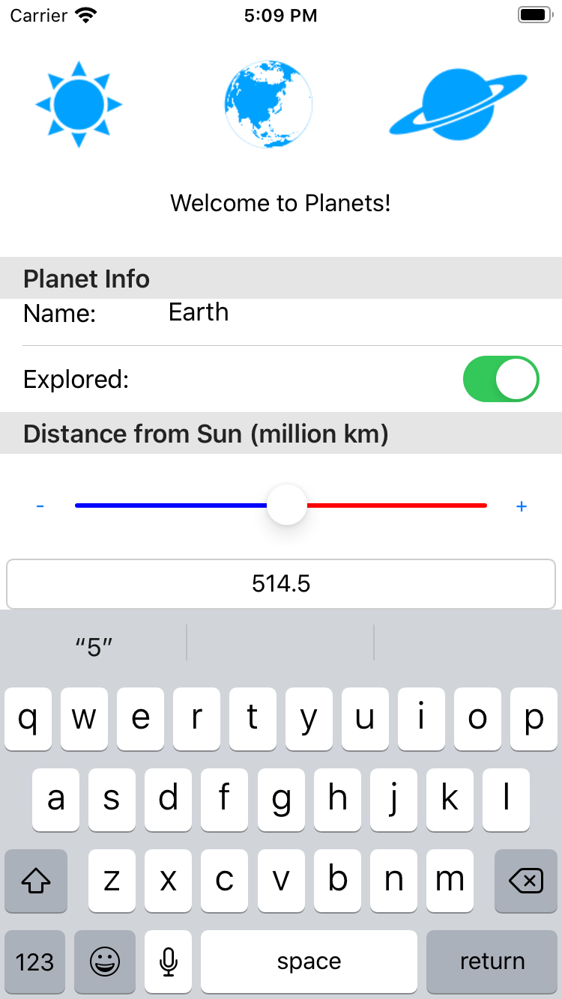

[Back](README.md)

---

# Simple `TableView` Example
The example code is found in the [/code/Chapter4/TableView](/code/Chapter4/TableView) folder.

> * Build and run the code
> * Click on a row
> * Familiarize yourself with the code

You might be relieved to know that `TableView` is a lot simpler than `ListView`. This is because it is static and not fed with a source of data in the same way as `ListView`. The equivalent of `TableView` is seen in many places, such as a phone settings application, in effect being used as a means to layout UI elements in rows. The number of rows is static, although the UI elements may be bound to data in the ViewModel.

Starting with the [PlanetEdit](/code/Chapter4/TableView/PlanetEdit) example (shown below) we have a single page with an image, label and a (grouped) `TableView`


The image at the top is not discussed until later. We will focus on the `TableView`. Unlike `ListView`, the number of groups and rows are static. In many ways, a `TableView` is similar to a layout. 

## MainPage.xaml
The XAML for the `TableView` is relatively simple:

```XML
    ...
    <TableView Margin="0,20,0,0">
        <TableRoot Title="Planets">
            <TableSection Title="Planet Info">
                <EntryCell Label="Name:" Placeholder="Planet Name" Keyboard="Text" Text="{Binding PlanetName}"/>
                <SwitchCell Text="Explored:" On="{Binding HasBeenExplored}"/>
            </TableSection>
            <TableSection Title="Distance from Sun (million km)">
                <TextCell Text="{Binding DistanceFromSun, StringFormat='{0:F0}'}"/>
                <ViewCell>
                    <ViewCell.View>
                        <Slider Minimum="0.0"
                                Maximum="1000.0"
                                MinimumTrackColor="Blue"
                                MaximumTrackColor="Red"
                                Value="{Binding DistanceFromSun, Mode=TwoWay}" />
                    </ViewCell.View>
                </ViewCell>
            </TableSection>
        </TableRoot>
    </TableView>
    ...
```

* Each section is enclosed with between `<TableSection>` elements
* Each row is a subclass of `Cell`. I have used stock cell items here, but your own custom cell can be used (see next example)
 
 A key point to note is that unlike the `ListView`, the `BindingContext` (source object reference) of each cell is the same as any other child element on the page, again re-emphasizing the point that a `TableView` is more like a layout.

# TableView and Custom Cells
Let's return to the idea of using (and reusing) a custom cell in a `TableView`. This gives us an opportunity to explore bindings a little more deeply.

Starting with the [PlanetEdit-customcell](/code/Chapter4/TableView/PlanetEdit-customcell) example we again have a single page with an image, label and a (grouped) `TableView`. 

This time the slider is accompanied with two buttons and an `Entry` control to allow the user to enter a value via the keyboard (with validation). 



The XAML below shows the layout for the `MainPage.xaml` which is actually shorter than the preceding example.

```XML
    xmlns:local="clr-namespace:SimpleTableView"
    ...
    <TableView Margin="0,20,0,0" HasUnevenRows="True">
        <TableRoot Title="Planets">
            <TableSection Title="Planet Info">
                <EntryCell Label="Name:" Placeholder="Planet Name" Keyboard="Text" Text="{Binding PlanetName}"/>
                <SwitchCell Text="Explored:" On="{Binding HasBeenExplored}"/>
            </TableSection>
            <TableSection Title="Distance from Sun (million km)">
                <local:Numerical_Input_Cell
                    MaxValue="1000"
                    Value="{Binding DistanceFromSun, Mode=TwoWay}"    
                    DoubleTapCommand="{Binding DoubleTapCommand}" />
            </TableSection>
        </TableRoot>
    </TableView>
    ...
```

**Key Points**
Note the following:

* The binding *source* is still the `BindingContext` of the page (a ViewModel)
* The binding *targets* are UI elements, including the custom cell `Numerical_Input_Cell`

> Remember that the properties of binding *targets* must be of type `BindableProperty`

With this in mind, let's now look at the custom cell. Much like a `Page`, this is split into two files:

* `Numerical_Input_Cell.xaml.cs` (also known as the code-behind)
* `Numerical_Input_Cell.xaml` which contains the XAML.

## Numerical_Input_Cell.xaml
The XAML for the custom cell is shown below:

```XML
<?xml version="1.0" encoding="UTF-8"?>
<ViewCell xmlns="http://xamarin.com/schemas/2014/forms"
          xmlns:x="http://schemas.microsoft.com/winfx/2009/xaml"
          x:Name="ThisCell"
          x:Class="SimpleTableView.Numerical_Input_Cell">
    <ViewCell.View>
        <StackLayout Padding="4">
            <StackLayout Orientation="Horizontal" Padding="8">
                <Button Text="-" Clicked="Button_Reduce_Clicked" HorizontalOptions="Center"/>            
                <Slider Minimum="{Binding Source={x:Reference ThisCell}, Path=MinValue}"
                        Maximum="{Binding Source={x:Reference ThisCell}, Path=MaxValue}"
                        MinimumTrackColor="Blue"
                        MaximumTrackColor="Red"
                        HorizontalOptions="FillAndExpand"
                        x:Name="Slider"
                        Value="{Binding Value, Source={x:Reference ThisCell}, Mode=TwoWay}" />
                <Button Text="+" Clicked="Button_Increase_Clicked"  HorizontalOptions="Center"/>            
            </StackLayout>
            <Entry Text="{Binding Source={x:Reference Slider}, Path=Value, StringFormat='{0:F1}', Mode=OneWay}"
                   HorizontalOptions="FillAndExpand"
                   HorizontalTextAlignment="Center"
                   Completed="Entry_Completed"
                   x:Name="ValueEntry"
                   />
        </StackLayout>
    </ViewCell.View>
</ViewCell>
```

**Key Points**

* The `Name` property of the `ViewCell` is set to `ThisCell` (so we can refer to it elsewhere).
* The UI element (target) properties are bound to properties declared in the code behind:
   * The `Numerical_Input_Cell` is the *binding source* specified by using `Source={x:Reference ThisCell}`
   * The binding paths are the names of properties declared in the code-behind.
   * This is similar to a Page with UI elements bound to properties in the code behind
* There is a **one-way** binding from the `Slider` (source object) to the `Text` property of the `Entry` component. 
   * There is no binding from target to source. We would not want every keystroke to update the slider, so the `Completed` event handler is used (run when the user taps an enter / return key)
   * Any edits are validated and performed within an event handler

Now let's remind ourselves how we are to use this cell in our `TableView`:

```XML
    <local:Numerical_Input_Cell
        MaxValue="1000"
        Value="{Binding DistanceFromSun, Mode=TwoWay}"    
        DoubleTapCommand="{Binding DoubleTapCommand}"
        />
```

From the context of creating a `TableView`, a ViewModel is the binding *source* and the  `Numerical_Input_Cell` is now the **target**, with properties `MaxValue`, `Value` and `DoubleTapCommand`. Of course, as with any binding *target*, these properties must be of type `BindableProperty`

We can see this in the code behind.

## Numerical_Input_Cell.xaml.cs
Take a read through this file and familiarize yourself with the code. As there is some repetition, some of the code is not shown for brevity.

```C#
...
namespace SimpleTableView
{
    [XamlCompilation(XamlCompilationOptions.Compile)]
    public partial class Numerical_Input_Cell : ViewCell
    {
        // ****************************** SLIDER *******************************

        ...

        public static readonly BindableProperty ValueProperty =
            BindableProperty.Create(propertyName: "Value",
                            returnType: typeof(double),
                            declaringType: typeof(Numerical_Input_Cell),
                            defaultValue: 0.0);

        public double Value {
            get => (double)GetValue(ValueProperty);
            set => SetValue(ValueProperty, value);
        }

        // ************************** BUTTON EVENTS ****************************
        void Button_Reduce_Clicked(System.Object sender, System.EventArgs e) => Value -= (Value >= 100.0) ? 100.0 : 0.0;
        void Button_Increase_Clicked(System.Object sender, System.EventArgs e) => Value += (Value <= 900.0) ? 100.0 : 0.0;

        // ********************** ENTRY STRING EVENTS **************************
        void Entry_Completed(System.Object sender, System.EventArgs e)
        {
            //Validate
            double proposedValue;
            string strValue = ValueEntry.Text;
            bool parsed = double.TryParse(strValue, out proposedValue);
            if (parsed == false) return;
            if ((proposedValue >= MinValue) && (proposedValue <= MaxValue))
            {
                Value = Math.Round(proposedValue,1);
            }
        }
        ...
    }
}
```

First, consider the property `Value`. This is the actual value the user is trying to input (type `double` ). For this to be a **bindable property**, you must create two properties:

* the actual property
   * the setter and getter must only contain calls to `GetValue(...)` and `SetValue(...)`
* a static property of type `BindableProperty` with the same name and the suffix `Property`


```C#
    public static readonly BindableProperty ValueProperty =
        BindableProperty.Create(propertyName: "Value",
                        returnType: typeof(double),
                        declaringType: typeof(Numerical_Input_Cell),
                        defaultValue: 0.0);

    public double Value {
        get => (double)GetValue(ValueProperty);
        set => SetValue(ValueProperty, value);
    }
```        

* When the source object is type `Numerical_Input_Cell`, you simply bind to the property `Value`
* When the target is type `Numerical_Input_Cell` , you bind it's property `Value` by specifying the bindable property `ValueProperty`
   * Remember the `SetBinding` API?

> It should be pointed out that [the documentation on `SetValue(..)`](https://docs.microsoft.com/dotnet/api/xamarin.forms.bindableobject.setvalue?view=xamarin-forms) states "Application developers should perform no other steps in the public property that defines the interface of the bound property."
>
> If you need to intercept changes to these properties (e.g. to validate or coerce), you are referred to the [Microsoft Documentation on Bindable Properties](https://docs.microsoft.com/xamarin/xamarin-forms/xaml/bindable-properties)

## The Entry Box
Consider the event handler for the `Entry` object:

```C#
void Entry_Completed(System.Object sender, System.EventArgs e)
{
    //Validate
    double proposedValue;
    string strValue = ValueEntry.Text;
    bool parsed = double.TryParse(strValue, out proposedValue);
    if (parsed == false) return;
    if ((proposedValue >= MinValue) && (proposedValue <= MaxValue))
    {
        Value = proposedValue;
    }
}
```

This requires moderately complex validation so that the value entered is a numerical value within the accepted range.

Note that the property `Value` is modified directly in this case. Doing this will trigger the following:

* The `Slider` to move
* The `DistanceFromSun` property will be updated on the ViewModel.


## A note about fractional properties:
Fraction numbers (non-integer) are commonly used to represent real quantities, such as physical measurements and constants. The two fractional data types are the *single precision floating point* type `float` and the *double precision floating point* type `double`.

Using `float` has a lower computational cost than `double`, but also has less precision. Neither `float` or `double` (the 'floating point' types) have infinite precision, and there are a finite set of `preferred values` which can be represented with zero error. 

> When you set a floating point type to a value, it will actually be set to the *nearest preferred value*. 
>
> If a user enters a fractional number into an entry box, and it is not a preferred value, then the actual value stored will not the precisely the same.

### Binding to fractional values
To prevent unnecessary updates to bindings, it is normal to check if a value has actually changed before invoking `OnPropertyChanged()` and updating the binding layer.

When working with type `float` or `double`, a key point to consider is *what do we consider to be a significant change*?

Testing for equality using `value == _model.Distance` could fail due to very small numerical rounding errors under certain circumstances, resulting in unnecessary updates in the binding layer. Back in the ViewModel, you will notice this has been accounted for:

```C#
public double DistanceFromSun
{
    get => _model.Distance;
    set
    {
        if ((Math.Abs(_model.Distance - value)) < 0.05) return;
        //if (value == _model.Distance) return;
        _model.Distance = value;
        OnPropertyChanged();
    }
}
```

where `Math.Abs(...)` refers to the *absolute value*, which is the positive representation of any number. Put in words, *the property is  only updated **if** the difference between the old and new values is greater than 0.05*


# Student Centered Task
The `+` and `-` buttons in this example increment the slider by a fixed amount we shall call _delta_. Add a bindable property that allows _delta_ to be specified from the TableView.

**Advanced**
Using the documentation on bindable properties, perform a validation check to ensure the change is not greater than the 0.5*(Max - Min). 

---

[Back](README.md)


